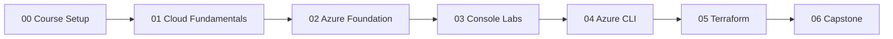

# Student Prerequisites

## Learning Goal

Confirm you have the skills and tools needed **before** starting Azure labs. This course assumes you are not new to IT — but you **are** new to Azure.

---

## Who This Course Is For

- Fresh DevOps engineers and bootcamp students
- Developers moving into cloud/DevOps roles
- Anyone learning Azure in a structured classroom path

---

## Required Prior Knowledge

You should already be comfortable with these topics. If any are weak, review them first.

| Skill | What you should know | Why it matters in this course |
|-------|----------------------|-------------------------------|
| **Linux** | Navigate with `cd`, `ls`, `sudo`; edit files; basic permissions (`chmod`) | SSH to VMs, install nginx, mount managed disks |
| **Git** | Clone, branch, commit, push; understand `.gitignore` | Course repo workflow; never commit Azure secrets |
| **Docker** | Build image, run container, basic Dockerfile | Container Apps and ACR capstone |
| **CI/CD concepts** | Pipeline stages: build, test, deploy | Understand why IaC and automation matter |
| **Networking basics** | IP address, port, HTTP vs HTTPS, SSH | NSGs, VNet, load balancers |
| **YAML/JSON basics** | Read key-value config files | Terraform and Azure policies later |

You do **not** need prior Azure experience — that is what this course teaches.

---

## Required Software (Windows)

Install and verify **before Module 03** (first Azure lab).

| Tool | Version | Used in module |
|------|---------|----------------|
| **Web browser** | Chrome, Firefox, or Edge | Azure Portal (all labs) |
| **Git for Windows** | Latest | Git Bash terminal |
| **Git Bash** | Included with Git | SSH, Azure CLI, Terraform |
| **VS Code** (recommended) | Latest | Edit Markdown, `.tf`, configs |
| **Azure CLI** | Latest 2.x | Module 04 |
| **Terraform** | 1.5+ | Module 05 |
| **Docker Desktop** | Latest | Module 03 Container Apps lab, capstone |

### Optional but helpful

| Tool | Purpose |
|------|---------|
| Windows Terminal | Better tab experience |
| `jq` | Parse JSON CLI output |

---

## Azure Subscription Requirements

| Requirement | Detail |
|-------------|--------|
| **Azure subscription** | Your own Free Account / pay-as-you-go or instructor-provided training subscription |
| **Credit card** | Required for signup — set Cost Management budget immediately |
| **Phone** | For verification and MFA |
| **Email** | Entra / Microsoft account login — keep secure |

**Free Account / Free trial:** Many lab resources can use free credits if your account is new. **Credits do not mean unlimited free** — always run cleanup.

---

## Verify Your Environment (Git Bash)

Open **Git Bash** and run:

```bash
# Git
git --version

# SSH client
ssh -V

# Optional now — required before Module 04/05
az --version
terraform version
docker --version
```

Expected: each command prints a version (or install before that module).

---

## Course Settings (Use Everywhere)

| Setting | Value |
|---------|-------|
| **Default Region** | `southeastasia` (Southeast Asia) |
| **CLI default location** | `southeastasia` |
| **Naming prefix** | `devops-lab-<yourname>-*` |

Your instructor may allow a different region — if so, use **one region consistently** for all labs.

---

## Knowledge Self-Check

Answer honestly. If you answer "no" to more than two, spend a day on basics first.

| Question | Yes / No |
|----------|----------|
| Can you SSH to a Linux server with a private key? | |
| Can you run `sudo dnf install` or `apt install`? | |
| Do you know what port 22 and port 80 are? | |
| Can you clone a Git repo and create a branch? | |
| Do you know why secrets should not be in Git? | |
| Have you built a Docker image with a Dockerfile? | |

---

## What You Do NOT Need Yet

- Azure certification
- Kubernetes (AKS is out of scope)
- Advanced Terraform modules
- Programming beyond basic shell commands

---

## Recommended Study Order



Do **not** skip to labs without reading Module 00 and 02 security topics.

---

## Interview-Style Questions

1. **What Linux commands will you use most in this course?**
   - *`ssh`, `sudo`, package install (`dnf`/`apt`), `lsblk`, `curl`.*

2. **Why learn Git before Azure?**
   - *Infrastructure and configs are versioned; prevents losing work and committing secrets.*

3. **When do you need Docker in this course?**
   - *Container Apps/ACR labs and capstone project.*

---

## References to Verify

- [Git for Windows](https://git-scm.com/download/win)
- [Azure Free Account](https://azure.microsoft.com/free/)
- [Docker Desktop for Windows](https://docs.docker.com/desktop/setup/install/windows-install/)

---

**Next:** [azure-subscription-safety.md](azure-subscription-safety.md)
