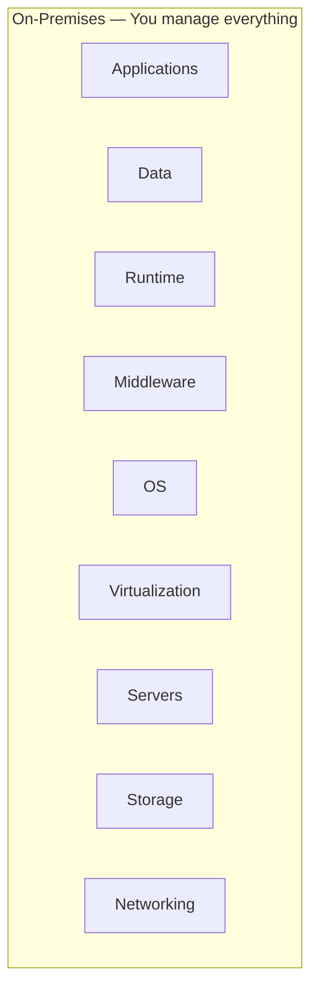
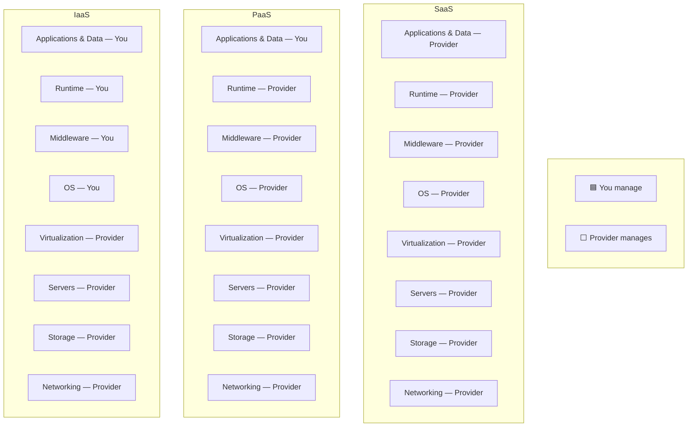

# SaaS, PaaS, and IaaS

## Learning Goal

Understand the three main **cloud service models** and know which layer you manage as a DevOps engineer.

---

## The Stack in One Picture

When you run an application, many layers are involved: physical hardware, networking, OS, runtime, application code, and user data.

Cloud providers offer different levels of management:

In cloud service models, the provider takes over more layers from the bottom up.

---

## Quick Comparison Table

| Model | Full Name | You Manage | Provider Manages | Example |
|-------|-----------|------------|------------------|---------|
| **IaaS** | Infrastructure as a Service | OS, apps, data, scaling logic | Servers, storage, networking, virtualization | Azure Virtual Machines, Managed Disks, Virtual Network |
| **PaaS** | Platform as a Service | Applications and data | OS, runtime, middleware, underlying infra | Azure App Service, Azure Container Apps, Azure Kubernetes Service (control plane) |
| **SaaS** | Software as a Service | Configuration, users, data you upload | Entire application stack | Microsoft 365, Gmail, Slack, GitHub, Salesforce |

---

## IaaS — Infrastructure as a Service

**What you get:** Virtual machines, networks, block storage, load balancers.

**What you do:** Install Linux, patch the OS, install Docker, configure nginx, write Terraform, set up monitoring.

### DevOps Example

Your team runs a CI runner on an **Azure Virtual Machine**:

- Azure provides the virtual server and network
- You install GitLab Runner, Docker, and security patches
- You configure the NSG to allow only required ports
- You delete the VM when not needed to save cost

**This course focuses heavily on IaaS** because it teaches foundational skills every DevOps engineer needs.

---

## PaaS — Platform as a Service

**What you get:** A platform to deploy code without managing the OS.

**What you do:** Push code or containers; configure environment variables; set scaling rules.

### DevOps Example

Your team deploys a web app to **Azure App Service**:

- You deploy the application package or container
- Azure provisions compute, OS, and platform updates behind the scenes
- You do not SSH into servers for routine patching — Azure handles platform updates
- You still manage application config, secrets, and deployment strategy

Another PaaS-style example: **Azure Container Apps** — you define containers and ingress; Azure runs the compute without you managing VMs or Kubernetes nodes.

---

## SaaS — Software as a Service

**What you get:** A ready-to-use application over the internet.

**What you do:** Create accounts, configure settings, manage users, integrate via API.

### DevOps Example

Your pipeline uses these SaaS tools daily:

| Tool | SaaS Role |
|------|-----------|
| **GitHub** | Source code hosting |
| **Slack** | Team notifications for deploy alerts |
| **Datadog** (or similar) | Monitoring dashboards |
| **Jira** | Ticket tracking |
| **Microsoft 365** | Email and collaboration |

You do not install or patch GitHub's servers. You use the product.

---

## Responsibility Diagram

This is the classic **shared management** view across models:

> **Memory trick:** As you move from IaaS → PaaS → SaaS, *you manage less* and the provider manages more.

See also: [diagrams.md](diagrams.md) for a cleaner classroom version.

---

## Which Model Should a DevOps Team Choose?

| Need | Likely Choice |
|------|---------------|
| Full control, custom OS hardening, learning Azure internals | **IaaS** (Virtual Machines) |
| Faster deploys, less OS management | **PaaS** (App Service, Container Apps) |
| Ready-made tool, not infrastructure | **SaaS** (GitHub, monitoring SaaS) |

Most real environments use **all three together**:

- SaaS for tooling (GitHub, Slack, Microsoft 365)
- IaaS or PaaS for the application (VM, Container Apps, App Service)
- Managed databases (PaaS-style) like Azure Database for MySQL or Azure SQL

---

## Common Confusion

| Confusion | Clarification |
|-----------|---------------|
| "Azure SQL / MySQL Flexible Server is IaaS" | These are **managed services** (platform-level). You do not manage the OS or database engine patching — closer to PaaS |
| "Kubernetes is always PaaS" | It depends. Self-managed K8s on VMs is IaaS-heavy. AKS is a managed control plane (more PaaS-like) |
| "SaaS means no security work" | You still secure **accounts, access, and data**. SaaS does not remove your security responsibility |
| "DevOps only works with IaaS" | DevOps practices (CI/CD, IaC, monitoring) apply to all models |
| "PaaS means zero ops" | You still handle deployments, config, observability, and incident response |

---

## Small Example (Conceptual)

| Task | SaaS | PaaS | IaaS |
|------|------|------|------|
| Host a company blog | WordPress.com | App Service + WordPress | VM + manual LAMP stack install |
| Run a database | Not typical for SaaS | Azure Database for MySQL / Azure SQL | MySQL installed on a VM |
| Send CI notifications | Slack | — | Self-hosted Mattermost on a VM |

---

## Interview-Style Questions

1. **What is the difference between IaaS and PaaS?**
   - *In IaaS you manage the OS and above. In PaaS the provider manages the OS and runtime; you manage applications and data.*

2. **Give one Azure example for each model.**
   - *IaaS: Virtual Machines. PaaS: App Service or Azure Database for MySQL. SaaS: Microsoft 365 or third-party SaaS integrated with Azure.*

3. **As a DevOps engineer, why learn IaaS first?**
   - *IaaS exposes networking, OS, and security fundamentals you need to understand before abstracting them away.*

4. **Is Blob Storage IaaS?**
   - *Blob is object storage — often classified as IaaS storage, but Microsoft calls it a managed service. You manage accounts, containers, and data; Azure manages the storage infrastructure.*

5. **Can one application use multiple models?**
   - *Yes. A common pattern: VM (IaaS) + Azure Database for MySQL (managed/PaaS-style) + GitHub (SaaS).*

---

## References to Verify

- [Azure — Types of cloud computing](https://azure.microsoft.com/resources/cloud-computing-dictionary/what-are-iaas-paas-saas/) — IaaS, PaaS, SaaS overview
- [NIST SP 800-145](https://csrc.nist.gov/publications/detail/sp/800-145/final) — service model definitions
- [Azure products](https://azure.microsoft.com/products/) — classify services by model as an exercise

---

**Next:** [03-public-private-hybrid-cloud.md](03-public-private-hybrid-cloud.md) — *where* the cloud runs, not just *what* it provides.
