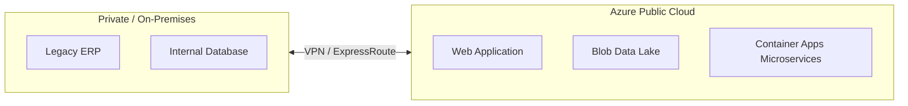

# Public, Private, and Hybrid Cloud

## Learning Goal

Understand the three **cloud deployment models** and when organizations choose each one.

---

## Deployment Model vs Service Model

Do not mix these up:

| Concept | Question It Answers | Examples |
|---------|---------------------|----------|
| **Service model** (IaaS/PaaS/SaaS) | *What does the provider manage?* | Azure VM, Azure SQL, Gmail |
| **Deployment model** (public/private/hybrid) | *Who owns the infrastructure and who can use it?* | Azure public cloud, company-owned data center |

This lesson is about **deployment models**.

---

## Public Cloud

**Definition:** IT resources owned and operated by a cloud provider, delivered over the internet to the general public (any customer who signs up).

### Examples

- **Microsoft Azure**
- Amazon Web Services (AWS)
- Google Cloud Platform (GCP)

### Characteristics

| Feature | Detail |
|---------|--------|
| Ownership | Provider owns data centers |
| Access | Multi-tenant — many customers share underlying hardware (logically isolated) |
| Billing | Pay-as-you-go |
| Scaling | Massive global scale |
| Maintenance | Provider patches physical infrastructure |

### DevOps Example

Your startup runs everything on Azure public cloud:

- Production Container Apps in `southeastasia`
- Blob Storage for static assets
- Azure Database for MySQL for the database
- No company-owned servers in an office basement

**This entire course uses Azure public cloud.**

---

## Private Cloud

**Definition:** Cloud-style IT resources used **exclusively by one organization**, often on-premises or in a dedicated facility.

### Characteristics

| Feature | Detail |
|---------|--------|
| Ownership | Organization owns or exclusively leases infrastructure |
| Access | Single organization only |
| Control | High — custom hardware, networking, compliance |
| Scaling | Limited by owned hardware |
| Cost | High upfront capital expense (CapEx) |

### DevOps Example

A bank runs a private cloud in its own data center:

- VMware or OpenStack cluster
- Internal CI/CD deploys only inside the bank network
- Regulatory rules prevent certain data from leaving the building

The bank may still use **Azure public cloud** for non-sensitive workloads — that becomes **hybrid**.

---

## Hybrid Cloud

**Definition:** A mix of **public cloud** and **private cloud** (or on-premises) connected together, with data and applications moving between them.

### Why Organizations Choose Hybrid

| Reason | Example |
|--------|---------|
| **Legacy systems** | 20-year-old app cannot be rehosted quickly |
| **Compliance** | Patient data stays on-prem; analytics runs in Azure |
| **Gradual migration** | Move one service at a time to cloud |
| **Burst capacity** | Use Azure for peak traffic, on-prem for baseline |

### DevOps Example

An e-commerce company:

- Customer-facing website on Azure (public cloud)
- Inventory system still on-premises (private)
- Azure ExpressRoute or VPN links both networks
- CI/CD deploys cloud services via Terraform; on-prem releases use a separate pipeline

---

## Comparison Table

| Factor | Public Cloud | Private Cloud | Hybrid Cloud |
|--------|-------------|---------------|--------------|
| **Upfront cost** | Low | High | Mixed |
| **Speed to deploy** | Fast | Slow | Mixed |
| **Control** | Less over physical layer | Full | Mixed |
| **Scaling** | Excellent | Limited by hardware | Flexible |
| **Compliance** | Provider certifications + your config | Full physical control | Split by workload |
| **Skills needed** | Cloud + DevOps | Virtualization + data center ops | Both |

---

## Multi-Cloud (Bonus Concept)

Some companies use **more than one public cloud provider** (e.g., Azure + AWS). This is **multi-cloud**, not hybrid.

| Term | Meaning |
|------|---------|
| Hybrid | Public + private combined |
| Multi-cloud | Multiple public providers |

DevOps teams must handle different APIs, networking, and identity models in multi-cloud setups — it adds complexity.

---

## Common Confusion

| Confusion | Clarification |
|-----------|---------------|
| "Private cloud = traditional on-prem" | Private cloud uses cloud features (self-service, pooling, automation) but for one org. Plain on-prem without automation is not truly "cloud" |
| "Public cloud means my data is public" | No. "Public" means the *cloud service* is available to many customers. Your data stays private if you configure access correctly |
| "Hybrid is always the best choice" | Hybrid adds integration complexity. Start simple unless compliance or legacy forces hybrid |
| "Azure is only for public cloud" | Azure also offers **Azure Stack** / Arc for hybrid and edge — advanced topics for later |
| "We need private cloud for security" | Public cloud can be very secure with proper design. Many security failures are customer misconfiguration, not the model itself |

---

## Small Example (Conceptual)

| Company Type | Likely Model |
|--------------|--------------|
| New SaaS startup | Public cloud only (Azure) |
| Government agency with strict data rules | Private cloud or hybrid |
| Retail chain modernizing IT | Hybrid — legacy on-prem + new apps on Azure |
| Student learning Azure | Public cloud (Free Account) |

---

## Interview-Style Questions

1. **What is public cloud?**
   - *Cloud resources owned by a provider, shared across customers, accessed over the internet on demand.*

2. **What is the difference between hybrid and multi-cloud?**
   - *Hybrid combines public and private environments. Multi-cloud uses multiple public cloud providers.*

3. **Why might a bank use hybrid cloud?**
   - *Keep regulated data on-premises while using public cloud for scalable customer-facing apps.*

4. **Is Azure a public cloud provider?**
   - *Yes. Microsoft sells Azure cloud services to any customer worldwide.*

5. **What connectivity links on-prem to Azure in hybrid setups?**
   - *Site-to-Site VPN or Azure ExpressRoute.*

---

## References to Verify

- [NIST SP 800-145 — Deployment Models](https://csrc.nist.gov/publications/detail/sp/800-145/final) — public, private, hybrid, community
- [Azure hybrid](https://azure.microsoft.com/solutions/hybrid-cloud-app/) — Azure hybrid offerings
- [What is cloud computing?](https://azure.microsoft.com/resources/cloud-computing-dictionary/what-is-cloud-computing/) — deployment model overview

---

**Next:** [04-on-prem-vs-cloud.md](04-on-prem-vs-cloud.md) — detailed trade-offs for migration decisions.
