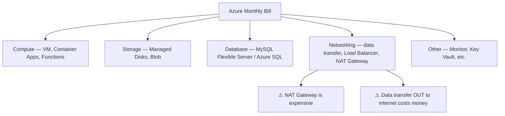

# Cloud Pricing Basics

## Learning Goal

Understand how cloud providers charge for services so you can design cost-aware infrastructure and avoid surprise bills.

---

## Core Pricing Idea

In cloud, you typically pay for:

1. **What you provision** (e.g., a VM size running 24/7)
2. **What you consume** (e.g., Blob storage GB, API requests, data transfer out)
3. **How long you use it** (per second, per hour, or per month)

> **DevOps rule:** If a resource exists, it probably costs money. If you are not using it, shut it down or delete it.

---

## Main Azure Pricing Models

| Model | How It Works | Best For | Azure Examples |
|-------|--------------|----------|----------------|
| **Pay-as-you-go (On-Demand)** | Pay per use, no commitment | Dev/test, unpredictable workloads | Pay-as-you-go VMs, Blob Hot tier |
| **Reservations** | Commit 1 or 3 years for lower rate | Steady production workloads | Reserved VM instances, reserved capacity |
| **Spot VMs** | Use spare capacity — can be evicted | Fault-tolerant batch jobs, CI workers | Azure Spot Virtual Machines |
| **Free Account / Free trial** | Limited free usage and credits for new accounts | Learning, small experiments | Free credits + always-free services |

---

## Pay-as-You-Go Pricing

**Simplest model.** No upfront payment. Pay for compute by the hour or second.

### DevOps Example

You launch a `Standard_B1s` VM in `southeastasia` for a 3-hour lab:

- Billed for ~3 hours of compute
- Stop/deallocate or delete when done
- No contract required

**Good for:** Labs, spikes, unknown duration workloads.

---

## Azure Reservations

When you know a workload will run 24/7 for months, pay-as-you-go is often the **most expensive** option.

| Option | Commitment | Savings (typical) |
|--------|------------|-------------------|
| **Reserved VM instances** | 1 or 3 years, specific size/region | Significant vs pay-as-you-go |
| **Reserved capacity** | 1 or 3 years for services like SQL / MySQL capacity | Lower rate for steady platforms |
| **Savings Plan for Compute** | Hourly commitment across compute services (flexible) | Good for varied compute mix |

### DevOps Example

Production API servers run 3× `Standard_B2s` year-round:

- Team buys a Reservation after 2 months of stable usage
- Finance approves because forecast is predictable

**Not for:** Short labs or coursework — stick to pay-as-you-go and Free Account credits.

---

## Spot VMs

Azure sells unused capacity as **Spot VMs** at a **large discount**. Azure can **evict** your VM when it needs capacity back.

### DevOps Example

| Workload | Spot OK? |
|----------|----------|
| Nightly data processing job | ✅ Yes — job can retry |
| CI build farm | ✅ Yes — with checkpointing |
| Production payment API | ❌ No — use pay-as-you-go or Reservations |
| Student lab VM | ❌ No — use pay-as-you-go for simplicity |

---

## Free Account — Read the Fine Print

Azure Free Account includes:

| Type | Detail |
|------|--------|
| **Free trial credits** | Commonly ~$200 for 30 days (verify current offer) |
| **Always Free** | Limited monthly allowance that never expires |
| **12-month free services** | Selected services with monthly caps for new customers |

### Common Free Account Mistakes

- Leaving VMs running overnight after a lab
- Creating MySQL Flexible Server (not always fully free)
- Running Load Balancer for days (hourly / capacity charges — **not** beginner-friendly for long idle periods)
- Creating NAT Gateway or Application Gateway without need
- Exceeding storage or request limits on Blob

Always check: [Azure Free Account](https://azure.microsoft.com/free/)

---

## What Drives Your Bill?

### Cost Drivers DevOps Engineers Must Know

| Service | Billing Pattern | Lab Tip |
|---------|-----------------|---------|
| **VM** | Per second/hour while running | Delete after lab |
| **Managed Disks** | Per GB-month even if VM is deallocated | Delete unattached disks |
| **Blob Storage** | Storage + requests + transfer | Delete test storage accounts |
| **MySQL Flexible Server** | Compute hours + storage + backups | Delete server when done |
| **Load Balancer** | Per hour / rules / data | Delete after HA lab |
| **NAT Gateway** | Per hour + per GB processed | Avoid in beginner VNet labs |
| **Public IP** | Charged when not associated or idle patterns apply | Delete unused IPs |

---

## Data Transfer Costs (Often Surprising)

| Transfer Type | Typical Cost |
|---------------|--------------|
| Data **into** Azure (ingress) | Usually free |
| Data **out** to internet (egress) | Charged per GB |
| Between Availability Zones | May be charged |
| Between Regions | Charged |

### DevOps Example

Serving 1 TB of video from Blob to internet users worldwide:

- Storage cost is one line item
- **Egress** (data transfer out) can be the larger bill
- Azure CDN / Front Door can reduce origin load and sometimes cost — advanced topic

---

## Cost Control Habits for DevOps

| Habit | Tool / Practice |
|-------|-----------------|
| Tag everything | `Project=azure-basic`, `Owner=student-name` |
| Set billing alerts | Cost Management budgets → alert at $5, $10, $20 |
| Review weekly | Cost analysis |
| Automate teardown | `terraform destroy`, delete resource group |
| Right-size VMs | Do not use `Standard_D4s_v3` when `Standard_B1s` is enough |
| Schedule dev environments | Start 8 AM, stop 6 PM |

---

## Pricing Page Workflow

When estimating cost for any Azure service:

1. Go to the service pricing page (e.g., [Virtual Machines pricing](https://azure.microsoft.com/pricing/details/virtual-machines/linux/))
2. Select your Region (`Southeast Asia`)
3. Choose VM size and hours per month
4. Add storage, transfer, and related services
5. Use [Azure Pricing Calculator](https://azure.microsoft.com/pricing/calculator/) for full estimates

---

## Common Confusion

| Confusion | Clarification |
|-----------|---------------|
| "Deallocated VM is free" | Compute stops, but **attached managed disks still cost money** |
| "Free Account covers everything in this course" | Not all lab services are fully free. Load Balancer and MySQL can charge quickly |
| "Spot is always best for cost" | Only for eviction-tolerant workloads |
| "Reservations save money immediately" | Reservations help steady production — wrong choice for short labs |
| "Blob is pennies so I can ignore it" | Millions of objects + requests + egress add up |

---

## Small Example (Conceptual)

**Lab budget estimate** for one VM afternoon lab in `southeastasia`:

| Resource | Duration | Approx. Cost (if not covered by credits) |
|----------|----------|------------------------------------------|
| `Standard_B1s` pay-as-you-go | 4 hours | < $1 USD |
| 8 GB managed disk | 1 day | cents |
| Forgotten VM 30 days | 720 hours | **$10–20+ USD** |

The expensive mistake is **forgetting to clean up**, not the lab itself.

---

## Interview-Style Questions

1. **What is the difference between pay-as-you-go and Reservations?**
   - *Pay-as-you-go has no commitment and highest flexibility. Reservations require commitment for lower rates.*

2. **When would you use Spot VMs?**
   - *Fault-tolerant, eviction-tolerant workloads like batch processing or CI workers.*

3. **Does deallocating a VM stop all charges?**
   - *Compute stops, but attached managed disks and some Public IPs may still incur charges.*

4. **What is Azure Free Account?**
   - *Limited free usage and credits for new accounts — free trial credits, always-free services, and time-bound offers with specific limits.*

5. **Name three ways a DevOps team controls cloud cost.**
   - *Tagging, Cost Management budgets, right-sizing, automation/teardown, Reservations for steady workloads.*

---

## References to Verify

- [Azure Pricing](https://azure.microsoft.com/pricing/) — official pricing hub
- [Azure Free Account](https://azure.microsoft.com/free/) — current Free Account offers and limits
- [Azure Cost Management](https://azure.microsoft.com/products/cost-management) — Budgets, Cost analysis, Billing
- [Azure Pricing Calculator](https://azure.microsoft.com/pricing/calculator/) — estimate monthly costs

---

**Next:** [diagrams.md](diagrams.md) — visual summary of Module 01.
