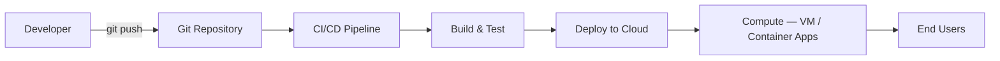
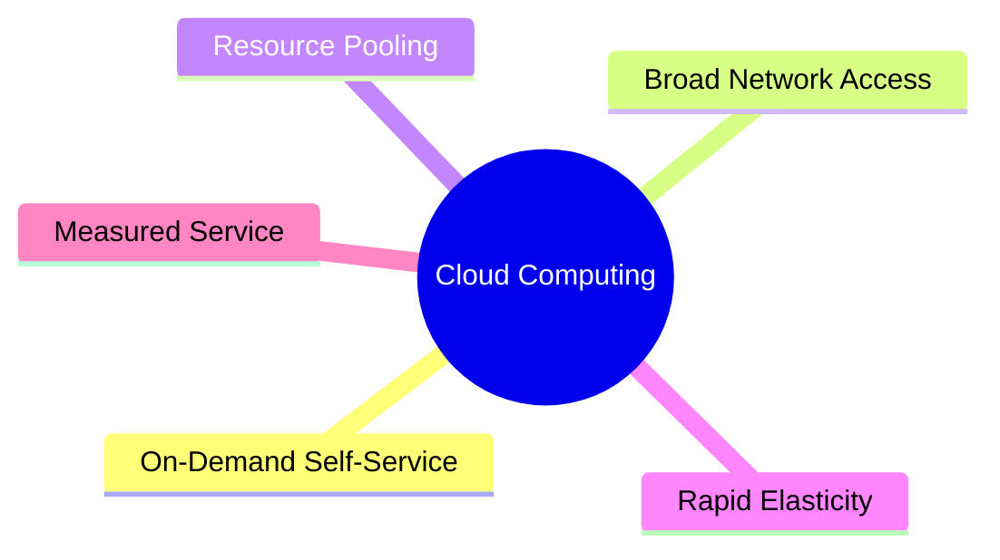
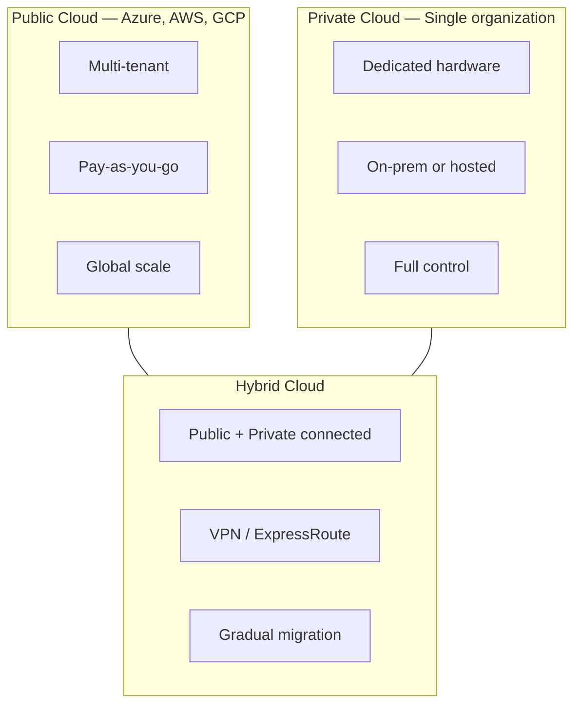
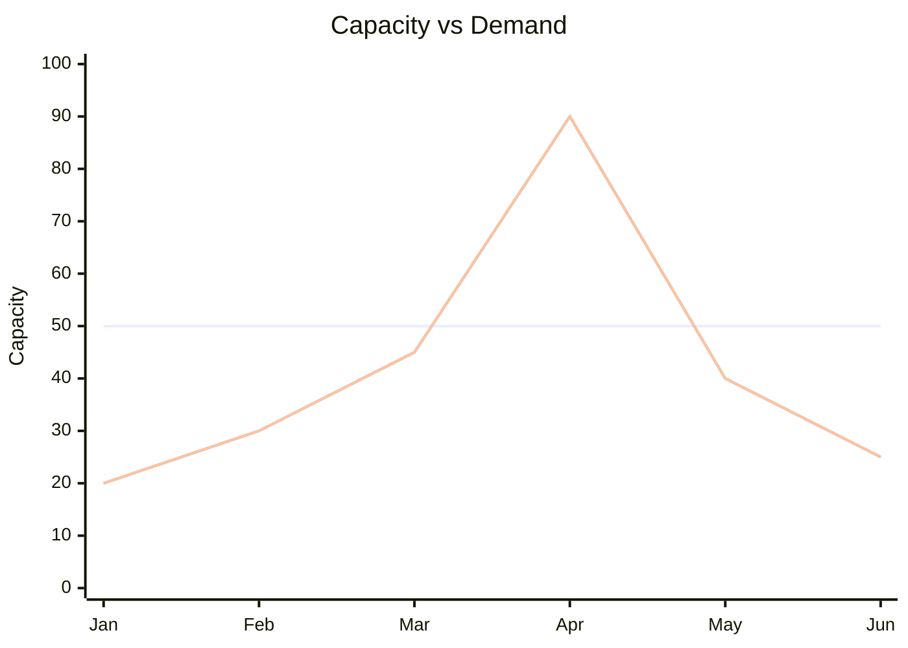
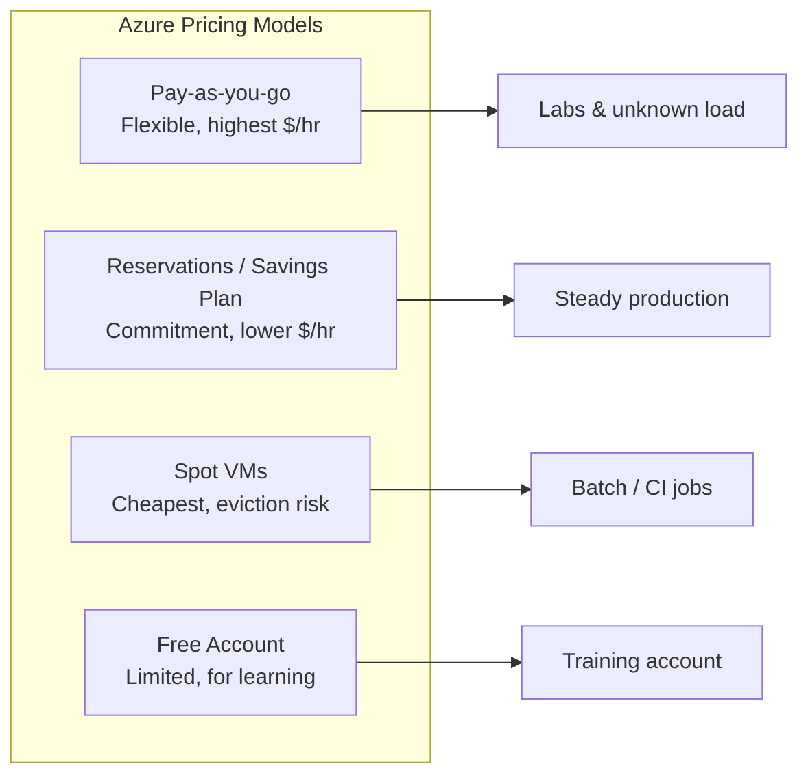
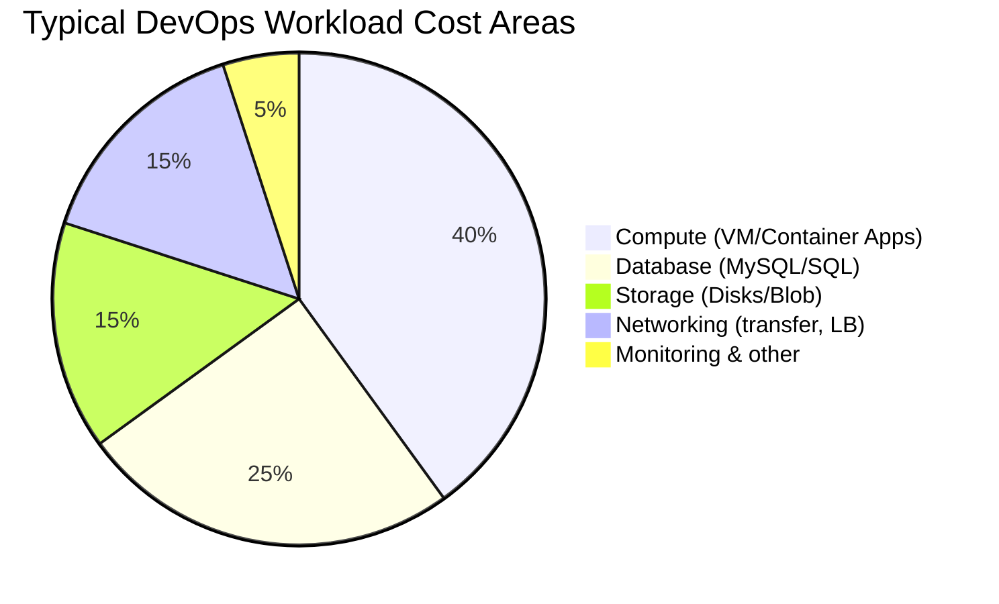
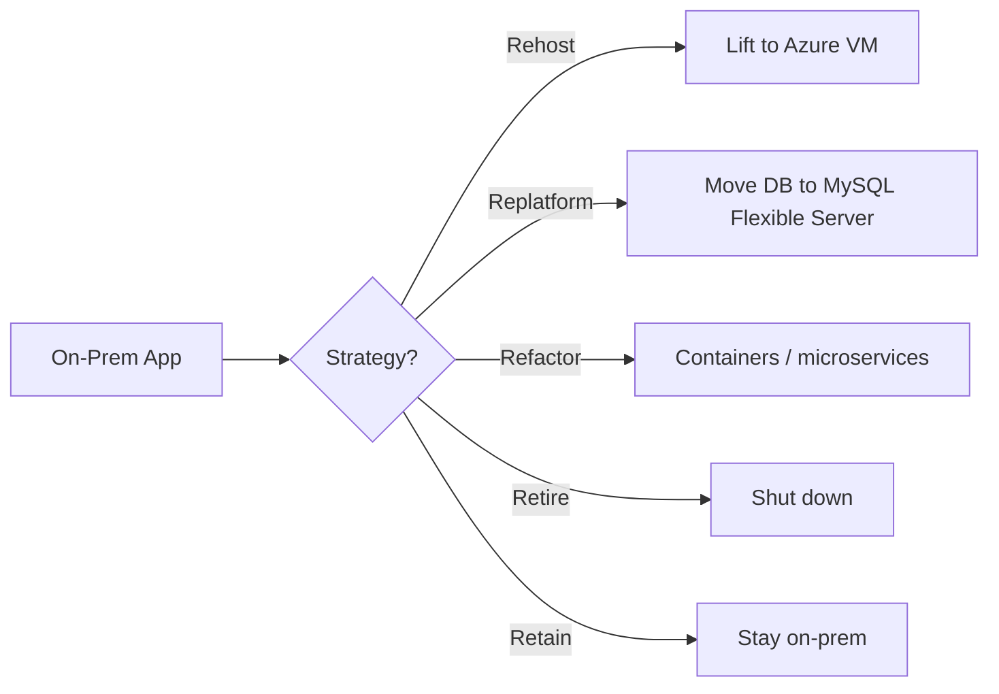

# Cloud Fundamentals — Diagrams

Visual reference for Module 01. Copy these into slides or docs. All diagrams use [Mermaid](https://mermaid.js.org/) syntax.

---

## 1. Cloud Computing Flow (DevOps View)

How code reaches users in the cloud:

---

## 2. Five Characteristics of Cloud (Summary)

---

## 3. SaaS / PaaS / IaaS — Responsibility Stack

**Diagram 1 (required):** Who manages each layer.

```mermaid
flowchart TB
    subgraph Layers["Application Stack"]
        direction TB
        L1["Applications & Data"]
        L2["Runtime / Middleware"]
        L3["Operating System"]
        L4["Virtualization"]
        L5["Servers & Storage"]
        L6["Networking"]
    end

    subgraph IaaS["IaaS — You manage top 4 layers"]
        direction TB
        I_Y1["🟦 Applications & Data"]
        I_Y2["🟦 Runtime"]
        I_Y3["🟦 OS"]
        I_P1["⬜ Virtualization"]
        I_P2["⬜ Servers & Storage"]
        I_P3["⬜ Networking"]
    end

    subgraph PaaS["PaaS — You manage apps & data only"]
        direction TB
        P_Y1["🟦 Applications & Data"]
        P_P1["⬜ Runtime"]
        P_P2["⬜ OS"]
        P_P3["⬜ Virtualization"]
        P_P4["⬜ Servers & Storage"]
        P_P5["⬜ Networking"]
    end

    subgraph SaaS["SaaS — Provider manages all"]
        direction TB
        S_P1["⬜ Applications through Networking — all provider"]
    end
```

**Legend:** 🟦 = Customer manages | ⬜ = Provider manages

---

## 4. Deployment Models

---

## 5. On-Prem vs Cloud — Capacity Over Time

On-prem line stays flat (waste or shortage). Cloud line follows demand.

---

## 6. Cloud Pricing Models

---

## 7. What Makes Up an Azure Bill

> Percentages vary by architecture. Use Cost analysis for real data.

---

## 8. Migration Path (CAF — Preview)

Full migration guidance appears in Microsoft CAF (Module 02).

---

## How to Use These Diagrams

| Audience | Tip |
|----------|-----|
| **Self-study** | Render in VS Code with a Mermaid preview extension or on GitHub |
| **Instructor** | Copy one diagram per slide; explain before lab |
| **Students** | Redraw on whiteboard from memory — best interview prep |

---

## References to Verify

- [Mermaid Documentation](https://mermaid.js.org/intro/) — syntax and diagram types
- [Azure Architecture Center icons](https://learn.microsoft.com/azure/architecture/icons/) — official icons for your own diagrams

---

**Module complete.** Continue to [02-azure-foundation](../02-azure-foundation/README.md).
