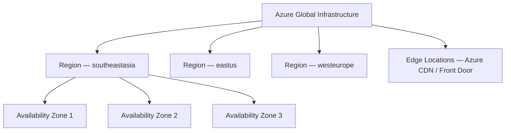

# Azure Global Infrastructure

## Learning Goal

Understand how Azure organizes its worldwide infrastructure so you can choose the right Region, design for high availability, and speak confidently in architecture discussions.

---

## Azure Is a Global Cloud Provider

Microsoft Azure runs data centers across the world. As a customer, you provision **logical resources** (Virtual Machines, Blob storage, MySQL Flexible Server) that run on Microsoft's physical infrastructure.

You do not pick a specific physical server in a rack. You choose:

- **Region** — geographic area
- **Availability Zone** — isolated datacenter within that Region
- **Edge location / CDN POP** — for content delivery (covered in the next lesson)

Default for this course: **`southeastasia` (Southeast Asia)**. You may use another Region if your instructor agrees — stay consistent across all labs.

---

## Global Infrastructure Hierarchy

---

## Key Components at a Glance

| Component | What It Is | DevOps Relevance |
|-----------|------------|------------------|
| **Region** | Geographic area with multiple datacenters / AZs | Where your resources live; affects latency and compliance |
| **Availability Zone (AZ)** | Physically separate datacenter(s) with independent power and networking | Deploy across AZs for high availability |
| **Availability Sets** | Fault/update domain grouping within a region (legacy HA pattern) | Older HA design; AZs preferred when available |
| **Edge / CDN POP** | CDN cache point worldwide | Faster static content via Azure CDN or Front Door |

For this course, focus on **Region** and **Availability Zone**.

---

## How Many Regions and AZs?

Azure continues to expand. Always verify current numbers on the official page.

As of common classroom references:

- **60+ Regions** worldwide (verify live count)
- Many Regions have **3 Availability Zones**
- Hundreds of CDN / edge Points of Presence

> Check live data: [Azure geographies](https://azure.microsoft.com/explore/global-infrastructure/geographies/)

---

## Why Global Infrastructure Matters to DevOps

### 1. Latency

Deploy close to your users. A web app for customers in Southeast Asia should use `southeastasia`, not `eastus`.

### 2. High Availability

Spread VMs across **multiple Availability Zones** in one Region. If one datacenter fails, traffic shifts to another AZ.

### 3. Disaster Recovery

Replicate backups to a **second Region** (e.g., primary in Southeast Asia, DR in East Asia `eastasia`).

### 4. Compliance and Data Residency

Some laws require data to stay in a specific country. Region choice is a **legal and architectural** decision.

### 5. Service Availability

Not every Azure service is available in every Region. Always check service availability for your Region before designing.

---

## Real-World DevOps Examples

| Scenario | Infrastructure Choice |
|----------|----------------------|
| Startup MVP for Southeast Asia users | Single Region (`southeastasia`), multi-AZ Load Balancer + VMSS |
| Global SaaS product | Multi-Region active-passive or active-active |
| CI/CD artifact storage | Blob / ACR in same Region as compute to reduce transfer cost |
| Student lab | One Region only — simpler and cheaper |

---

## Sovereign / Special Clouds (Bonus)

Microsoft offers specialized cloud environments:

| Environment | Typical Use |
|-------------|-------------|
| Azure public cloud | Standard customers worldwide |
| Azure Government | US government workloads |
| Azure China | Operated by local partners |

Most students use the commercial **public Azure** cloud.

---

## Common Confusion

| Confusion | Clarification |
|-----------|---------------|
| "Region and AZ are the same" | A Region contains multiple AZs. AZs are isolated within a Region |
| "More Regions = better for one small app" | Usually one Region with multi-AZ is enough. Multi-Region adds complexity |
| "I can access any Region from the Portal" | Yes, but resources in `southeastasia` do not automatically appear in `eastus` |
| "Edge locations are AZs" | No. Edge/CDN POPs are for caching, not for running VMs |
| "Azure automatically makes my app highly available" | No. **You** must design multi-AZ or multi-Region architectures |

---

## Small Example (Conceptual)

Your team deploys a web API:

| Design | Uptime if one AZ fails |
|--------|------------------------|
| 1 VM in Zone 1 only | **Outage** — app is down |
| 2 VMs across Zone 1 and Zone 2 behind Load Balancer | **Survives** — LB routes to healthy instance |

You will build the second pattern in the Load Balancer + VMSS lab.

---

## Interview-Style Questions

1. **What is an Azure Region?**
   - *A geographic area containing datacenters and often multiple Availability Zones.*

2. **Why deploy across multiple AZs?**
   - *To survive failure of a single datacenter and improve availability.*

3. **What is the default Region for this course?**
   - *southeastasia (Southeast Asia).*

4. **Can you run a VM in an edge location?**
   - *No. VMs run in Regions/AZs. Edge locations are for CDN caching.*

5. **Why does Region choice affect compliance?**
   - *Data residency laws may require data to remain in specific countries or jurisdictions.*

---

## References to Verify

- [Azure global infrastructure](https://azure.microsoft.com/explore/global-infrastructure/) — Regions, AZs, edge
- [Products available by region](https://azure.microsoft.com/explore/global-infrastructure/products-by-region/) — which services exist where
- [Azure Well-Architected — Reliability](https://learn.microsoft.com/azure/well-architected/reliability/) — designing for failure

---

**Next:** [02-region-az-edge-location.md](02-region-az-edge-location.md) — deep dive into Region, AZ, and edge locations.
