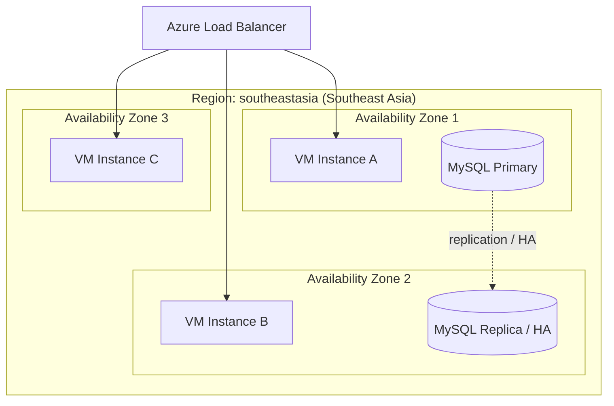
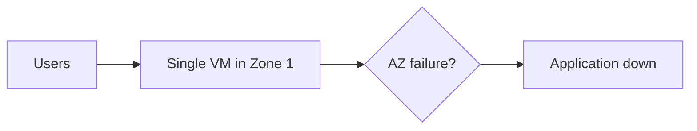
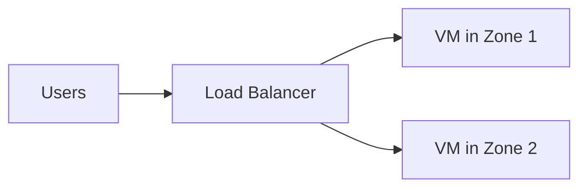

# Region, Availability Zone, and Edge Location

## Learning Goal

Clearly distinguish **Region**, **Availability Zone (AZ)**, and **edge location** — three terms every Azure engineer must use correctly.

---

## Region

A **Region** is a physical geographic area where Microsoft clusters datacenters.

### Properties

| Property | Detail |
|----------|--------|
| **Naming** | `southeastasia`, `eastus`, `westeurope` |
| **Independence** | Each Region is largely isolated from others |
| **Data** | Data in one Region does not automatically replicate to another |
| **Pricing** | Can differ between Regions |
| **Latency** | Lower when users are geographically close |

### DevOps Example

Your production stack for Southeast Asia:

```
Region: southeastasia (Southeast Asia)
├── Resource Group
├── VNet
├── Virtual Machines
├── Azure Database for MySQL
└── Storage Account (Blob)
```

All resources share the same Region for lower latency and simpler networking.

---

## Availability Zone (AZ)

An **Availability Zone** is one or more discrete datacenters within a Region, with **independent power, cooling, and networking**.

### Properties

| Property | Detail |
|----------|--------|
| **Naming** | Zone 1, Zone 2, Zone 3 (physical mapping can vary by subscription) |
| **Isolation** | Failure in one AZ should not take down another AZ |
| **Connection** | AZs in the same Region are connected by **high-speed private network** |
| **Design pattern** | Run redundant workloads in **at least 2 AZs** |

### Diagram 2 (Required): Region and AZ



> **Classroom rule:** Load Balancer + instances in multiple AZs = high availability within a Region.

---

## Edge Location

An **edge location** (CDN POP) is a site worldwide where **Azure CDN** or **Azure Front Door** caches copies of content close to end users.

### Properties

| Property | Detail |
|----------|--------|
| **Purpose** | Content delivery (CDN) — not general compute |
| **Count** | Hundreds globally (verify on Microsoft site) |
| **Services** | Azure CDN, Front Door, some edge functions |
| **Benefit** | Lower latency for static assets (images, JS, CSS, video) |

### DevOps Example

Your React app is hosted on Blob static website hosting:

| Without CDN / Front Door | With CDN / Front Door |
|--------------------------|------------------------|
| User in Tokyo fetches files from Blob in Southeast Asia | User in Tokyo gets cached copy from nearest POP |
| Higher latency | Lower latency |
| All requests hit origin | Most requests served from cache |

Edge locations do **not** replace Regions. They **cache content from** your origin in a Region.

---

## Comparison Table

| | Region | Availability Zone | Edge Location |
|---|--------|-------------------|---------------|
| **Scope** | Geographic area | Datacenter(s) in Region | Global cache point |
| **Run VM?** | Yes (in AZs) | Yes | No |
| **Run MySQL Flexible Server?** | Yes | Yes (when supported) | No |
| **CDN cache?** | No | No | Yes |
| **Isolation** | From other Regions | From other AZs | N/A |
| **This course** | ✅ Primary focus | ✅ HA labs | Mentioned only |

---

## Choosing a Region — Checklist

| Question | Action |
|----------|--------|
| Where are your users? | Pick closest Region |
| Is the service available there? | Check [products by region](https://azure.microsoft.com/explore/global-infrastructure/products-by-region/) |
| Any data residency rules? | Legal/compliance review |
| What is the price? | Compare on pricing page |
| Is your team aligned? | One Region for all labs |

**Course default:** `southeastasia`

---

## High Availability Patterns

### Single AZ (Avoid for Production)



### Multi-AZ (Recommended)



You will configure this in Module 03 (Load Balancer + VMSS lab).

---

## Data Transfer Between AZs

Traffic between AZs in the **same Region** may be charged (per GB). Design matters:

| Pattern | Cost Impact |
|---------|-------------|
| App and DB in same AZ | Lower transfer cost; lower availability |
| App and DB in different AZs | Small transfer cost; better fault tolerance |
| Resources spread across Regions | Higher transfer cost; disaster recovery |

For labs, keep related resources in the same Region. Spread VMs across AZs when learning HA.

---

## Common Confusion

| Confusion | Clarification |
|-----------|---------------|
| "Zone 1 is in a different country than Zone 2" | No. AZs in a Region are typically within the same metro area, isolated at the datacenter level |
| "I need multi-Region for every app" | No. Multi-AZ within one Region is enough for many workloads |
| "Front Door replaces Blob Storage" | No. Blob is origin storage; CDN/Front Door caches and delivers |
| "Edge location = Availability Zone" | Different. AZs run compute; edge locations primarily cache content |
| "Zone numbers are the same for every subscription" | Physical zone mapping can vary. Prefer zone-redundant designs, not hardcoded zone letters alone |

---

## Small Example (Conceptual)

| Resource | Region | AZ | Edge |
|----------|--------|-----|------|
| VM web server | `southeastasia` | Zone 1 | — |
| MySQL Flexible Server HA | `southeastasia` | Zone-redundant when available | — |
| Storage account (origin) | `southeastasia` | — | — |
| CDN / Front Door | Global | — | Tokyo, Singapore, Sydney, … |

---

## Interview-Style Questions

1. **What is the relationship between Region and AZ?**
   - *A Region contains multiple isolated Availability Zones connected by high-speed links.*

2. **What is an edge location used for?**
   - *Caching and delivering content closer to users, primarily via Azure CDN or Front Door.*

3. **How do you improve availability within one Region?**
   - *Deploy across multiple Availability Zones, often with a load balancer.*

4. **Can managed MySQL use multiple AZs?**
   - *Yes. High availability / zone-redundant options keep standby capacity for failover when the SKU supports it.*

5. **Why use one Region for all student labs?**
   - *Consistency, lower cross-Region transfer cost, and simpler troubleshooting.*

---

## References to Verify

- [Azure Availability Zones](https://learn.microsoft.com/azure/reliability/availability-zones-overview)
- [Azure Front Door](https://learn.microsoft.com/azure/frontdoor/front-door-overview)
- [Azure reliability guidance](https://learn.microsoft.com/azure/reliability/) — fault isolation concepts

---

**Next:** [03-azure-well-architected-framework.md](03-azure-well-architected-framework.md) — the pillars of good cloud architecture.
