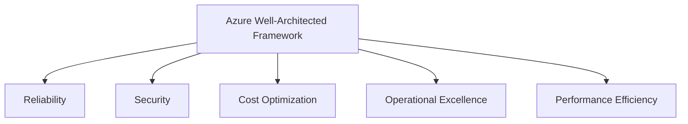

# Azure Well-Architected Framework

## Learning Goal

Learn the five pillars of the **Azure Well-Architected Framework** — Microsoft's guide for building secure, high-performing, resilient, and efficient systems.

---

## What Is the Well-Architected Framework?

The **Azure Well-Architected Framework** helps cloud architects and DevOps teams evaluate architectures against best practices. It is not a product you install — it is a **set of design principles and questions**.

Use it when you:

- Design a new workload on Azure
- Review an existing system before production
- Prepare for an architecture review with your team

Official support: **Azure Well-Architected reviews** and Microsoft Learn guidance — walks you through pillar questions.

---

## The Five Pillars

> Azure's framework emphasizes five pillars. (Compare carefully if you also know AWS's six-pillar model — sustainability themes appear in Azure guidance under efficient design and cost/ops practices.)

---

## Pillar 1: Reliability

**Focus:** Recover from failures, meet demand, and mitigate disruptions (network issues, AZ failures, misconfigurations).

### Key Ideas

| Principle | DevOps Practice |
|-----------|-----------------|
| Automatically recover from failure | VM Scale Sets, health probes, zone-redundant MySQL |
| Test recovery procedures | Restore from backup / snapshot drills |
| Scale horizontally | More small VMs vs one giant server |
| Stop guessing capacity | Autoscale on metrics |
| Manage change through automation | Terraform plan/apply with review |

### DevOps Example

Load Balancer health probes detect a broken VM and stop sending traffic. VMSS replaces it. Zone-redundant MySQL fails over if a zone fails.

You will practice related patterns in the Load Balancer + VMSS lab.

---

## Pillar 2: Security

**Focus:** Protect information, systems, and assets while delivering business value through risk assessments and mitigation strategies.

### Key Ideas

| Principle | DevOps Practice |
|-----------|-----------------|
| Implement strong identity foundation | Entra ID, RBAC, MFA, least privilege |
| Enable traceability | Activity Log, diagnostic settings |
| Protect data in transit and at rest | TLS, disk encryption, Blob encryption |
| Automate security best practices | IaC with NSGs, Azure Policy (advanced) |
| Prepare for security events | Incident response plan |

### DevOps Example

No daily Owner for routine work. CI/CD uses a **service principal** or managed identity (not long-lived secrets in Git). Storage accounts block anonymous public access by default. NSGs allow only required ports from the Load Balancer / your IP.

> Deep dive: [06-basic-azure-security.md](06-basic-azure-security.md) and [05-shared-responsibility-model.md](05-shared-responsibility-model.md)

---

## Pillar 3: Cost Optimization

**Focus:** Avoid unnecessary costs and understand where money is spent.

### Key Ideas

| Principle | DevOps Practice |
|-----------|-----------------|
| Implement cloud financial management | Budgets, Cost analysis, tagging |
| Adopt a consumption model | Pay for what you use; tear down dev envs |
| Measure overall efficiency | Cost per customer, cost per transaction |
| Stop spending on undifferentiated heavy lifting | Managed services over self-managed |
| Analyze and attribute expenditure | Tag `Project`, `Environment`, `Owner` |

### DevOps Example

Every Terraform resource gets tags. Cost Management Budget sends email at $10. Friday script runs `terraform destroy` on `env=dev` workspaces. MySQL right-sized after metrics review. Deleting the lab resource group removes orphan spend.

> Pricing basics: [05-cloud-pricing-basics.md](../01-cloud-fundamentals/05-cloud-pricing-basics.md)

---

## Pillar 4: Operational Excellence

**Focus:** Run and monitor systems to deliver business value, and improve supporting processes and procedures.

### Key Ideas

| Principle | DevOps Practice |
|-----------|-----------------|
| Operations as code | Terraform, Bicep for repeatable infra |
| Automate changes | CI/CD pipelines for app and infra |
| Learn from failures | Post-incident reviews, runbooks |
| Frequent small changes | Reduce blast radius of deployments |
| Annotate documentation | Runbooks, architecture diagrams in Git |

### DevOps Example

Your team stores nginx config in Git, deploys via GitHub Actions, and uses Azure Monitor alerts for CPU > 80%. When an alert fires, a runbook in the repo tells the on-call engineer what to check.

### Questions to Ask

- Can we deploy without manual Portal clicks?
- Do we have logs and metrics for every production service?
- Can we roll back a bad deploy in minutes?

---

## Pillar 5: Performance Efficiency

**Focus:** Use computing resources efficiently and adapt as requirements change.

### Key Ideas

| Principle | DevOps Practice |
|-----------|-----------------|
| Democratize advanced technologies | Use managed services (MySQL Flexible Server vs self-hosted DB) |
| Go global in minutes | Deploy in Regions close to users |
| Use serverless where it fits | Azure Functions for event-driven tasks |
| Experiment more often | Quick A/B tests with separate environments |
| Mechanical sympathy | Match VM size to workload (CPU vs memory) |

### DevOps Example

Instead of a large D-series "just in case," the team right-sizes to `Standard_B1s`, monitors CPU/memory for two weeks, and adjusts. Static assets move to Blob + CDN to reduce load on VMs.

---

## Pillars at a Glance

| Pillar | One-Line Summary | DevOps Keyword |
|--------|------------------|----------------|
| **Reliability** | Survive failure; meet SLAs | Multi-AZ, backups, VMSS |
| **Security** | Protect data and access | Entra, RBAC, encryption, least privilege |
| **Cost Optimization** | Spend wisely | Tags, budgets, teardown |
| **Operational Excellence** | Run systems well; automate ops | CI/CD, runbooks, IaC |
| **Performance Efficiency** | Right resources for the job | Right-sizing, CDN, managed services |

---

## How Pillars Work Together

No pillar stands alone. Trade-offs are normal:

| Decision | Pillar tension |
|----------|----------------|
| Multi-AZ everything | **Reliability** ↑, **Cost** ↑ |
| Largest VM size "to be safe" | **Reliability** ↑, **Cost** ↓, **Performance** wasted |
| No logging to save money | **Cost** ↑ short-term savings, **Security** and **Operational Excellence** ↓ |
| Aggressive auto shutdown of dev | **Cost** ↑, developer convenience ↓ |

Good architects document trade-offs explicitly.

---

## Common Confusion

| Confusion | Clarification |
|-----------|---------------|
| "Well-Architected is only for enterprises" | Teams of any size benefit from the pillar questions |
| "Security pillar replaces shared responsibility" | No. Shared responsibility defines *who* secures what; Well-Architected defines *how* to design well |
| "If I use VMSS, Reliability is solved" | Scale sets help, but you still need health probes, graceful deploys, and data durability |
| "Cost Optimization means always choose cheapest" | Choose **cost-effective** — cheapest option that meets reliability and performance needs |
| "Azure has exactly the same pillars as AWS" | Close conceptually; Azure documents **five** named pillars — know the Microsoft list for interviews |

---

## Small Example (Conceptual)

**Student lab web app architecture review:**

| Pillar | Current Lab Design | Improvement |
|--------|-------------------|-------------|
| Operational Excellence | Manual Portal deploy | Add Terraform in Module 05 |
| Security | NSG allows SSH from 0.0.0.0/0 | Restrict to your IP only |
| Reliability | Single VM | Load Balancer + VMSS across 2 AZs |
| Performance | `Standard_B1s` adequate for lab | Keep it — right-sized |
| Cost | Delete after lab | Add Cost Management budget |

---

## Interview-Style Questions

1. **Name the five pillars of the Azure Well-Architected Framework.**
   - *Reliability, Security, Cost Optimization, Operational Excellence, Performance Efficiency.*

2. **Which pillar covers multi-AZ and VM Scale Sets?**
   - *Reliability.*

3. **Which pillar covers Entra ID, RBAC, and encryption?**
   - *Security.*

4. **What is the Well-Architected Framework for?**
   - *A set of principles and review questions to design and evaluate high-quality Azure workloads.*

5. **Give one Cost Optimization practice for DevOps.**
   - *Resource tagging, budgets, tearing down non-production environments, right-sizing VMs, deleting unused resource groups.*

---

## References to Verify

- [Azure Well-Architected Framework](https://learn.microsoft.com/azure/well-architected/) — official overview
- [Well-Architected pillars](https://learn.microsoft.com/azure/well-architected/pillars) — detailed pillar documentation
- [Azure Architecture Center](https://learn.microsoft.com/azure/architecture/) — reference architectures

---

**Next:** [04-azure-cloud-adoption-framework.md](04-azure-cloud-adoption-framework.md) — how organizations adopt cloud, not just technology.
