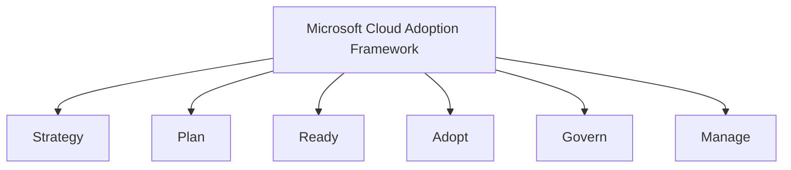
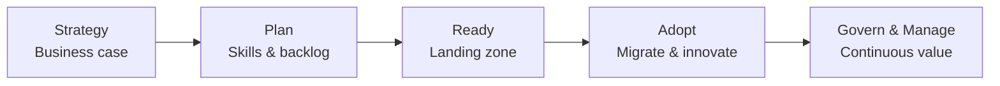

# Microsoft Cloud Adoption Framework (CAF)

## Learning Goal

Understand the **Microsoft Cloud Adoption Framework (CAF)** — how organizations plan people, process, and platform changes when moving to Azure, not just the technical migration.

---

## What Is Microsoft CAF?

Moving to cloud is not only a **technology** project. It is also a **business**, **people**, and **governance** change.

The **Microsoft Cloud Adoption Framework (CAF)** provides guidance and best practices so organizations can transform successfully across strategy, plan, ready, adopt, govern, and manage methodologies.

> **For DevOps engineers:** You will mostly work in **Ready** (landing zones), **Adopt** (migrate/innovate), **Govern**, and **Manage** — but knowing the full story helps you communicate with managers, security teams, and business stakeholders.

---

## CAF Methodologies Overview

Each methodology has **outcomes**, **actions**, and **stakeholders**. Below is a beginner-friendly summary.

---

## Strategy

**Stakeholders:** CEO, CFO, product owners, business managers

**Focus:** Align cloud adoption with business outcomes and measure value.

### Key Outcomes

| Outcome | Example |
|---------|---------|
| Faster time to market | Launch new feature in weeks, not months |
| Cost transformation | Shift CapEx to OpEx; optimize spend over time |
| Revenue enablement | Scale for seasonal traffic without upfront hardware |
| Business agility | Enter new markets using global Regions |

### DevOps Connection

You demonstrate business value when:

- CI/CD reduces deploy time from days to hours
- Autoscale prevents lost sales during traffic spikes
- Cost reports show dev environments shut down after hours

---

## Plan

**Stakeholders:** Program managers, engineering managers, training leads

**Focus:** Skills readiness, digital estate inventory, and prioritized roadmap.

### Key Outcomes

| Outcome | Example |
|---------|---------|
| Cloud fluency | Engineers understand Azure services and patterns |
| New roles | Cloud engineer, DevOps engineer, FinOps analyst |
| Training paths | Microsoft Learn, certifications, hands-on labs (like this course) |
| Prioritized backlog | Which apps migrate first |

### DevOps Connection

**You are the skills outcome in action.** This course builds:

- Portal skills → CLI → Terraform progression
- Naming conventions and cleanup habits
- Shared vocabulary for interviews and teams

---

## Ready

**Stakeholders:** Platform engineers, solutions architects, DevOps teams

**Focus:** Design and build the **landing zone** — the shared cloud foundation others deploy on.

### Key Outcomes

| Outcome | Example |
|---------|---------|
| Landing zone | Standard subscription, resource groups, VNet, RBAC baselines |
| Self-service | Developers deploy via Terraform modules without rebuilding networking |
| Hybrid connectivity | VPN/ExpressRoute to on-prem |
| Platform guardrails | Approved modules for VM, MySQL, Blob patterns |

### DevOps Connection

This is your **primary technical home** in CAF:

- VNet design (Module 03 custom VNet lab)
- CI/CD integration with Azure
- Terraform modules in Module 05
- Container Apps platform for container workloads

---

## Adopt

**Stakeholders:** Application teams, migration leads, DevOps

**Focus:** Migrate existing workloads and innovate with cloud-native patterns.

### Key Outcomes

| Outcome | Example |
|---------|---------|
| Rehost | Lift VMs to Azure Virtual Machines |
| Replatform | Move DB to Azure Database for MySQL |
| Refactor | Containers on Container Apps |
| New innovation | Event-driven Functions, modern APIs |

### DevOps Connection

Your course labs sit here — hands-on skills for pilots and production patterns.

---

## Govern

**Stakeholders:** CIO, compliance, finance, enterprise architects

**Focus:** Policies, controls, and accountability for cloud usage.

### Key Outcomes

| Outcome | Example |
|---------|---------|
| Policy enforcement | Only approved Regions and VM sizes |
| Compliance | Meet ISO, SOC, HIPAA requirements (industry-dependent) |
| Financial oversight | Budgets, chargeback by team tags |
| Risk management | Standard architectures approved by architecture board |

### DevOps Connection

| Practice | Governance tie-in |
|----------|-------------------|
| Resource tagging | Cost allocation and ownership |
| IaC code review | Changes audited in Git |
| Azure Policy (advanced) | Prevent creating resources in wrong Region |
| Separate subscriptions / RGs per environment | Prod vs/dev isolation |

---

## Manage

**Stakeholders:** SREs, operations managers, on-call engineers

**Focus:** Run production workloads reliably on Azure day to day.

### Key Outcomes

| Outcome | Example |
|---------|---------|
| Observability | Metrics, logs, traces in Azure Monitor |
| Event management | Alerts, on-call rotations, runbooks |
| Change management | Controlled deploys, maintenance windows |
| Continual improvement | Well-Architected reviews, capacity planning |

### DevOps Connection

| Activity | Manage capability |
|----------|-------------------|
| Alerts on VM CPU | Monitoring |
| MySQL backup and restore lab | Backup & recovery |
| Load Balancer health probes | Service health management |
| `terraform destroy` / RG delete in,dev | Environment management |

---

## CAF Summary Table

| Methodology | Primary Question | DevOps Role |
|-------------|------------------|-------------|
| **Strategy** | Why move to cloud? What value? | Show speed, cost, reliability wins |
| **Plan** | Who has skills? What is the roadmap? | Learn and share automation practices |
| **Ready** | What shared landing zone do teams use? | Build VNet, CI/CD, Terraform modules |
| **Adopt** | How do we migrate and innovate? | Deliver Portal/CLI/IaC workloads |
| **Govern** | What rules and guardrails? | Tags, IaC review, policy awareness |
| **Manage** | How do we run in production? | Monitoring, backups, incident response |

---

## CAF vs Well-Architected Framework

| Framework | Scope | When to Use |
|-----------|-------|-------------|
| **Microsoft CAF** | Organization-wide cloud **adoption** (people, process, platform) | Migration planning, executive alignment |
| **Well-Architected** | Individual **workload** architecture quality | Design review of one application |

They complement each other: CAF gets the organization to cloud; Well-Architected keeps each system healthy.

---

## Adoption Journey (CAF Context)

Your course labs sit in the **Ready** and **Adopt** learning phase — hands-on skills for pilots and production patterns.

---

## Common Confusion

| Confusion | Clarification |
|-----------|---------------|
| "CAF is only for managers" | Engineers benefit from knowing stakeholder perspectives |
| "Ready = only creating a subscription" | Ready means the entire shared foundation: network, identity, deployment patterns |
| "Govern replaces Security pillar" | CAF Govern is organizational; Well-Architected Security is workload design — related but different scope |
| "We adopted cloud when we created a subscription" | Adoption includes people, governance, and operations — not just subscription creation |
| "DevOps only cares about Ready/Adopt" | DevOps touches Ready, Adopt, Govern, and Manage |

---

## Small Example (Conceptual)

**Company launches a new mobile app on Azure:**

| Methodology | Action |
|-------------|--------|
| Strategy | Project ROI: 50% faster releases |
| Plan | Train 10 engineers with this Azure course |
| Ready | Shared VNet + Container Apps environment for all microservices |
| Adopt | Deploy first microservice to Container Apps |
| Govern | Mandate tagging; separate RG for prod vs training |
| Manage | Azure Monitor dashboards, on-call alerts |

---

## Interview-Style Questions

1. **What is Microsoft CAF?**
   - *A framework of methodologies to guide organizational cloud adoption beyond just technology.*

2. **Name the main CAF methodologies.**
   - *Strategy, Plan, Ready, Adopt, Govern, Manage.*

3. **Which methodology covers training and skills?**
   - *Plan (with Strategy defining the business why).*

4. **How is CAF different from Well-Architected?**
   - *CAF focuses on organization-wide adoption; Well-Architected evaluates individual workload architecture.*

5. **Which CAF methodology is most aligned with building a shared VNet and Terraform modules?**
   - *Ready.*

---

## References to Verify

- [Microsoft Cloud Adoption Framework](https://learn.microsoft.com/azure/cloud-adoption-framework/) — official overview
- [CAF methodologies](https://learn.microsoft.com/azure/cloud-adoption-framework/) — detailed guidance
- [Azure Migrate](https://azure.microsoft.com/products/azure-migrate/) — migration tooling

---

**Next:** [05-shared-responsibility-model.md](05-shared-responsibility-model.md) — who secures what in Azure.
