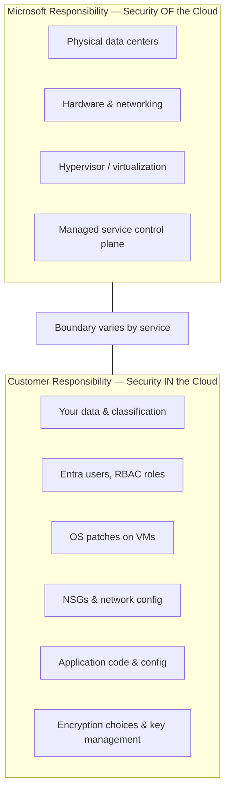
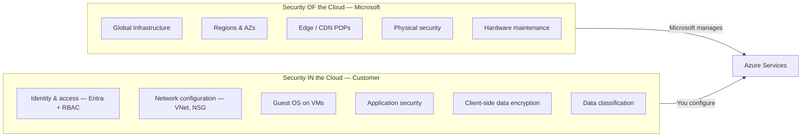

# Shared Responsibility Model

## Learning Goal

Explain clearly who is responsible for what in Azure:

- **Microsoft** is responsible for security **OF** the cloud
- **Customer** is responsible for security **IN** the cloud

This is one of the most important concepts for interviews and real operations.

---

## The Core Idea

Security and operations are **shared** between Microsoft and you. The boundary depends on the service type.

---

## Diagram 3 (Required): Shared Responsibility Model

---

## Responsibility Shifts by Service Model

| Service Type | Microsoft Manages More | You Manage More |
|--------------|------------------------|-----------------|
| **IaaS (VM)** | Physical infra, hypervisor | OS, apps, network config, data |
| **Managed DB (MySQL Flexible Server)** | OS patching, DB engine patching, hardware | DB users, schemas, firewall/VNet rules, encryption settings |
| **Object storage (Blob)** | Storage durability, physical layer | Storage account policies, public access, encryption, blob data |
| **SaaS (external)** | Entire application stack | Users, config, data you upload |

> **Trend:** As you move to more managed services, Microsoft takes more operational burden — but you **never** hand off all security responsibility.

---

## Service Examples (Required)

### Azure Virtual Machines

| Microsoft Responsible (OF cloud) | Customer Responsible (IN cloud) |
|----------------------------------|--------------------------------|
| Physical servers and racks | Operating system patches |
| Hypervisor security | Installed software (nginx, Docker) |
| Physical network in data center | NSGs attached to NIC / subnet |
| VM service availability in Region | SSH key management |
| | Managed identity / RBAC attached to VM |
| | Data on OS disk / attached managed disks |
| | Application vulnerabilities |

**DevOps example:** You launch Ubuntu on a VM. Microsoft secures the hypervisor. **You** must `apt update` for OS patches, configure the NSG to allow only port 443, and not store secrets in `/home/azureuser/.bashrc`.

---

### Azure Blob Storage

| Microsoft Responsible (OF cloud) | Customer Responsible (IN cloud) |
|----------------------------------|--------------------------------|
| Durability and availability of storage platform | Storage account names and blob paths |
| Physical storage infrastructure | **Access policies**, RBAC, SAS |
| Blob API service | **Anonymous / public access** settings |
| | Encryption configuration |
| | Classification of sensitive data in blobs |
| | Lifecycle rules and versioning choices |

**DevOps example:** A misconfigured container that exposes customer PII to the internet is **your** responsibility — not Microsoft's. Azure provides public access controls; you must enable and verify them.

---

### Azure Database for MySQL Flexible Server

| Microsoft Responsible (OF cloud) | Customer Responsible (IN cloud) |
|----------------------------------|--------------------------------|
| Database engine patching (managed) | Database users and passwords |
| Underlying OS for managed instance | Firewall / VNet rules (who can connect) |
| Physical storage and replication infra | Schema design, queries, indexes |
| Automated backup infrastructure (when enabled) | Whether to enable encryption / TLS |
| HA / zone-redundant failover mechanisms | Backup retention settings |
| | Network placement (public access vs private) |

**DevOps example:** MySQL in a restricted network with strong password and rules allowing only the app VM — **your** design. Microsoft patches MySQL minor versions on maintenance windows.

---

### Microsoft Entra ID + Azure RBAC

| Microsoft Responsible (OF cloud) | Customer Responsible (IN cloud) |
|----------------------------------|--------------------------------|
| Identity platform availability and API | **Creating and deleting users** |
| Authentication service infrastructure | **Role assignments** (permissions granted) |
| Control plane security | MFA enforcement for users |
| | App registration secrets — create, rotate, delete |
| | Least privilege RBAC scopes |
| | Not sharing credentials in Git |

**DevOps example:** If a developer commits a client secret to GitHub and an attacker uses it — that is a **customer** failure in the shared model. Microsoft provided Entra/RBAC; you misused credentials.

---

## Comparison Table — All Four Services

| Area | VM | Blob | MySQL Flexible | Entra/RBAC |
|------|-----|------|----------------|------------|
| Physical security | Microsoft | Microsoft | Microsoft | Microsoft |
| Hypervisor | Microsoft | N/A | Microsoft | N/A |
| OS patching | **Customer** | N/A | Microsoft | N/A |
| Network firewall rules | **Customer** (NSG) | N/A | **Customer** (firewall/VNet) | N/A |
| Data encryption config | **Customer** | **Customer** | **Customer** | N/A |
| Who can access | **Customer** (RBAC) | **Customer** (RBAC + policies) | **Customer** (RBAC + network) | **Customer** |
| Application security | **Customer** | N/A | **Customer** (SQL injection etc.) | N/A |

---

## What This Means for DevOps Daily Work

| Your Task | Shared Model Reminder |
|-----------|----------------------|
| Launch VM | You own OS hardening and NSGs |
| Create storage account | You own public access and RBAC |
| Deploy MySQL Flexible Server | You own network exposure and credentials |
| Assign RBAC roles | You own least privilege and secret rotation |
| Use Terraform | You own what `apply` creates — including insecure rules |

**Microsoft secures the building. You secure what you put inside and who gets keys.**

---

## Common Confusion

| Confusion | Clarification |
|-----------|---------------|
| "Microsoft is responsible for my data security" | Microsoft provides encryption tools; **you** enable them and control access |
| "Managed service = Microsoft handles everything" | MySQL still needs your network rules, credentials, and design |
| "If Azure gets hacked, it's always Microsoft fault" | Depends on layer. Customer misconfig is the most common breach cause |
| "Shared responsibility means 50/50" | Split is **not** equal — it is **layer-based** |
| "Compliance certification = my app is compliant" | Microsoft certifications cover **OF cloud**. You must still prove **IN cloud** controls |

---

## Small Example (Conceptual)

**Incident:** Public Blob container with employee salary CSV files.

| Question | Answer |
|----------|--------|
| Did Microsoft fail physical security? | No |
| Did Microsoft fail to offer public access controls? | No — features exist |
| Who is responsible? | **Customer** misconfigured anonymous access |
| Fix | Disable public access, audit RBAC/SAS, enable logging, train team |

---

## Interview-Style Questions

1. **State the shared responsibility model in one sentence each for Microsoft and customer.**
   - *Microsoft: security OF the cloud. Customer: security IN the cloud.*

2. **Who patches the OS on an Azure VM?**
   - *The customer.*

3. **Who patches the MySQL engine on Flexible Server?**
   - *Microsoft manages engine patching; customer manages configuration and access.*

4. **Who is responsible if a Blob container is accidentally public?**
   - *The customer — container/account access configuration is customer responsibility.*

5. **Who manages RBAC role assignments?**
   - *The customer.*

6. **Does shared responsibility change for SaaS on Azure?**
   - *For Azure services like Blob/MySQL, Microsoft takes more at managed layers. For third-party SaaS, that vendor has their own model too.*

---

## References to Verify

- [Shared responsibility in the cloud](https://learn.microsoft.com/azure/security/fundamentals/shared-responsibility) — official page
- [Azure security documentation](https://learn.microsoft.com/azure/security/) — customer security best practices
- [Azure Database for MySQL security](https://learn.microsoft.com/azure/mysql/flexible-server/concepts-security) — MySQL-specific customer responsibilities
- [Blob storage security](https://learn.microsoft.com/azure/storage/blobs/security-recommendations) — Blob access and encryption

---

**Next:** [06-basic-azure-security.md](06-basic-azure-security.md) — practical security habits before your first lab.
