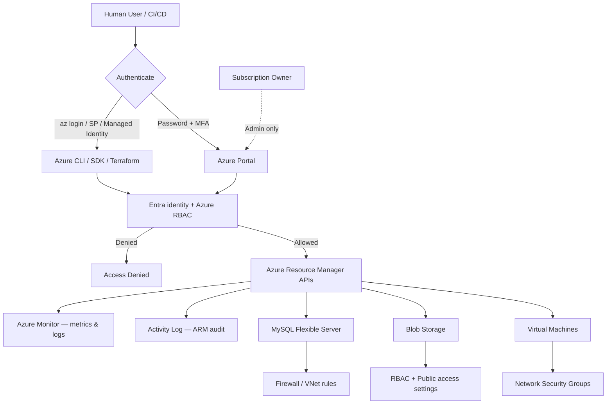

# Basic Azure Security

## Learning Goal

Learn practical Azure security fundamentals every DevOps engineer applies **before** the first Portal lab: identity, access, network, encryption, and monitoring basics.

---

## Security Is Your Job in the Cloud

Azure provides powerful security **tools**. You must **configure** them correctly.

Remember from the shared responsibility model:

- **Microsoft** → security **OF** the cloud
- **You** → security **IN** the cloud

This lesson focuses on what **you** control from day one.

---

## Diagram 4 (Required): Basic Azure Account and Security Flow



---

## 1. Identity — Owner vs Lab User vs Managed Identity

| Identity | When to Use | Rules |
|----------|-------------|-------|
| **Subscription Owner** | Subscription setup, RBAC changes, rare recovery | Enable MFA; do not use for daily labs |
| **Entra user + Contributor** | Individual human access (lab, work) | MFA; least privilege; one user per person |
| **Service principal / Managed identity** | Automation, CI/CD, VM-to-Azure access | Temporary or non-interactive; prefer managed identity over long-lived secrets |

### DevOps Example

| Bad | Good |
|-----|------|
| Whole team shares Owner login | Each engineer has Entra user + scoped RBAC |
| CI pipeline uses client secret in `.env` committed to Git | CI uses OIDC federation / managed identity |
| Owner on every student | Contributor on lab resource group for training |

You will practice Entra/RBAC in the first console lab.

---

## 2. Least Privilege

Grant **only** the permissions needed — nothing more.

### Example Role Mindset

| Task | Permission Needed |
|------|-------------------|
| Student VM lab | Contributor on `devops-lab-<yourname>-rg` |
| CI deploy to Blob | Storage Blob Data Contributor on one storage account — not Owner on `*` |
| Read-only auditor | Reader on subscription or RG |

Start restrictive; add permissions when blocked — not the reverse.

---

## 3. Multi-Factor Authentication (MFA)

MFA requires a second factor (phone app, hardware token) after password.

| Account | MFA |
|---------|-----|
| Subscription / tenant admins | **Required** — enable in first account setup |
| Entra users (Portal access) | **Strongly recommended** |
| Programmatic-only CI identities | Prefer managed identity / federation; no static passwords |

---

## 4. Credential Hygiene

| Rule | Why |
|------|-----|
| Never commit client secrets or keys to Git | Public repos are scanned by attackers in minutes |
| Rotate secrets periodically | Limits blast radius if leaked |
| Delete unused app registrations / keys | Reduces attack surface |
| Use placeholders in course materials | e.g. `<CLIENT_SECRET>`, not real secrets |
| Prefer managed identity on VMs | Temporary credentials without storing secrets |

### Placeholder Example (Not Real)

```bash
# Local only — never commit
export ARM_CLIENT_ID="00000000-0000-0000-0000-000000000000"
export ARM_CLIENT_SECRET="PLACEHOLDER-NOT-A-REAL-SECRET"
export ARM_TENANT_ID="11111111-1111-1111-1111-111111111111"
export ARM_SUBSCRIPTION_ID="22222222-2222-2222-2222-222222222222"
```

---

## 5. Network Security

### Network Security Groups (Firewall for NIC/Subnet)

| Concept | Detail |
|---------|--------|
| **Rules** | Allow/deny inbound and outbound by port, protocol, source/destination |
| **Default** | Deny inbound from internet unless you open it |
| **Best practice** | Allow SSH (22) only from **your IP**, not `0.0.0.0/0` |
| **Web traffic** | Allow 80/443 from Load Balancer / your IP as the lab requires |

### Public vs Private Subnets

| Subnet | Route to Internet | Typical Placement |
|--------|-------------------|-------------------|
| **Public** | Yes (with Public IP) | Load Balancer frontends, bastion (if used) |
| **Private** | No direct public exposure | Application servers, MySQL |

**DevOps rule:** Databases should not be publicly accessible in production.

---

## 6. Data Protection

| Layer | Options |
|-------|---------|
| **In transit** | HTTPS/TLS, SSH |
| **At rest — Managed Disks** | Azure Disk Encryption / platform encryption |
| **At rest — Blob** | Storage service encryption (default) / customer-managed keys (advanced) |
| **At rest — MySQL** | Encryption at rest; enforce TLS for connections |

You manage encryption **choices**. Azure provides encryption **mechanisms**.

**Key Vault awareness:** Use Azure Key Vault later for secrets and keys — do not store passwords in Git or plain text scripts.

---

## 7. Blob Public Access

Blob data leaks are a top Azure security incident pattern.

| Control | Purpose |
|---------|---------|
| **Allow Blob public access** setting | Prevent accidental anonymous containers |
| **Container public access level** | Private vs blob/container anonymous |
| **RBAC / SAS** | Who can read or write blobs |

Always verify: "Should this container ever be public?" For labs: usually **no** (except intentional static website labs).

---

## 8. Logging and Monitoring (Awareness)

You will use these more in production; know they exist:

| Service | Purpose |
|---------|---------|
| **Activity Log** | Audit of ARM operations (who created that VM?) |
| **Azure Monitor** | Metrics and logs (CPU, disk, application logs) |
| **Microsoft Defender for Cloud** | Security posture / recommendations (advanced) |
| **Microsoft Sentinel** | SIEM (advanced) |

**Operational Excellence:** You cannot secure what you cannot see.

---

## 9. Production Follow-Through

This course stays intentionally foundational. In production, a DevOps engineer should extend these basics with:

- Activity Log / diagnostic settings enabled and reviewed
- Azure Monitor alerts for important infrastructure and application signals
- Managed identities for workloads and CI/CD instead of long-lived secrets
- Encryption choices documented for disks, Blob, MySQL, and backups
- Patch and vulnerability management for VMs and container images
- Security review of public exposure, especially `0.0.0.0/0`, before deployment

The labs teach the building blocks first. Production hardening is the next layer, not a replacement for these basics.

---

## Security Checklist Before Module 03 Labs

| # | Item | Status |
|---|------|--------|
| 1 | Cost Management budget configured | ☐ |
| 2 | MFA enabled on Entra | ☐ |
| 3 | Lab user / Contributor scope planned (not Owner daily) | ☐ |
| 4 | No secrets in Git | ☐ |
| 5 | Region set to `southeastasia` (or agreed region) | ☐ |
| 6 | Understand NSG basics | ☐ |
| 7 | Read [COST-AND-SAFETY-GUIDE.md](../COST-AND-SAFETY-GUIDE.md) | ☐ |

---

## Real-World DevOps Security Scenarios

| Scenario | Secure Approach |
|----------|-----------------|
| VM needs to read Blob | Attach **managed identity** with Blob Data Reader on one account |
| Developer needs Portal | Entra user + MFA + Contributor on lab RG |
| Terraform in CI/CD | OIDC / federated credentials — no static secrets in repo |
| Temporary contractor access | Time-bound Entra guest / role; remove when project ends |
| SSH to VM for debugging | Your IP only in NSG; use SSH key |

---

## Common Confusion

| Confusion | Clarification |
|-----------|---------------|
| "NSG and Azure Firewall are the same" | NSG = basic allow/deny rules on NIC/subnet. Firewall = richer network security appliance (advanced) |
| "My VM is private so it's secure" | Private networking helps, but RBAC and app vulnerabilities still matter |
| "HTTPS on the LB means database is encrypted" | TLS to the front encrypts client-to-LB; DB connections need separate TLS config |
| "Azure encrypts everything by default" | Many services offer default encryption now, but you must verify per service and historically created resources |
| "I'll add security later after the lab works" | Configure NSGs and RBAC correctly on first launch — retrofitting is harder |

---

## Small Example (Conceptual)

**Insecure lab setup:**

- Owner account for every click
- VM NSG: SSH from `0.0.0.0/0`
- Blob container public read
- Client secret in GitHub repo

**Secure lab setup:**

- Entra lab user with MFA + Contributor on lab RG
- VM NSG: SSH from `203.0.113.10/32` (your IP)
- Blob public access disabled
- Secrets only in local env / Key Vault — never in Git

---

## Interview-Style Questions

1. **What is least privilege?**
   - *Granting only the minimum permissions required to perform a task.*

2. **Why avoid using Subscription Owner daily?**
   - *Owner can change RBAC and broad control; compromise or mistakes have larger blast radius.*

3. **What is the difference between Entra ID and Azure RBAC?**
   - *Entra authenticates identities; RBAC authorizes what those identities can do on Azure resources.*

4. **Why not allow SSH from 0.0.0.0/0?**
   - *Exposes SSH to the entire internet, increasing brute-force and exploit risk.*

5. **What does disabling Blob public access do?**
   - *Prevents anonymous public access to containers and blobs at the account level.*

6. **What is Activity Log used for?**
   - *Recording Azure Resource Manager activity for audit and security investigation.*

---

## References to Verify

- [Azure security best practices](https://learn.microsoft.com/azure/security/fundamentals/best-practices-and-patterns) — architecture guidance
- [Azure RBAC best practices](https://learn.microsoft.com/azure/role-based-access-control/best-practices) — official RBAC guidance
- [Microsoft Entra ID](https://learn.microsoft.com/entra/fundamentals/whatis) — identity basics
- [Blob anonymous access](https://learn.microsoft.com/azure/storage/blobs/anonymous-read-access-configure) — public access controls
- [Network security groups](https://learn.microsoft.com/azure/virtual-network/network-security-groups-overview) — NSG documentation

---

**Next:** [diagrams.md](diagrams.md) — visual summary of Module 02.

**Ready for labs:** [03-console-labs/01-entra-rbac-basics](../03-console-labs/01-entra-rbac-basics/README.md)
