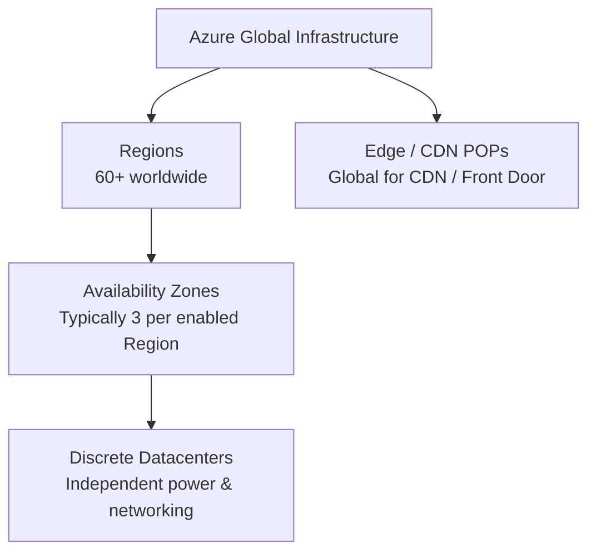
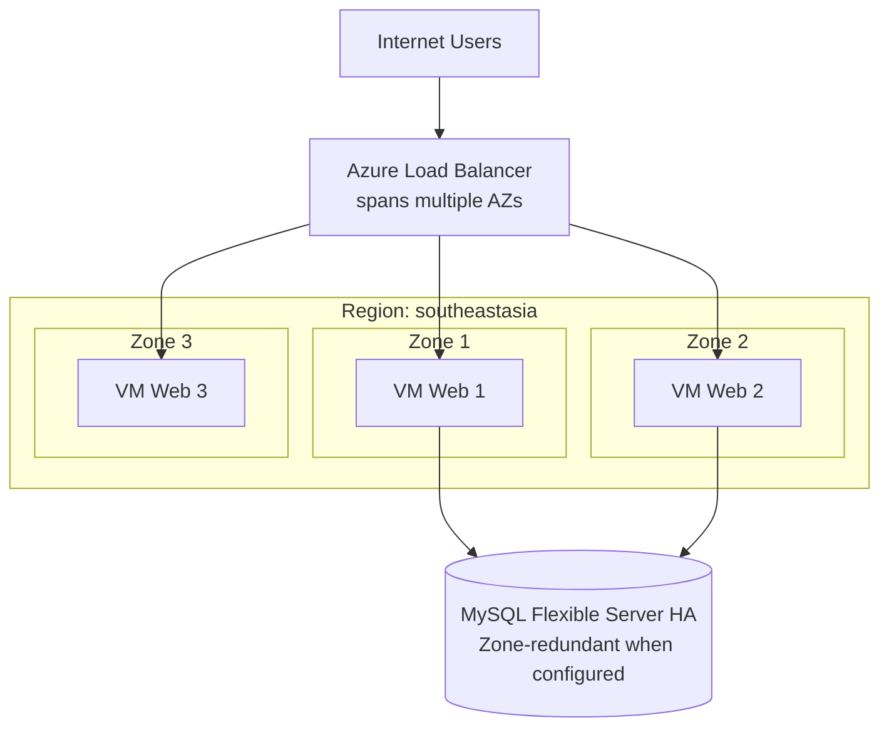
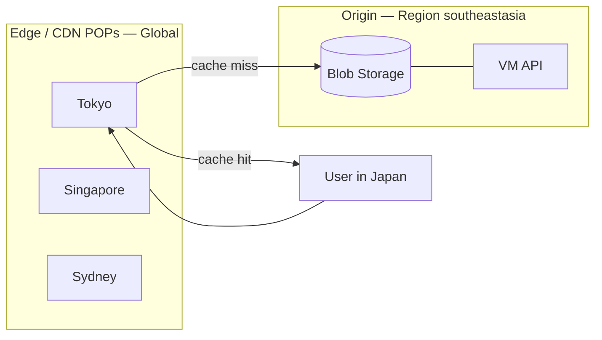
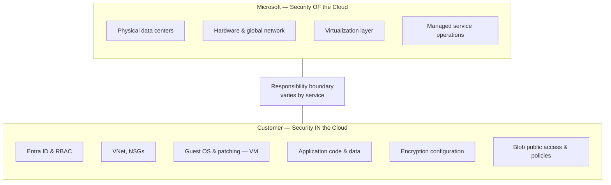
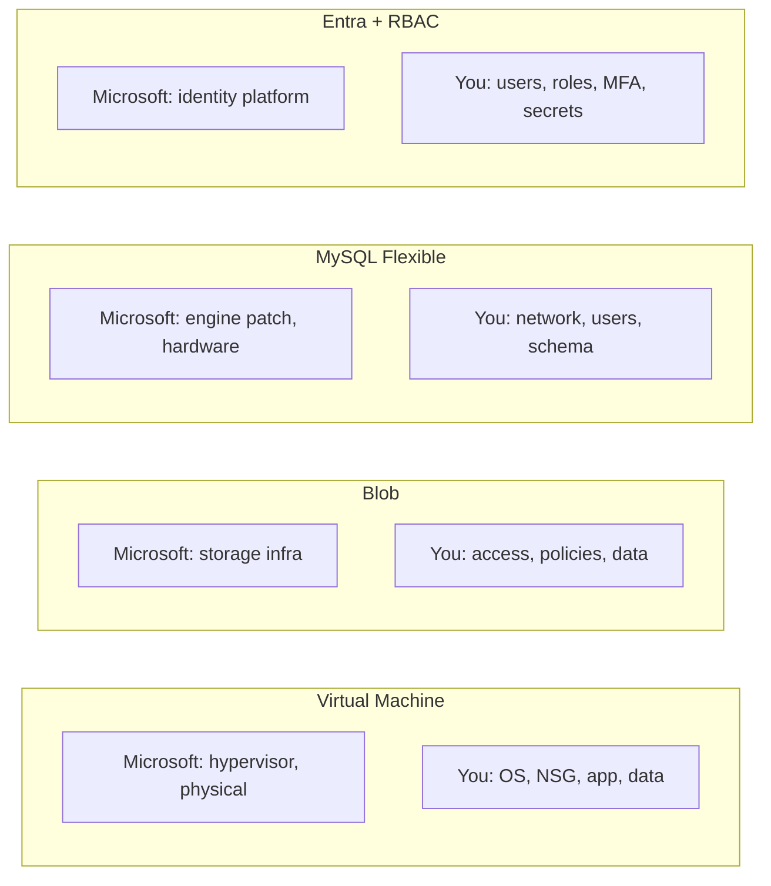
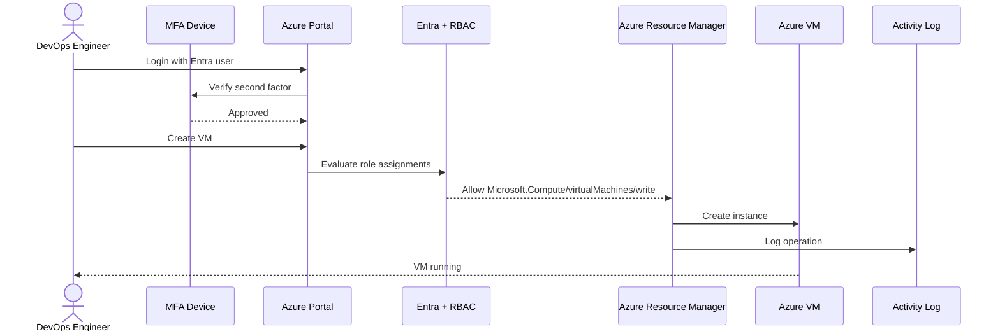
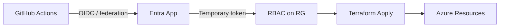
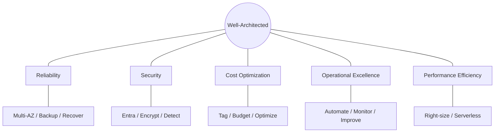
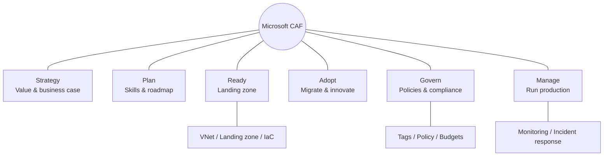
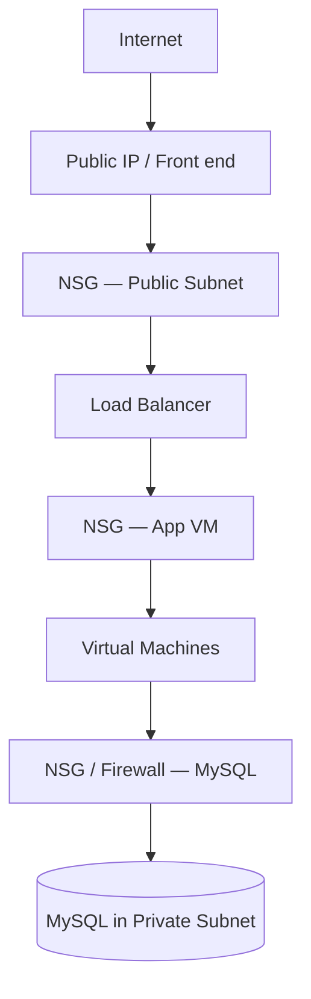

# Azure Foundation — Diagrams

Visual reference for Module 02. All diagrams use [Mermaid](https://mermaid.js.org/) syntax and render on GitHub.

---

## 1. Azure Global Infrastructure Overview

---

## 2. Region and Availability Zones (Required)

**Diagram 2:** How components span AZs in one Region.

**Key takeaway:** Load balancer and compute spread across AZs → survives single datacenter failure.

---

## 3. Region vs Edge Location

Edge locations cache content; Regions run your workloads.

---

## 4. Shared Responsibility Model (Required)

**Diagram 3:** Security OF vs IN the cloud.

### By Service (Quick View)

---

## 5. Basic Azure Account and Security Flow (Required)

**Diagram 4:** How identity flows to services and controls.

### CI/CD Path (Identity-Based)

Preferred over long-lived client secrets in pipelines.

---

## 6. Well-Architected — Five Pillars

---

## 7. Microsoft CAF — Methodologies

---

## 8. VNet Security Layers (Preview for Module 03)

Defense in depth: NSGs + private subnets for data tier.

---

## Cross-Module Diagram Index

| Diagram | Also In |
|---------|---------|
| SaaS / PaaS / IaaS responsibility | [01-cloud-fundamentals/diagrams.md](../01-cloud-fundamentals/diagrams.md) |
| Region / AZ | This file + [02-region-az-edge-location.md](02-region-az-edge-location.md) |
| Shared responsibility | This file + [05-shared-responsibility-model.md](05-shared-responsibility-model.md) |
| Account security flow | This file + [06-basic-azure-security.md](06-basic-azure-security.md) |

---

## How to Practice

1. Open any diagram in VS Code with Mermaid preview
2. Cover the labels and redraw from memory on paper
3. Explain each diagram to a classmate in under 2 minutes
4. Link diagram concepts to an upcoming lab (e.g., diagram 2 → Load Balancer lab)

---

## References to Verify

- [Azure Architecture icons](https://learn.microsoft.com/azure/architecture/icons/) — build professional diagrams
- [Mermaid Live Editor](https://mermaid.live/) — test diagram syntax
- [Azure Well-Architected](https://learn.microsoft.com/azure/well-architected/) — pillar exercises and guidance

---

**Modules 01 and 02 complete.** Start hands-on work: [03-console-labs/01-entra-rbac-basics](../03-console-labs/01-entra-rbac-basics/README.md)
