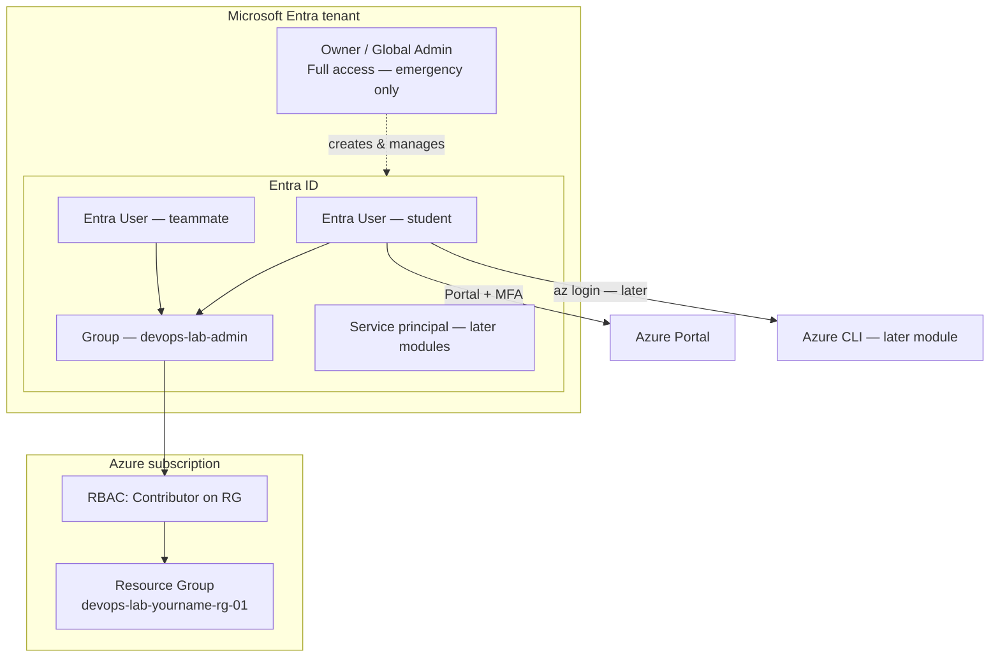

# Owner / Global Admin vs Entra Lab User

## 1. Concept Overview

When you create or get access to an Azure subscription, you may sign in with a highly privileged identity — often the **subscription Owner**, a **User Access Administrator**, or (in Microsoft Entra ID) a **Global Administrator**. These are like the AWS **root user**: powerful and dangerous for everyday work.

For everyday work, Microsoft recommends separate **Microsoft Entra ID users** (workforce identities) with **Azure RBAC** roles scoped to what they need — typically a **resource group**, not the entire subscription.

| Identity | What it is |
|----------|------------|
| **Subscription Owner / Global Admin** | Near-full control of billing, identities, or all resources — emergency / setup only |
| **Entra ID user** | Named user in your tenant with specific directory and Azure RBAC permissions |

Think of Owner / Global Admin as the **building owner master key**. Entra users are **staff badges** with limited access.

---

## 2. Why DevOps Engineers Use Entra + RBAC (Not Owner Daily)

| Reason | Explanation |
|--------|-------------|
| **Least privilege** | Developers get only what they need — not full subscription control |
| **Audit trail** | Activity logs and Entra sign-in logs show *which user* did an action |
| **Safer daily work** | If a lab password leaks, damage is limited by RBAC scope |
| **Team scaling** | Each person gets their own user — no shared passwords |
| **Automation** | CI/CD uses **service principals** or managed identities, not Owner credentials |

**DevOps rule:** Use Owner / Global Admin only for rare setup and break-glass tasks. Use a scoped Entra user + RBAC for labs, CLI, and Terraform.

---

## 3. Important Terms

| Term | Meaning |
|------|---------|
| **Microsoft Entra ID** | Identity plane (formerly Azure AD) — users, groups, MFA, app registrations |
| **Azure RBAC** | Authorization on Azure resources (Owner, Contributor, Reader, custom roles) |
| **Subscription Owner** | Full control of subscription resources and role assignments |
| **Global Administrator** | Directory-wide Entra privilege — not the same as Azure RBAC Owner |
| **Entra group** | Collection of users; can be assigned Azure RBAC roles |
| **Role assignment** | Role + principal + scope (subscription, RG, or resource) |
| **MFA** | Multi-Factor Authentication — second step after password |
| **Resource group (RG)** | Deploy/manage boundary — lab scope for Contributor |

---

## 4. Architecture Diagram

---

## 5. Before You Start

| Requirement | Detail |
|-------------|--------|
| **Azure subscription** | Active subscription (Free trial or pay-as-you-go) |
| **Region** | Default lab region: `southeastasia` (Southeast Asia). You may use another region if your instructor allows — stay consistent for all labs |
| **Browser** | Chrome, Firefox, or Edge |
| **Login** | You need Owner / admin access **once** to set up Entra users, MFA, and RBAC |
| **Cost** | Entra basics and RBAC are **free** — no charge for users, groups, or role assignments |

> **Cost warning:** Identity and RBAC cost nothing. The risk is *what* lab users can create (VMs, MySQL, etc.) in later labs. Use budgets and cost alerts.

---

## 6. Step-by-Step Azure Portal Lab

### Part A — Sign in as Owner / admin and open Entra

1. Open [https://portal.azure.com/](https://portal.azure.com/)
2. Sign in with your **high-privilege** account (subscription Owner or tenant admin used for setup)
3. Confirm the portal region picker for resource creation later will use **Southeast Asia** — identity work is tenant-wide, not regional
4. In the search bar at the top, type **Microsoft Entra ID** and open **Microsoft Entra ID**

### Part B — Enable MFA for privileged accounts (required)

1. In Entra left menu, open **Users** → select your admin account (or use **Protect** / Conditional Access if your tenant already enforces MFA)
2. Prefer enabling **Security defaults** or Conditional Access MFA per your organization
3. For personal/training tenants: open your account → **Authentication methods** / follow prompts to register **Authenticator app** (Microsoft Authenticator)
4. Complete MFA registration with the phone app

> **Why:** Owner / Global Admin without MFA is a major security risk. One stolen password = subscription or tenant takeover.

### Part C — Review security posture on the dashboard

1. On Entra **Overview**, note **Tenant ID** and domain name
2. Open **Users**, **Groups**, and **Roles and administrators** — just explore the layout
3. Note recommendations such as:
   - MFA for privileged users
   - Limit Global Administrator count
   - Prefer PIM / time-bound elevation in real companies (awareness only)

### Part D — Understand Azure RBAC vs Entra roles

1. Search **Subscriptions** → open your subscription → **Access control (IAM)**
2. Note **Role assignments** — who has Owner / Contributor at subscription scope
3. Search **Resource groups** — later you will assign Contributor at **RG scope**, not subscription

### Part E — Verify you are not overusing Global Admin for labs

1. Entra → **Roles and administrators** → **Global Administrator**
2. Confirm only break-glass / necessary accounts hold Global Admin
3. Lab work will use a separate Entra user with **Contributor on a resource group**

---

## 7. Validation / Testing Steps

| Check | Expected Result |
|-------|-----------------|
| MFA on privileged account | Authenticator (or Conditional Access) required for sign-in |
| Entra service opens | You can navigate Users, Groups, Roles |
| IAM on subscription visible | Access control (IAM) lists role assignments |
| Region plan | You will use `southeastasia` for resource labs |

Sign out and sign in again with MFA to confirm MFA works.

---

## 8. Troubleshooting

| Problem | Solution |
|---------|----------|
| Cannot find Microsoft Entra ID | Use top search bar — type "Microsoft Entra ID" or "Azure Active Directory" |
| MFA codes rejected | Check phone time is automatic/synced; wait for new code |
| Locked out of admin | Use account recovery; contact tenant admin or Microsoft support if needed |
| Wrong subscription | Click directory/subscription filter (top right) → select correct subscription |
| "Insufficient privileges" in Entra | You need Global Admin or User Administrator (or equivalent) to create users |

---

## 9. Cleanup

This lesson creates no resources to delete. Keep MFA enabled on privileged accounts.

| Item | Action |
|------|--------|
| MFA on Owner / break-glass | **Keep** — do not remove |
| Entra lab users | None created yet — nothing to delete |

---

## 10. Interview Questions

1. **What is a subscription Owner?**
   - *A principal with full control of Azure resources and role assignments in that subscription.*

2. **Why should you not use Global Admin / Owner for daily tasks?**
   - *Unlimited impact, poor separation of duties, and high damage if credentials are compromised.*

3. **What is MFA and why use it on privileged accounts?**
   - *A second authentication factor that protects against password theft.*

4. **What is the difference between an Entra user and a managed identity / service principal?**
   - *User is a long-term human identity; service principal / managed identity is for apps and automation with credentials or identity federation.*

5. **Should you grant Contributor at subscription scope for every student?**
   - *Prefer resource-group scope for labs — limits blast radius.*

---

## 11. What We Achieved

- Understood **Owner / Global Admin vs Entra lab user**
- Enabled or verified **MFA** on privileged accounts
- Explored **Entra ID** and **Azure RBAC (IAM)** layout
- Set mental default region to **`southeastasia`** for later labs

**Next:** [02-create-lab-user.md](02-create-lab-user.md) — create your lab Entra user.

---

## 12. References

- [Microsoft Entra ID documentation](https://learn.microsoft.com/entra/fundamentals/whatis)
- [Azure RBAC overview](https://learn.microsoft.com/azure/role-based-access-control/overview)
- [Secure privileged access](https://learn.microsoft.com/azure/security/fundamentals/identity-management-best-practices)
