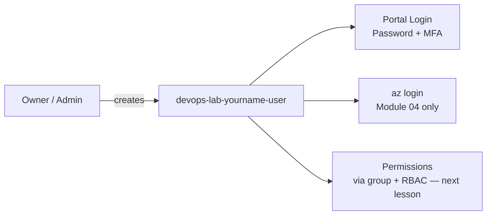

# Create Lab Entra User

## 1. Concept Overview

A **Microsoft Entra ID user** is a named identity in your tenant. Each student should have their own Entra user for labs instead of sharing Owner / Global Admin.

Your lab user will have:

- **Portal access** — sign in to Azure Portal with password + MFA
- **Azure CLI / Terraform access later** — `az login` as this user (Module 04) — no service principal secrets in this lesson

**Naming pattern for this course:**

```
devops-lab-<yourname>-user
```

Example: `devops-lab-faizul-user`

The UPN (sign-in name) typically looks like:

```
devops-lab-<yourname>-user@<your-tenant-domain>
```

Example: `devops-lab-faizul-user@contoso.onmicrosoft.com`

---

## 2. Why DevOps Engineers Use Separate Entra Users

| Practice | Benefit |
|----------|---------|
| One user per person | Clear audit trail in activity / sign-in logs |
| Separate lab vs production tenants (companies) | Blast radius control |
| Credentials per user | Revoke one identity without affecting whole team |
| Password / MFA policy | Enforce strong authentication |

---

## 3. Important Terms

| Term | Meaning |
|------|---------|
| **UPN** | User Principal Name — sign-in email-style name |
| **Tenant domain** | e.g. `something.onmicrosoft.com` or custom domain |
| **Authentication methods** | Password, Authenticator app, etc. |
| **Tags** | Azure resource tags apply later on RGs/VMs — use `Project=azure-basic`, `Owner=<yourname>` |

---

## 4. Architecture Diagram



---

## 5. Before You Start

| Requirement | Detail |
|-------------|--------|
| **Signed in as** | Owner / User Administrator / Global Admin (enough rights to create users) |
| **Region** | Identity is tenant-wide; resource labs use `southeastasia` |
| **Name ready** | `devops-lab-<yourname>-user` |
| **MFA app** | Microsoft Authenticator (or instructor-approved app) |

> **Cost warning:** Entra users are free for this lab pattern. Do not create unused app registrations or client secrets.

---

## 6. Step-by-Step Azure Portal Lab

### Step 1 — Open Entra Users

1. Sign in to Azure Portal as **admin**
2. Search **Microsoft Entra ID** → open it
3. Click **Users** → **+ New user** → **Create new user**

### Step 2 — Set user identity

1. **User principal name:** `devops-lab-<yourname>-user`
2. **Display name:** `devops-lab-<yourname>-user`
3. **Password:**
   - Choose **Auto-generate password** or create a strong custom password
   - Save the password in your password manager — **not** in Git
   - Uncheck **Account enabled** only if you need to stage the account; otherwise leave **enabled**
4. Click **Review + create** → **Create**

### Step 3 — Save sign-in details

1. On success, note:
   - **UPN:** `devops-lab-<yourname>-user@<domain>`
   - **Initial password** (copy once)
2. **Never commit these to Git**

### Step 4 — Enable MFA for the lab user

1. Stay in Entra → **Users** → click `devops-lab-<yourname>-user`
2. Prefer tenant **Security defaults** or Conditional Access so MFA is required
3. Alternatively: first sign-in as the lab user and complete **Microsoft Authenticator** registration when prompted
4. Confirm MFA methods under user → **Authentication methods** after registration

### Step 5 — Create a lab resource group (scope target)

You need an RG so the next lesson can assign **Contributor** at RG scope:

1. Search **Resource groups** → **+ Create**
2. **Subscription:** your lab subscription
3. **Resource group:** `devops-lab-<yourname>-rg-01`
4. **Region:** `Southeast Asia`
5. **Tags:**

| Key | Value |
|-----|-------|
| `Project` | `azure-basic` |
| `Owner` | `<yourname>` |
| `Environment` | `training` |

6. **Review + create** → **Create**

### Step 6 — Temporary minimal access (optional)

For now, the user may not see resources until the next lesson assigns Contributor via group.

> If you need portal browse access immediately, your instructor may allow a temporary **Reader** on the RG — prefer the group method in lesson 03 for Contributor.

### Step 7 — Test lab user login

1. Sign **out** of admin (or use InPrivate / another browser)
2. Open [https://portal.azure.com/](https://portal.azure.com/)
3. Sign in as `devops-lab-<yourname>-user@<domain>` with password + MFA
4. Confirm you reach the Portal home page
5. You may have limited resource access until RBAC is assigned in the next lesson

### Step 8 — Do NOT create service principal secrets yet

Leave app registrations and client secrets for [Module 04 Azure CLI](../../04-azure-cli/) unless your instructor says otherwise.

---

## 7. Validation / Testing Steps

| Check | How |
|-------|-----|
| User exists | Entra → Users → `devops-lab-<yourname>-user` listed |
| MFA enabled / prompted | Security defaults / Conditional Access / Authenticator registered |
| Portal login works | Sign in as lab user with MFA |
| RG exists | `devops-lab-<yourname>-rg-01` in Southeast Asia |
| Tags visible | RG tags show `Project=azure-basic` |

---

## 8. Troubleshooting

| Problem | Solution |
|---------|----------|
| Cannot sign in as lab user | Verify UPN domain, password, and MFA; check account enabled |
| MFA fails | Sync phone time; use fresh code |
| "No subscriptions" message | Normal until RBAC is assigned — continue to next lesson |
| Forgot password | Admin → Entra → user → **Reset password** |
| Created client secret by mistake | Delete secret immediately; never commit to Git |

---

## 9. Cleanup

**Do not delete this user until course end** — you need it for all labs.

At course end, see [cleanup.md](cleanup.md).

| Now | Action |
|-----|--------|
| Lab user | **Keep** |
| Service principal secrets | **Do not create** yet |
| MFA | **Keep** enabled |
| `rg-01` | Keep for RBAC; later lab RGs are separate |

---

## 10. Interview Questions

1. **Why create an Entra user instead of using Owner daily?**
   - *Least privilege, individual accountability, and safer credential management.*

2. **What is a UPN?**
   - *The user’s sign-in name, usually `alias@tenant-domain`.*

3. **When should you create a service principal?**
   - *When automation (CLI/CI/CD) needs non-interactive access; prefer managed identity when possible.*

4. **Why enable MFA on lab users?**
   - *Protects against password compromise.*

5. **Should you commit the initial password to Git?**
   - *Never.*

---

## 11. What We Achieved

- Created Entra user `devops-lab-<yourname>-user`
- Enabled / registered **MFA** on lab user
- Tested **Portal sign-in** as lab user
- Created scoped RG `devops-lab-<yourname>-rg-01`
- Deferred **service principal secrets** to CLI module

**Next:** [03-create-admin-group-for-training.md](03-create-admin-group-for-training.md)

---

## 12. References

- [Add or delete users](https://learn.microsoft.com/entra/fundamentals/how-to-create-delete-users)
- [Plan a multi-factor authentication deployment](https://learn.microsoft.com/entra/identity/authentication/howto-mfa-getstarted)
