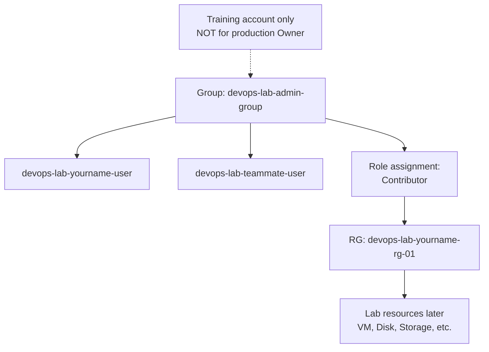

# Create Admin Group for Training

## 1. Concept Overview

A **Microsoft Entra group** is a collection of Entra users that can share the same Azure RBAC assignments. Instead of assigning roles to each user, you assign a role to the group at a scope and add users to the group.

For this **training subscription only**, we create a training admin group and assign **Contributor** on the lab resource group so you can complete later portal labs without constant "access denied" errors.

> **⚠️ Production warning:** Broad Contributor (or Owner) on shared groups is **risky** in production. In real companies, use least-privilege custom roles per job function (e.g. VM Operator, Storage Reader) and prefer PIM for elevation.

**AWS mapping:** IAM group + attached policy → Entra group + Azure RBAC role assignment (Contributor on RG).

---

## 2. Why DevOps Engineers Use Groups

| Practice | Benefit |
|----------|---------|
| Group per role | `Developers`, `Contributors`, `Readers` |
| Onboarding | Add new hire to group — inherits Azure RBAC |
| Offboarding | Remove from group — access revoked |
| Policy management | Update one assignment instead of 50 users |

---

## 3. Important Terms

| Term | Meaning |
|------|---------|
| **Built-in role** | Microsoft-defined (e.g. `Contributor`, `Owner`, `Reader`) |
| **Custom role** | Role you define (advanced — not used in this lab) |
| **Contributor** | Create/manage resources; cannot assign roles (unlike Owner) |
| **Scope** | Subscription, resource group, or single resource |
| **Role assignment** | Role + principal (user/group/SP) + scope |

---

## 4. Architecture Diagram

---

## 5. Before You Start

| Requirement | Detail |
|-------------|--------|
| **Signed in as** | Owner or User Access Administrator on the subscription / RG |
| **Entra user** | Created in previous lesson |
| **Group name** | `devops-lab-admin-group` |
| **RG** | `devops-lab-<yourname>-rg-01` |

> **Cost warning:** The group and role assignment are free. Contributor lets you create **billable** resources in later labs. Set a budget alert today.

### Set a budget alert (recommended now)

1. Search **Cost Management + Billing** → **Budgets**
2. **+ Add** → monthly budget (e.g. **$10 USD** or your instructor’s amount)
3. Set alert thresholds at 80% and 100%
4. Add your email → Create

---

## 6. Step-by-Step Azure Portal Lab

### Step 1 — Create the Entra group

1. Sign in as **admin**
2. Open **Microsoft Entra ID** → **Groups** → **+ New group**
3. **Group type:** Security
4. **Group name:** `devops-lab-admin-group`
5. **Membership type:** Assigned
6. **Members:** add `devops-lab-<yourname>-user`
7. **Create**

### Step 2 — Assign Contributor on the lab resource group

1. Search **Resource groups** → open `devops-lab-<yourname>-rg-01`
2. Left menu → **Access control (IAM)**
3. **+ Add** → **Add role assignment**
4. **Role** tab → select **Contributor** → Next
5. **Members** tab → **User, group, or service principal** → **+ Select members**
6. Select `devops-lab-admin-group` → Select → Next
7. **Review + assign** → **Review + assign**

> Prefer the **group**, not the individual user, so teammates can share the same assignment pattern.

### Step 3 — Avoid Owner unless required

1. Do **not** assign **Owner** on the subscription for daily lab work
2. Contributor on the RG is enough to create VMs, disks, VNets inside that RG
3. Creating **additional** RGs for Labs 02–08 may require subscription-level rights — if your lab user cannot create RGs, either:
   - Have admin pre-create `devops-lab-<yourname>-rg-02` … `rg-08`, or
   - Temporarily grant **Contributor** at subscription scope for training (instructor decision)

### Step 4 — Verify role assignment

1. Still on RG → **Access control (IAM)** → **Role assignments**
2. Confirm:
   - Role **Contributor**
   - Member `devops-lab-admin-group`
   - Scope = this resource group

### Step 5 — Test as lab user

1. Sign out → sign in as `devops-lab-<yourname>-user`
2. Open resource group `devops-lab-<yourname>-rg-01` — should load without access denied
3. Try **+ Create** → search **Virtual machine** — wizard should open (you will create VMs in Lab 02)

---

## 7. Validation / Testing Steps

| Check | Expected |
|-------|----------|
| Group exists | `devops-lab-admin-group` in Entra Groups |
| Role assigned | Contributor on `devops-lab-<yourname>-rg-01` to the group |
| User in group | Lab user listed under group members |
| Portal access | Lab user can open the RG |
| Admin still works | Owner/admin can still manage IAM and billing |

---

## 8. Troubleshooting

| Problem | Solution |
|---------|----------|
| Cannot assign Contributor | Must be Owner or User Access Administrator at that scope |
| User still denied | Wait 1–5 minutes; sign out/in; confirm group membership |
| Assigned role to user and group | Prefer group only — remove duplicate user assignment |
| Accidentally gave Owner | Remove Owner assignment immediately; keep Contributor on RG |
| Cannot create new RGs | Ask instructor for subscription Contributor or pre-created RGs |

---

## 9. Cleanup

Keep group, user, and role assignment for remaining labs.

| Resource | End of course action |
|----------|---------------------|
| `devops-lab-admin-group` | Delete after removing members / role assignment |
| `devops-lab-<yourname>-user` | Delete user |
| Role assignments | Remove Contributor assignment |
| `devops-lab-<yourname>-rg-01` | Delete empty RG if unused |

See [cleanup.md](cleanup.md) for full steps.

---

## 10. Interview Questions

1. **Why use Entra groups with Azure RBAC?**
   - *Manage permissions for many users in one place.*

2. **Is Owner OK for every student in production?**
   - *No — use least privilege per job function and limited scope.*

3. **What is the difference between Contributor and Owner?**
   - *Contributor manages resources but cannot assign roles; Owner can also manage access.*

4. **How do group permissions reach a user?**
   - *User inherits Azure RBAC roles assigned to groups they belong to.*

5. **What should you set up before labs with Contributor access?**
   - *Budgets/cost alerts and a personal cleanup habit.*

---

## 11. What We Achieved

- Created group `devops-lab-admin-group`
- Assigned **Contributor** on lab RG (training pattern)
- Added lab Entra user to the group
- Verified Portal access to the resource group
- Set up a **budget alert** (recommended)

**Entra / RBAC module complete.** Next lab: [02-vm-default-vnet](../02-vm-default-vnet/README.md)

---

## 12. References

- [Azure built-in roles](https://learn.microsoft.com/azure/role-based-access-control/built-in-roles)
- [Assign Azure roles using the Azure portal](https://learn.microsoft.com/azure/role-based-access-control/role-assignments-portal)
- [Create a basic group and add members](https://learn.microsoft.com/entra/fundamentals/how-to-manage-groups)
