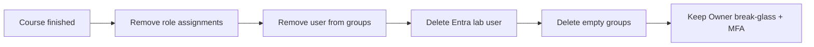

# Entra ID / RBAC Basics — Cleanup

## 1. Concept Overview

Entra users/groups and Azure RBAC assignments do not cost money, but **unused lab users and privileged memberships** are a security risk. Clean up when the course ends or when offboarding a student from a shared training tenant.

---

## 2. Why DevOps Engineers Clean Up Identity

| Risk | Why it matters |
|------|----------------|
| Orphaned credentials | Attackers try leaked passwords and tokens |
| Old admin group members | Former students retain Contributor access |
| Too many role assignments | Harder to audit who can do what |

---

## 3. Important Terms

| Term | Meaning |
|------|---------|
| **Disable account** | Temporarily block sign-in |
| **Delete** | Permanently remove user, group, or role assignment |

---

## 4. Architecture Diagram

---

## 5. Before You Start

| Item | Detail |
|------|--------|
| **When** | After all labs, CLI, Terraform, and capstone projects |
| **Sign in as** | Owner / User Access Administrator / privileged Entra admin |
| **Do NOT delete** | Your only break-glass Owner / Global Admin |

> **Cost warning:** Identity cleanup has no direct cost. Failing to cleanup risks unauthorized resource creation on your bill.

---

## 6. Step-by-Step Azure Portal Lab — Cleanup

### Step 1 — Remove Azure RBAC assignments

1. **Resource groups** → `devops-lab-<yourname>-rg-01` → **Access control (IAM)**
2. **Role assignments** → find Contributor for `devops-lab-admin-group`
3. **Remove** the assignment
4. Repeat for any subscription-scope training assignments your instructor granted

### Step 2 — Remove user from group

1. **Microsoft Entra ID** → **Groups** → `devops-lab-admin-group`
2. **Members** → select lab user → **Remove**

### Step 3 — Delete / disable lab user

1. **Microsoft Entra ID** → **Users** → `devops-lab-<yourname>-user`
2. Prefer **Delete** after course end (or **Block sign-in** first)
3. Confirm deletion

### Step 4 — Delete empty group

1. **Groups** → `devops-lab-admin-group`
2. **Delete** (only if no members remain / no longer needed)

### Step 5 — Delete empty lab resource group (optional)

1. If `devops-lab-<yourname>-rg-01` is empty and unused → **Delete resource group**
2. Type the RG name to confirm

### Step 6 — Verify privileged security

1. Sign in as break-glass / Owner admin
2. Confirm **MFA** still enabled
3. Confirm Global Administrator count is still minimal

---

## 7. Validation / Testing Steps

| Check | Expected |
|-------|----------|
| Lab user gone | User not in Entra Users list |
| Group gone or empty | No training admin group with active students |
| No stray RBAC | IAM clean on lab RGs |
| Owner MFA | Still enabled |

---

## 8. Troubleshooting

| Problem | Solution |
|---------|----------|
| Cannot delete user | Remove group memberships and app role assignments first |
| Cannot delete group | Remove members and enterprise app ownership links first |
| Deleted wrong user | Recreate user; reassign group + Contributor |

---

## 9. Cleanup Checklist

- [ ] Contributor (and any Owner) training assignments removed
- [ ] Lab Entra user deleted or blocked
- [ ] `devops-lab-admin-group` deleted
- [ ] Empty `rg-01` deleted (optional)
- [ ] Break-glass Owner MFA still enabled

---

## 10. Interview Questions

1. **Should you delete the subscription Owner account?**
   - *No — keep a secured break-glass admin; remove lab users instead.*

2. **What do you remove first — user or role assignment?**
   - *Remove role assignments and group membership, then delete the user, then empty groups.*

3. **Why remove unused Contributor memberships?**
   - *Reduce attack surface and accidental billing.*

---

## 11. What We Achieved

- Removed lab Entra identities safely
- Preserved privileged admin with MFA
- Reduced long-term security risk on the training tenant

---

## 12. References

- [Delete a user](https://learn.microsoft.com/entra/fundamentals/how-to-create-delete-users)
- [Remove Azure role assignments](https://learn.microsoft.com/azure/role-based-access-control/role-assignments-remove)
