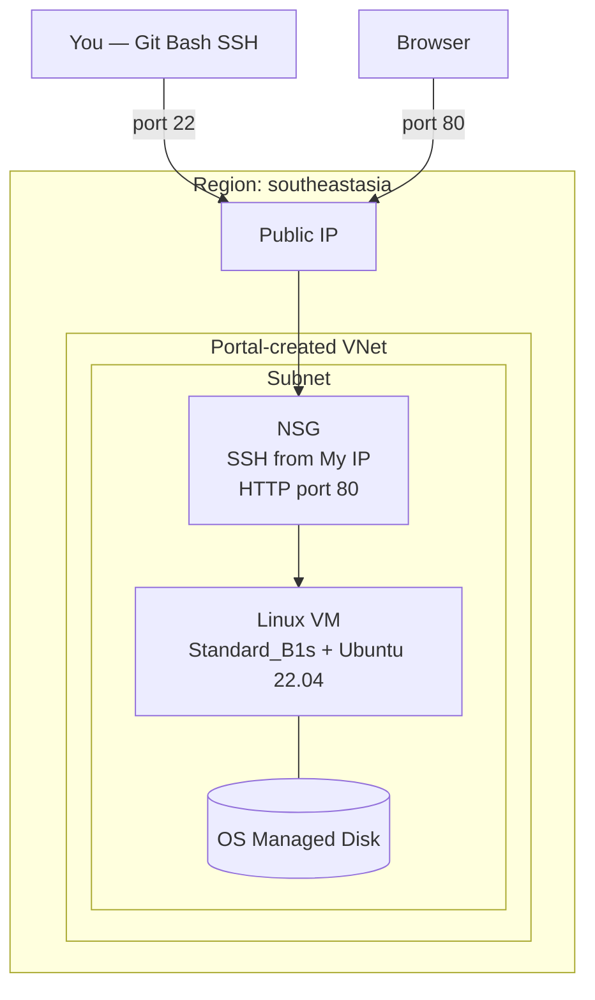

# Azure VM Theory

## 1. Concept Overview

**Azure Virtual Machines** provide virtual servers in Microsoft Azure. You choose an operating system image, VM size, disks, and network — then Azure runs a VM on shared physical hardware.

Azure VMs are **IaaS**: you manage the OS, applications, and configuration. Azure manages the physical servers and hypervisor.

**AWS mapping:** EC2 → Azure VM; AMI → image; instance type → VM size; Security Group → NSG; EBS root → OS managed disk; Default VPC → Portal-created VNet during VM create (Azure has no single global “default VPC” like AWS).

---

## 2. Why DevOps Engineers Use Azure VMs

| Use Case | Example |
|----------|---------|
| Web servers | nginx, Apache, Node.js behind Load Balancer |
| CI/CD runners | Self-hosted agents |
| Bastion / jump host | SSH entry point to private network (advanced) |
| Legacy apps | Lift-and-shift from on-premises VMs |
| Learning | First hands-on Azure compute service |

Most teams also use containers (Container Apps / AKS) or serverless, but **VM fundamentals** are required for interviews and troubleshooting.

---

## 3. Important Terms

| Term | Meaning |
|------|---------|
| **Virtual machine (VM)** | A running virtual server |
| **Image** | Template with OS (e.g. Ubuntu Server 22.04 LTS) |
| **VM size** | CPU, memory, network (e.g. `Standard_B1s`) |
| **Series** | Family: `B` (burstable), `D` (general), `E` (memory), `F` (compute) |
| **SSH public key** | Public half of key pair placed on the VM for Linux login |
| **NSG** | Network security group — virtual firewall for NICs/subnets |
| **Public IP** | Reachable from internet (if configured) |
| **Private IP** | Internal VNet address |
| **Managed disk (OS)** | Persistent OS disk attached to the VM |
| **Portal-created VNet** | VNet/subnet created for you during VM wizard — quick start for labs |

### Size quick reference

| Size / series | Use | Lab choice |
|---------------|-----|------------|
| **B-series** (`Standard_B1s`) | Burstable general purpose | ✅ Lab default |
| **D-series** | Balanced production workloads | Larger apps |
| **F-series** | CPU-heavy | Batch processing |
| **E-series** | Memory-heavy | In-memory workloads |

---

## 4. Architecture Diagram

---

## 5. Before You Start

| Requirement | Detail |
|-------------|--------|
| **Lab user** | `devops-lab-<yourname>-user` with Contributor on lab RGs |
| **Region** | `southeastasia` (Southeast Asia) — or agreed region |
| **SSH key name** | `devops-lab-<yourname>-key` (local key pair) |
| **Git Bash** | Installed on Windows for SSH |
| **Resource group** | `devops-lab-<yourname>-rg-02` |

> **Cost warning:** VMs charge while **running**. `Standard_B1s` is low-cost for labs. **Delete** (or stop + delete disks/RG) after each lab. A forgotten VM can cost $10–15+/month depending on size and disks.

---

## 6. Step-by-Step Azure Portal Lab

This theory lesson has no billable resources to create yet. Review the compute blades:

1. Portal → search **Virtual machines** → open **Virtual machines**
2. Note the empty list (or existing instructor demos)
3. Search **Virtual networks** — no lab VNet yet until next lesson
4. Search **Disks** — OS disks appear after VM create
5. Search **Network security groups** — explore layout
6. Open **Create a virtual machine** wizard (do not finish) → browse **Image** list for **Ubuntu Server 22.04 LTS** → cancel

---

## 7. Validation / Testing Steps

| Check | Expected |
|-------|----------|
| VM blade loads | No authorization errors |
| Region plan | You will select `Southeast Asia` |
| Naming ready | `devops-lab-<yourname>-rg-02` and `...-web` |

---

## 8. Troubleshooting

| Problem | Solution |
|---------|----------|
| VM blade not authorized | Confirm Contributor on subscription or target RG |
| Size not available | Pick another size in `southeastasia` or change AZ/zone |
| Wrong region habit | Always set **Southeast Asia** before Create |

---

## 9. Cleanup

Nothing to clean up in this theory lesson.

---

## 10. Interview Questions

1. **What is an Azure VM?**
   - *A resizable virtual server in Azure (IaaS).*

2. **What is an image?**
   - *A template defining the OS (and optional software) for a VM.*

3. **What does Standard_B1s mean?**
   - *B-series burstable size — 1 vCPU, 1 GiB RAM (verify current specs on Microsoft Learn).*

4. **What is an NSG?**
   - *A stateful virtual firewall controlling inbound/outbound traffic for NICs or subnets.*

5. **What is the difference between public and private IP on a VM?**
   - *Public IP reachable from internet; private IP used inside the VNet.*

---

## 11. What We Achieved

- Understood VMs, images, sizes, SSH keys, NSGs
- Located Virtual machines blade and Ubuntu 22.04 image
- Ready to launch a VM

**Next:** [02-launch-vm.md](02-launch-vm.md)

---

## 12. References

- [Virtual machines in Azure](https://learn.microsoft.com/azure/virtual-machines/overview)
- [Sizes for virtual machines in Azure](https://learn.microsoft.com/azure/virtual-machines/sizes)
