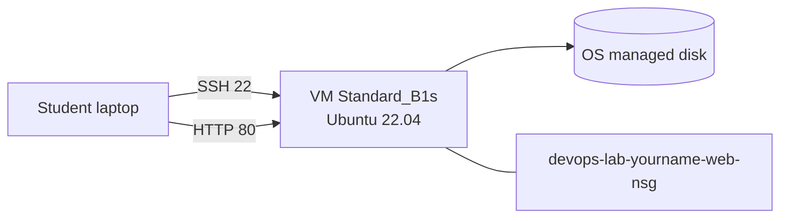

# Launch VM with Portal-Created VNet

## 1. Concept Overview

You will launch a **Linux Azure VM** while the Portal creates a **VNet, subnet, public IP, NIC, and NSG** for you. This is the fastest way to get a server running in Azure — similar to launching EC2 in the AWS default VPC.

**Resource names for this lab:**

| Resource | Name |
|----------|------|
| Resource group | `devops-lab-<yourname>-rg-02` |
| SSH key (local) | `devops-lab-<yourname>-key` |
| NSG | Usually `devops-lab-<yourname>-web-nsg` (Portal default from VM name) |
| VM | `devops-lab-<yourname>-web` |
| VNet (Portal-created) | Often `devops-lab-<yourname>-web-vnet` |

---

## 2. Why DevOps Engineers Launch VMs This Way

- Prove networking and SSH access before custom VNet design
- Baseline pattern: image + size + NSG + SSH key + public IP
- Same settings later automated in Azure CLI and Terraform

---

## 3. Important Terms

| Term | Meaning |
|------|---------|
| **Public IP (Basic/Standard)** | Internet-routable address attached to NIC |
| **Premium SSD / Standard SSD** | Managed disk performance tiers (lab: smallest Standard SSD OK) |
| **Custom data** | Cloud-init script at first boot (optional) |

---

## 4. Architecture Diagram



---

## 5. Before You Start

| Item | Value |
|------|-------|
| Region | `southeastasia` |
| Image | Ubuntu Server 22.04 LTS |
| Size | `Standard_B1s` |
| Login user | `azureuser` (or your chosen admin username) |
| Resource group | `devops-lab-<yourname>-rg-02` |

> **Cost warning:** Running VM billed while allocated. Delete resource group same day after lab unless deferring for Lab 04.

---

## 6. Step-by-Step Azure Portal Lab

### Step 1 — Create SSH key pair locally (Git Bash)

```bash
# Set your short lowercase name first (do not paste angle-bracket placeholders in Bash)
export YOURNAME=alice   # change me
ssh-keygen -t rsa -b 4096 -f ~/.ssh/devops-lab-${YOURNAME}-key -N ""
chmod 400 ~/.ssh/devops-lab-${YOURNAME}-key
```

- Public key file: `~/.ssh/devops-lab-${YOURNAME}-key.pub`
- Private key: `~/.ssh/devops-lab-${YOURNAME}-key` — **never commit to Git**

### Step 2 — Create resource group

1. **Resource groups** → **+ Create**
2. **Name:** `devops-lab-<yourname>-rg-02`
3. **Region:** Southeast Asia
4. Tags: `Project=azure-basic`, `Owner=<yourname>`, `Environment=training`
5. **Create**

### Step 3 — Start Create a virtual machine

1. Search **Virtual machines** → **+ Create** → **Azure virtual machine**
2. **Subscription:** your lab subscription
3. **Resource group:** `devops-lab-<yourname>-rg-02`
4. **Virtual machine name:** `devops-lab-<yourname>-web`
5. **Region:** Southeast Asia
6. **Availability options:** No infrastructure redundancy required (lab)
7. **Image:** Ubuntu Server 22.04 LTS — Gen2 (or Gen1 if Gen2 unavailable)
8. **Size:** `Standard_B1s` (or Change size → select B1s)
9. **Authentication type:** SSH public key
10. **Username:** `azureuser`
11. **SSH public key source:** Use existing public key → paste contents of `devops-lab-<yourname>-key.pub`
12. **Public inbound ports:** Allow selected ports → **SSH (22)** for now (we refine NSG later)
13. **Licensing:** leave defaults

### Step 4 — Disks

1. **OS disk type:** Standard SSD (or Premium SSD if required by size — keep cheapest allowed)
2. Leave data disks empty (Lab 04 adds a data disk)

### Step 5 — Networking (let Portal create VNet)

1. **Virtual network:** Create new (accept generated name under your RG)
2. **Subnet:** default / accept Portal defaults
3. **Public IP:** Create new
4. **NIC network security group:** Basic or Advanced — ensure SSH allowed from your IP if prompted
5. Prefer **Advanced** and note the NSG name for the next lessons

### Step 6 — Tags and create

| Key | Value |
|-----|-------|
| Name | `devops-lab-<yourname>-web` |
| Project | `azure-basic` |
| Owner | `<yourname>` |
| Environment | `training` |

1. **Review + create** → **Create**
2. Wait for deployment to finish
3. Open the VM → copy **Public IP address**

### Step 7 — Tighten SSH source to your IP (recommended now)

1. Open the VM’s **Networking** blade (or the NSG resource)
2. Inbound rule for SSH (22):
   - Source: **IP Addresses**
   - Source IP: `YOUR_PUBLIC_IP/32` (from `curl -s https://ifconfig.me`)
3. Save

> **Security note:** Do **not** leave SSH open to `Any` / `0.0.0.0/0` longer than needed — that exposes SSH to the entire internet.

---

## 7. Validation / Testing Steps

| Check | How |
|-------|-----|
| VM running | Virtual machines → Status: **Running** |
| Public IP assigned | Overview shows Public IP address |
| NSG attached | Networking shows SSH allow rule |
| Key stored locally | Private key exists with `chmod 400` |

---

## 8. Troubleshooting

| Problem | Solution |
|---------|----------|
| No public IP | Networking → attach/create Public IP → associate to NIC |
| Size not available | Try nearby size (e.g. `Standard_B1ms`) in Southeast Asia |
| Deployment fails on quota | Request quota increase or delete unused VMs |
| Wrong region | Delete and recreate in Southeast Asia |

---

## 9. Cleanup

Full cleanup in [cleanup.md](cleanup.md) after nginx / NSG lessons. For now, **keep VM running** for next lessons. If proceeding to Lab 04, keep this RG until Lab 04 cleanup.

---

## 10. Interview Questions

1. **Why restrict SSH to your IP instead of Any?**
   - *Limits SSH exposure, reducing brute-force risk.*

2. **Does Azure have a default VPC like AWS?**
   - *No single per-region default VPC — the Portal can create a VNet during VM create for quick starts.*

3. **Why store the private key securely?**
   - *It proves SSH identity — anyone with it can access the VM.*

---

## 11. What We Achieved

- Created SSH key, resource group, and Linux VM with Portal-created VNet
- Applied safer SSH rule (your IP /32)
- VM running with public IP

**Next:** [03-connect-using-ssh.md](03-connect-using-ssh.md)

---

## 12. References

- [Quickstart: Create a Linux VM in the Azure portal](https://learn.microsoft.com/azure/virtual-machines/linux/quick-create-portal)
- [Connect to a Linux VM using SSH](https://learn.microsoft.com/azure/virtual-machines/linux-vm-connect)
