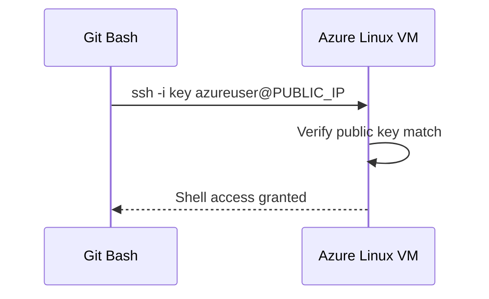

# Connect Using SSH

## 1. Concept Overview

**SSH (Secure Shell)** lets you securely log in to a Linux Azure VM over the network. You authenticate with a **private key** instead of a password.

On Windows, we use **Git Bash** (includes OpenSSH client).

---

## 2. Why DevOps Engineers Use SSH

- Install software (nginx, Docker)
- Read logs and debug
- Run commands when Azure Bastion / Run Command is not used
- First skill before automation (cloud-init, Ansible)

---

## 3. Important Terms

| Term | Meaning |
|------|---------|
| **Private key** | Secret file — proves your identity |
| **Public key** | Stored on VM in `~/.ssh/authorized_keys` |
| **azureuser** | Common default Linux admin username in Portal labs |
| **chmod 400** | Restrict private key permissions so SSH accepts it |

---

## 4. Architecture Diagram



---

## 5. Before You Start

| Item | Detail |
|------|--------|
| VM | Running with public IP |
| Key file | `~/.ssh/devops-lab-<yourname>-key` |
| NSG | SSH (22) from your IP `/32` |
| Tool | Git Bash on Windows |

> **Cost warning:** VM still billing while running.

---

## 6. Step-by-Step Lab (Git Bash on Windows)

### Step 1 — Open Git Bash

Open **Git Bash** from Start menu.

### Step 2 — Fix key permissions

```bash
cd ~/.ssh
# Use the same YOURNAME as when you created the key
chmod 400 ~/.ssh/devops-lab-${YOURNAME:-alice}-key
```

### Step 3 — Connect via SSH

Replace `<PUBLIC_IP>` with your VM public IP:

```bash
ssh -i ~/.ssh/devops-lab-${YOURNAME:-alice}-key azureuser@<PUBLIC_IP>
```

Example:

```bash
ssh -i devops-lab-faizul-key azureuser@20.195.123.45
```

### Step 4 — Accept host key

First connection asks:

```
Are you sure you want to continue connecting (yes/no)?
```

Type `yes` and press Enter.

### Step 5 — Verify you are on the server

```bash
whoami
# azureuser

hostname
uname -a

# Azure Instance Metadata Service
curl -s -H Metadata:true --noproxy "*" \
  "http://169.254.169.254/metadata/instance/compute/name?api-version=2021-02-01&format=text"
# shows VM name — confirms you are on Azure
```

### Step 6 — Disconnect

```bash
exit
```

---

## 7. Validation / Testing Steps

| Check | Expected |
|-------|----------|
| SSH login | Shell prompt for `azureuser` |
| `whoami` | `azureuser` |
| Instance metadata | Returns your VM name |

---

## 8. Troubleshooting

| Problem | Solution |
|---------|----------|
| `Permission denied (publickey)` | Wrong private key, wrong username, or `chmod 400` not set |
| `Connection timed out` | NSG missing SSH rule; wrong public IP; VM stopped/deallocated; your IP changed — update NSG source |
| `WARNING: UNPROTECTED PRIVATE KEY` | Run `chmod 400` on private key |
| `Connection refused` | SSH service down (rare on fresh Ubuntu) — restart VM |
| Works yesterday, not today | Home ISP changed your IP — update NSG SSH source to new `/32` |

### Update My IP in NSG

1. Portal → your NSG (or VM → Networking)
2. Inbound security rules → edit SSH rule
3. Source → IP Addresses → `NEW_PUBLIC_IP/32` → Save

---

## 9. Cleanup

Keep VM for nginx lab. No cleanup this lesson.

---

## 10. Interview Questions

1. **Why use SSH keys instead of passwords on Azure Linux VMs?**
   - *Stronger authentication; Portal defaults to key-based auth for Linux.*

2. **What does chmod 400 do?**
   - *Owner read-only — SSH clients require restricted private key permissions.*

3. **What if your IP changes?**
   - *Update NSG SSH source to the new public IP /32.*

---

## 11. What We Achieved

- Connected to Azure VM from Git Bash using SSH and a private key
- Verified shell access on Ubuntu

**Next:** [04-install-nginx-and-test.md](04-install-nginx-and-test.md)

---

## 12. References

- [Connect to a Linux VM using SSH](https://learn.microsoft.com/azure/virtual-machines/linux/ssh-from-windows)
- [Azure Instance Metadata Service](https://learn.microsoft.com/azure/virtual-machines/instance-metadata-service)
