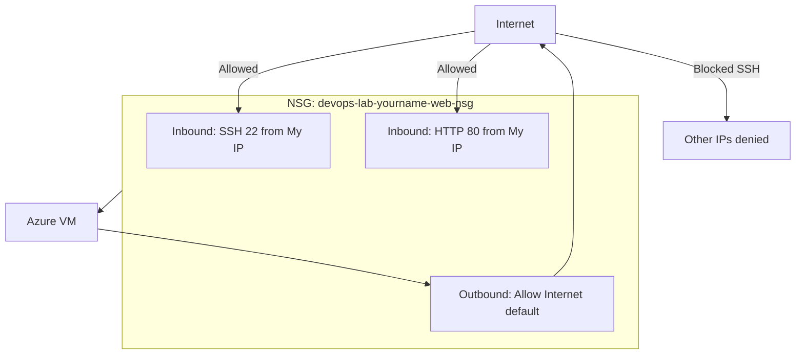

# Network Security Group Explanation

## 1. Concept Overview

A **network security group (NSG)** is a virtual firewall that can attach to a **NIC** and/or a **subnet**. It controls **inbound** (incoming) and **outbound** (outgoing) traffic using allow/deny rules with priority numbers.

**Key properties:**

| Property | Behavior |
|----------|----------|
| **Stateful** | If inbound is allowed and a connection starts, return traffic is automatically allowed (like AWS security groups) |
| **Default rules** | Azure includes default allow VNet / Load Balancer and deny internet inbound at lower priority |
| **Priority** | Lower number = higher priority (100–4096 for custom rules) |
| **Attachment** | NIC and/or subnet (both evaluated when present) |

**AWS mapping:** Security Group ≈ NSG (both stateful). Azure has **no Network ACL (NACL)** equivalent in this course — focus on NSGs.

---

## 2. Why DevOps Engineers Use NSGs

- First line of network defense for VMs and PaaS private endpoints patterns
- Document who can reach a service (LB → app subnet → data tier)
- Change rules without OS firewall edits

---

## 3. Important Terms

| Term | Meaning |
|------|---------|
| **Inbound rule** | Who can connect TO the VM/NIC |
| **Outbound rule** | Where the VM can connect FROM itself |
| **Source** | IP/CIDR, Service Tag, or Application Security Group |
| **0.0.0.0/0 / Any** | All IPv4 addresses — **high risk for SSH** |
| **Service tag** | e.g. `Internet`, `VirtualNetwork` — named IP groups maintained by Azure |

---

## 4. Architecture Diagram

---

## 5. Before You Start

| Item | Detail |
|------|--------|
| VM | Running with lab NSG attached |
| Console | VM → Networking, or standalone NSG resource |

---

## 6. Step-by-Step Azure Portal Lab

### Step 1 — Review current rules

1. Open NSG for `devops-lab-<yourname>-web` (VM → Networking → click NSG name)
2. **Inbound security rules** — note SSH and HTTP from your IP
3. **Outbound security rules** — note defaults allowing outbound internet

### Step 2 — Understand stateful behavior

1. SSH to VM
2. Run: `curl https://www.microsoft.com` — works because **outbound** is allowed
3. Response packets return without an extra inbound rule for ephemeral client ports (stateful)

### Step 3 — Safe lab exercise — ASG / source concepts (view)

Production pattern: Load Balancer frontend allows 443 from Internet; app NSG allows 80 **only from the load balancer / app ASG**, not from Any.

In Portal (view for awareness):

1. Note **Source** can be a **Service tag** or **Application security group** — not just a single IP

### Step 4 — Demonstrate risk of Any / 0.0.0.0/0 (read only — do NOT apply for SSH)

| Rule | Risk |
|------|------|
| SSH from `Any` | Bots scan port 22 constantly — brute force attempts |
| HTTP from `Any` | Needed for **public websites** behind proper design — OK with LB + WAF in production |
| HTTP from your IP `/32` | Fine for **personal lab testing** |

**Classroom rule:** Use **your IP /32** for SSH. For public demos later, use the Load Balancer / VMSS lab.

### Step 5 — Edit rule when IP changes

1. Edit inbound SSH rule
2. Source IP → current `curl -s https://ifconfig.me` value with `/32`
3. Save

---

## 7. Validation / Testing Steps

| Test | Expected |
|------|----------|
| SSH from your laptop | Works |
| Browser HTTP | Works |
| Remove SSH rule temporarily | SSH fails — proves NSG effect |
| Re-add My IP SSH rule | SSH works again |

---

## 8. Troubleshooting

| Problem | Solution |
|---------|----------|
| Rule added but no access | Wrong NSG attached; check NIC vs subnet NSG; priority too low vs deny |
| NIC + subnet NSGs | Traffic must be allowed by both association points when both apply |
| IPv6 issues | Add separate rules if using IPv6 public IPs |

---

## 9. Cleanup

If **not** doing Lab 04 next, proceed to [cleanup.md](cleanup.md). If doing Lab 04 Managed Disks, **keep the VM and RG running**.

---

## 10. Interview Questions

1. **Are NSGs stateful or stateless?**
   - *Stateful.*

2. **Why not open SSH to Any?**
   - *Exposes SSH to the entire internet; constant attack traffic.*

3. **Can source be a service tag or ASG?**
   - *Yes — common pattern for tiered apps and platform services.*

4. **Does Azure have NACLs like AWS?**
   - *No direct NACL equivalent in typical labs — use NSGs (and Azure Firewall for advanced edge filtering).*

---

## 11. What We Achieved

- Understood NSG **inbound/outbound** rules and priorities
- Practiced **My IP /32** restriction for SSH
- Learned production-oriented source patterns
- Ready to clean up VM lab resources (or keep them for Lab 04)

**Next:** [cleanup.md](cleanup.md)

---

## 12. References

- [Network security groups](https://learn.microsoft.com/azure/virtual-network/network-security-groups-overview)
- [Service tags](https://learn.microsoft.com/azure/virtual-network/service-tags-overview)
