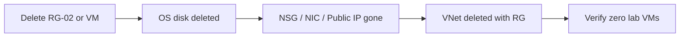

# VM Default VNet — Cleanup

## Important: Lab sequence with Managed Disks (Lab 04)

**If you plan to do Lab 04 Managed Disks next**, do **not** run this cleanup yet. Lab 04 attaches a data disk to `devops-lab-<yourname>-web` from this lab. Complete Lab 04 [cleanup.md](../04-managed-disks/cleanup.md) first — it deletes this VM and related resources in `devops-lab-<yourname>-rg-02`.

**If you are skipping Lab 04 or already finished it**, proceed with cleanup below.

---

## 1. Concept Overview

Delete billable resources: VM, disks, public IP, NIC, NSG, and VNet. The simplest safe method is **delete the entire resource group** `devops-lab-<yourname>-rg-02`.

---

## 2. Why DevOps Engineers Clean Up

Forgotten VMs (and their OS disks / public IPs) are a top student billing surprise.

---

## 3. Important Terms

| Term | Meaning |
|------|---------|
| **Delete** | Permanently destroy the VM resource |
| **Stop (deallocate)** | Stops compute billing; disks/IPs may still cost |
| **Delete resource group** | Removes all contained resources |

---

## 4. Architecture Diagram



---

## 5. Before You Start

| Item | Detail |
|------|--------|
| Region | `southeastasia` |
| Save | Download any data you need from the VM first |

> **Cost warning:** Resources bill until deleted. Stopped (deallocated) VMs still incur **disk** charges. Public IPs can incur charges depending on SKU when unused.

---

## 6. Step-by-Step Azure Portal Lab — Cleanup

### Preferred — Delete the resource group

1. **Resource groups** → `devops-lab-<yourname>-rg-02`
2. **Delete resource group**
3. Type the RG name to confirm
4. Wait until deletion completes

### Alternative — Delete resources individually

### Step 1 — Delete VM

1. **Virtual machines** → select `devops-lab-<yourname>-web`
2. **Delete**
3. Check options to delete associated disks / NIC / public IP if prompted
4. Confirm

### Step 2 — Delete leftover disks

1. **Disks** → delete any lab OS/data disks still present

### Step 3 — Delete public IP / NIC / NSG / VNet

1. Delete unused **Public IP addresses**
2. Delete **Network interfaces**
3. Delete **Network security groups**
4. Delete **Virtual networks** created for this lab

### Step 4 — Delete local private key (optional)

```bash
# Replace alice with your name (same as when you created the key)
rm -f ~/.ssh/devops-lab-alice-key ~/.ssh/devops-lab-alice-key.pub
```

> Keep the key if reusing for Lab 03/04 — Lab 04 needs the same VM/key if deferred cleanup.

---

## 7. Validation / Testing Steps

| Check | Expected |
|-------|----------|
| Resource group | `rg-02` gone (preferred) |
| VMs | No running `devops-lab-*` lab VMs |
| Disks | No unattached lab disks |
| Public IPs | No orphaned lab public IPs |

---

## 8. Troubleshooting

| Problem | Solution |
|---------|----------|
| RG delete fails | Delete locks; wait for NIC/IP detach; retry |
| Disk remains | Manually delete unattached disk |
| Still charged | Check other regions; look for leftover disks/IPs |

---

## 9. Cleanup Checklist

- [ ] VM deleted (or entire `rg-02` deleted)
- [ ] No orphaned managed disks
- [ ] Custom NSG / public IP / VNet removed
- [ ] Local private key removed or secured

---

## 10. Interview Questions

1. **Delete vs stop (deallocate)?**
   - *Stop deallocates compute but disks remain; delete removes the VM resource.*

2. **Does a stopped VM cost money?**
   - *No compute charge when deallocated; attached managed disks (and some IPs) still cost.*

---

## 11. What We Achieved

- Removed all Lab 02 VM resources
- Avoided ongoing VM/disk charges

**Next lab:** [03-custom-vnet-vm](../03-custom-vnet-vm/README.md)

---

## 12. References

- [Delete a resource group](https://learn.microsoft.com/azure/azure-resource-manager/management/delete-resource-group)
- [Manage Azure Disks](https://learn.microsoft.com/azure/virtual-machines/managed-disks-overview)
