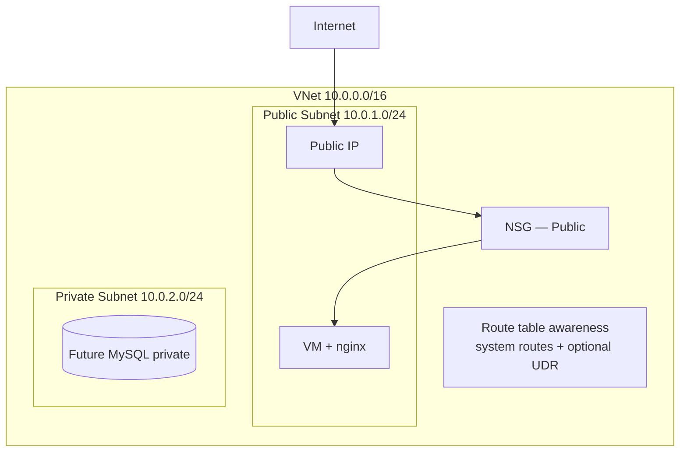

# VNet Theory

## 1. Concept Overview

An **Azure Virtual Network (VNet)** is your own isolated network inside Azure. You control IP ranges, subnets, routing, and firewalls (NSGs).

A **Portal-created VNet** (Lab 02) is quick. A **custom VNet** gives full control — required for production-style designs.

**AWS mapping:** VPC → VNet; subnet → subnet; IGW → public IP + Azure’s default internet routing for public endpoints; route table → UDR / system routes; SG → NSG; NACL → *no direct lab equivalent*.

---

## 2. Why DevOps Engineers Use Custom VNets

| Reason | Benefit |
|--------|---------|
| Network isolation | Separate dev/stage/prod |
| Public + private subnets | App public, database private |
| Custom CIDR | Plan IP space for growth |
| Compliance | Control internet exposure |

---

## 3. Important Terms

| Term | Meaning |
|------|---------|
| **CIDR** | IP range notation (e.g. `10.0.0.0/16`) |
| **Subnet** | Segment of VNet IP space |
| **Public subnet (lab meaning)** | Workloads get a public IP and can reach/be reached from internet via NSG |
| **Private subnet (lab meaning)** | No public IP; no direct inbound internet |
| **Public IP** | Azure resource enabling inbound/outbound internet for a NIC |
| **System routes** | Azure-created default routes (including Internet) |
| **UDR / Route table** | User-defined routes you create and associate to subnets |
| **NSG** | Stateful firewall for NIC/subnet |

---

## 4. Architecture Diagram

---

## 5. Before You Start

| Item | Value |
|------|-------|
| Region | `southeastasia` |
| Resource group | `devops-lab-<yourname>-rg-03` |
| VNet name | `devops-lab-<yourname>-vnet` |
| CIDR | `10.0.0.0/16` |

> **Cost warning:** VNet, subnets, NSGs, route tables are **low/no cost**. VMs and NAT Gateway cost money — **do not create NAT Gateway** in this lab.

---

## 6. Step-by-Step Azure Portal Lab

Explore Virtual networks dashboard only:

1. Search **Virtual networks** → open **Virtual networks**
2. Note Lab 02 VNet if still present (separate RG)
3. Left menu concepts for a VNet once opened: **Subnets**, **Settings** → **Route tables**, **Network security groups**
4. Read address space of any existing VNet for comparison

---

## 7. Validation / Testing Steps

| Check | Expected |
|-------|----------|
| Virtual networks blade opens | No errors |
| Region plan | `southeastasia` |

---

## 8. Troubleshooting

| Problem | Solution |
|---------|----------|
| Menu missing | Search "Virtual networks" in top bar |

---

## 9. Cleanup

None this lesson.

---

## 10. Interview Questions

1. **What is a VNet?**
   - *Isolated virtual network in Azure.*

2. **What is CIDR 10.0.0.0/16?**
   - *65,536 IP addresses from 10.0.0.0 to 10.0.255.255.*

3. **Public vs private subnet in Azure labs?**
   - *Public workloads use public IPs + NSG; private workloads have no public IP and no direct inbound internet.*

---

## 11. What We Achieved

- Understood VNet, CIDR, subnets, public IP vs IGW mental model, route tables, NSGs
- Ready to build a custom VNet

**Next:** [02-create-vnet.md](02-create-vnet.md)

---

## 12. References

- [Azure Virtual Network overview](https://learn.microsoft.com/azure/virtual-network/virtual-networks-overview)
- [Virtual network FAQ](https://learn.microsoft.com/azure/virtual-network/virtual-networks-faq)
