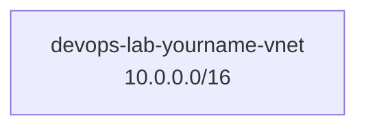

# Create VNet

## 1. Concept Overview

Create a custom Virtual Network with address space `10.0.0.0/16` — provides 65,536 private IP addresses for subnets.

---

## 2. Why DevOps Engineers Create Custom VNets

Foundation for all network resources — every VM, MySQL Flexible Server (private), and Load Balancer backend in this VNet shares your IP plan.

---

## 3. Important Terms

| Term | Meaning |
|------|---------|
| **Address space** | CIDR ranges owned by the VNet |
| **DNS servers** | Default Azure DNS is fine for labs |

---

## 4. Architecture Diagram

---

## 5. Before You Start

| Item | Value |
|------|-------|
| Resource group | `devops-lab-<yourname>-rg-03` |
| Name | `devops-lab-<yourname>-vnet` |
| IPv4 address space | `10.0.0.0/16` |
| Region | Southeast Asia |

> **Cost warning:** VNet is free / included with platform networking.

---

## 6. Step-by-Step Azure Portal Lab

### Step 1 — Create resource group

1. **Resource groups** → **+ Create**
2. **Name:** `devops-lab-<yourname>-rg-03`
3. **Region:** Southeast Asia
4. Tags: `Project=azure-basic`, `Owner=<yourname>`, `Environment=training`
5. **Create**

### Step 2 — Create VNet

1. Search **Virtual networks** → **+ Create**
2. **Resource group:** `devops-lab-<yourname>-rg-03`
3. **Name:** `devops-lab-<yourname>-vnet`
4. **Region:** Southeast Asia
5. **IP addresses** tab:
   - Address space: `10.0.0.0/16`
   - You may delete the default subnet for now and add named subnets in the next lesson, **or** create a temporary subnet and rename/replace later — follow instructor preference
6. **Security** tab — leave Bastion / DDoS / Firewall off for this lab (cost/complexity)
7. Tags as above
8. **Review + create** → **Create**

### Step 3 — Verify DNS defaults

1. Open the VNet → **DNS servers**
2. Confirm **Default (Azure-provided)** unless instructor requires custom DNS

---

## 7. Validation / Testing Steps

| Check | Expected |
|-------|----------|
| VNet listed | Succeeded deployment |
| Address space | `10.0.0.0/16` |
| Region | Southeast Asia |
| Resource group | `rg-03` |

---

## 8. Troubleshooting

| Problem | Solution |
|---------|----------|
| Address space overlap with peered VNets | Choose unused range (e.g. `10.10.0.0/16`) if conflicts exist in class |
| Region greyed out | Select RG in Southeast Asia first / match RG region |

---

## 9. Cleanup

See [cleanup.md](cleanup.md) at module end.

---

## 10. Interview Questions

1. **How many IPs in /16?**
   - *65,536 addresses.*

2. **Is a VNet regional?**
   - *Yes — a VNet lives in one region.*

---

## 11. What We Achieved

- Created custom VNet `devops-lab-<yourname>-vnet` in `rg-03`

**Next:** [03-create-subnets.md](03-create-subnets.md)

---

## 12. References

- [Create a virtual network](https://learn.microsoft.com/azure/virtual-network/quickstart-create-virtual-network)
