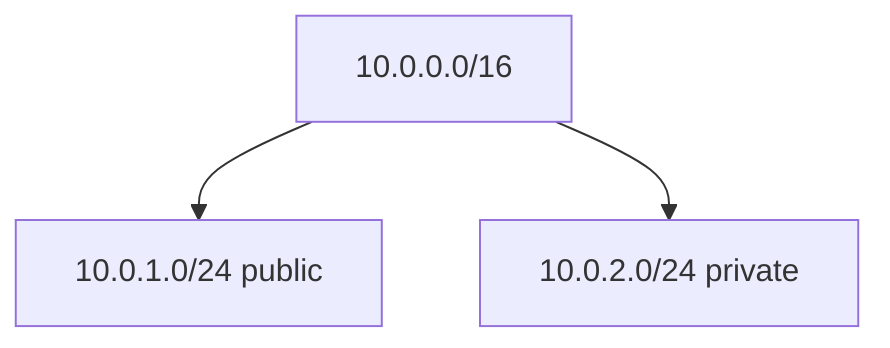

# Create Subnets

## 1. Concept Overview

**Subnets** divide your VNet IP space. This lab creates:

| Subnet | CIDR | Purpose |
|--------|------|---------|
| Public | `10.0.1.0/24` | VM + public IP + nginx |
| Private | `10.0.2.0/24` | Future private resources (e.g. MySQL concept) |

Azure subnets are not tied to Availability Zones the same way AWS subnets are — AZs are chosen at resource creation (VM zones). Still create separate address ranges for tiers.

---

## 2. Why DevOps Engineers Use Subnets

- **Tier separation** — web public, data private
- **NSG association** — different rules per subnet
- **Route control** — optional UDRs per subnet

---

## 3. Important Terms

| Term | Meaning |
|------|---------|
| **/24 subnet** | 256 IP addresses (Azure reserves some per subnet) |
| **Delegation** | Special subnet use for PaaS (not needed for this VM lab) |

---

## 4. Architecture Diagram

---

## 5. Before You Start

VNet `devops-lab-<yourname>-vnet` must exist in `rg-03`.

> **Cost warning:** Subnets are free.

---

## 6. Step-by-Step Azure Portal Lab

### Create public subnet

1. Open VNet → **Subnets** → **+ Subnet**
2. **Name:** `devops-lab-<yourname>-public`
3. **Subnet address range:** `10.0.1.0/24`
4. Leave NAT gateway empty
5. **Save**

### Create private subnet

1. **+ Subnet** again
2. **Name:** `devops-lab-<yourname>-private`
3. **Subnet address range:** `10.0.2.0/24`
4. **Save**

### Clean up Portal default subnet (if unused)

If the create wizard made a default subnet you do not need and nothing uses it, you may delete it after your named subnets exist.

---

## 7. Validation / Testing Steps

| Check | Expected |
|-------|----------|
| Two named subnets | `public` and `private` CIDRs as planned |
| Inside VNet space | Both inside `10.0.0.0/16` |

---

## 8. Troubleshooting

| Problem | Solution |
|---------|----------|
| CIDR outside VNet | Must fit inside `10.0.0.0/16` |
| Overlap with existing subnet | Adjust to unused /24 |

---

## 9. Cleanup

Module [cleanup.md](cleanup.md).

---

## 10. Interview Questions

1. **Why separate public and private subnets?**
   - *Limit internet exposure; place data tiers without public IPs.*

2. **How many usable IPs in an Azure /24?**
   - *Fewer than 256 — Azure reserves addresses for platform use (commonly 5).*

---

## 11. What We Achieved

- Public and private subnets for tiered design

**Next:** [04-create-public-ip-and-routing.md](04-create-public-ip-and-routing.md)

---

## 12. References

- [Add, change, or delete a virtual network subnet](https://learn.microsoft.com/azure/virtual-network/virtual-network-manage-subnet)
