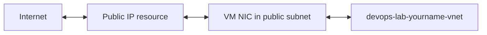

# Create Public IP and Internet Routing

## 1. Concept Overview

In AWS, an **Internet Gateway (IGW)** is a VPC component you attach, then you add a route `0.0.0.0/0 → IGW`.

In Azure, internet access for a VM normally comes from:

1. Associating a **Public IP** to the VM’s NIC (inbound and SNAT patterns for labs)
2. Relying on Azure **system routes** (including a default route to Internet)
3. Allowing traffic with an **NSG**

You do **not** create a separate “Internet Gateway” resource. This lesson creates a Public IP you will attach when launching the VM.

---

## 2. Why DevOps Engineers Use Public IPs Carefully

Without a public IP (or Bastion / Load Balancer frontend), you cannot SSH from the internet to a VM for this lab style. Production often avoids direct VM public IPs — use Bastion, VPN, or LB instead.

---

## 3. Important Terms

| Term | Meaning |
|------|---------|
| **Public IP** | Azure resource with an internet-facing address |
| **SKU** | Basic vs Standard (prefer **Standard** for new labs when available) |
| **Assignment** | Static vs Dynamic (Standard typically static) |
| **NAT Gateway** | Outbound for private subnets — **costly; skip in this lab** |
| **System route** | Azure default route to Internet for the VNet |

---

## 4. Architecture Diagram

---

## 5. Before You Start

| Name | `devops-lab-<yourname>-pip` |
| RG | `devops-lab-<yourname>-rg-03` |
| Region | Southeast Asia |

> **Cost warning:** Public IPs can incur charges. NAT Gateway is **not** for this lab — do not create NAT.

---

## 6. Step-by-Step Azure Portal Lab

### Step 1 — Create Public IP

1. Search **Public IP addresses** → **+ Create**
2. **Resource group:** `devops-lab-<yourname>-rg-03`
3. **Region:** Southeast Asia
4. **Name:** `devops-lab-<yourname>-pip`
5. **SKU:** Standard (recommended)
6. **IP version:** IPv4
7. **Assignment:** Static
8. Tags: `Project=azure-basic`, `Owner=<yourname>`
9. **Review + create** → **Create**

### Step 2 — Understand attachment timing

- You will associate this Public IP to the VM NIC during [07-launch-vm-in-custom-vnet.md](07-launch-vm-in-custom-vnet.md)
- Or create the Public IP inside the VM wizard — either works; this lesson teaches the standalone resource

### Step 3 — Mentally map AWS IGW → Azure

| AWS | Azure lab equivalent |
|-----|----------------------|
| Create IGW | Create Public IP |
| Attach IGW to VPC | Associate Public IP to NIC |
| Route `0.0.0.0/0 → igw` | System routes (Internet) already exist — see next lesson |

---

## 7. Validation / Testing Steps

| Check | Expected |
|-------|----------|
| Public IP resource | Succeeded in `rg-03` |
| SKU | Standard (or instructor choice) |
| Association | Not yet associated (OK) |

---

## 8. Troubleshooting

| Problem | Solution |
|---------|----------|
| SKU mismatch with LB later | Standard Public IP matches Standard Load Balancer |
| Cannot delete Public IP | Disassociate from NIC first |

---

## 9. Cleanup

[cleanup.md](cleanup.md) — disassociate then delete Public IP (or delete RG).

---

## 10. Interview Questions

1. **Does Azure have an Internet Gateway resource like AWS?**
   - *No — use Public IP (and system routing) for lab-style internet access.*

2. **Public IP vs NAT Gateway?**
   - *Public IP for direct NIC internet addressing; NAT Gateway for shared outbound from private subnets (costs more).*

---

## 11. What We Achieved

- Created a Public IP for the custom VNet lab
- Mapped IGW mental model to Azure Public IP + system routes

**Next:** [05-route-table-and-routing.md](05-route-table-and-routing.md)

---

## 12. References

- [Public IP addresses in Azure](https://learn.microsoft.com/azure/virtual-network/ip-services/public-ip-addresses)
- [Virtual network traffic routing](https://learn.microsoft.com/azure/virtual-network/virtual-networks-udr-overview)
