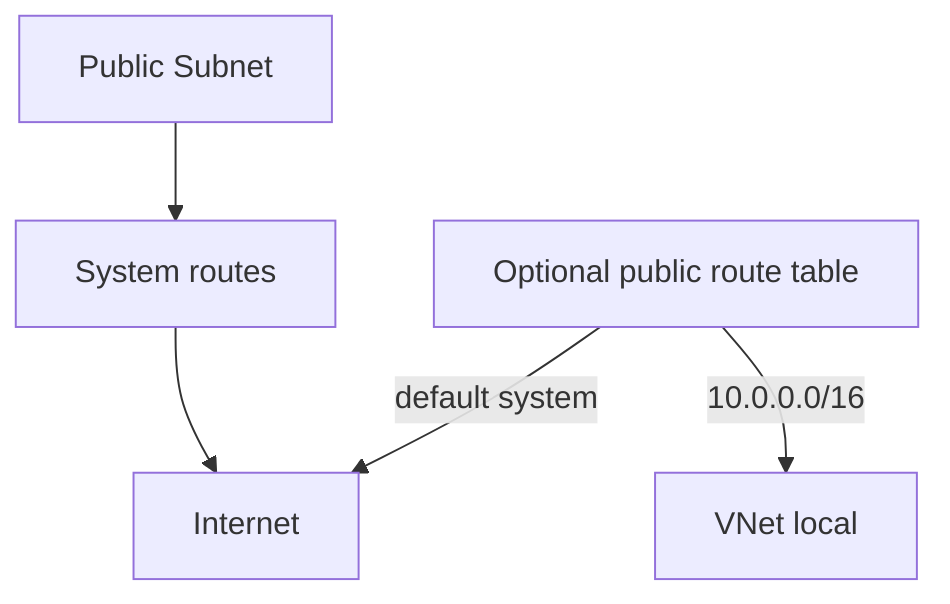

# Route Table and Routing (Light)

## 1. Concept Overview

Azure automatically creates **system routes** for each subnet, including a default route to **Internet**. For a public VM with a Public IP, you often need **no custom route table** to reach the internet — unlike AWS where you must add `0.0.0.0/0 → IGW`.

This lesson teaches **route tables (UDRs)** lightly so you understand production patterns (force tunneling, NVA, private egress) without requiring a custom route for Lab 03 success.

---

## 2. Why DevOps Engineers Configure Route Tables

Custom **user-defined routes (UDRs)** send traffic to a firewall appliance, ExpressRoute, or specific next hop. Misrouting is a top cause of “SSH times out” when someone *accidentally* overrides system Internet routes.

---

## 3. Important Terms

| Term | Meaning |
|------|---------|
| **System routes** | Azure defaults (VNet local, Internet, etc.) |
| **UDR / Route table** | Optional table you create and associate to subnets |
| **Next hop types** | VirtualAppliance, Internet, VNetLocal, None, etc. |
| **Effective routes** | What a NIC actually uses after system + UDR merge |

---

## 4. Architecture Diagram

---

## 5. Before You Start

Public IP created; public subnet exists.

> **Cost warning:** Route tables are free. Do not add routes that blackhole traffic (`None`) for Internet unless experimenting carefully.

---

## 6. Step-by-Step Azure Portal Lab

### Step 1 — Inspect effective system routing concept

1. Open VNet → **Subnets** → `devops-lab-<yourname>-public`
2. Note there is **no requirement** to attach a route table for basic internet with Public IP
3. After the VM exists (next lessons), you can open NIC → **Effective routes** to see system Internet route

### Step 2 — Create an optional route table (awareness)

1. Search **Route tables** → **+ Create**
2. **Name:** `devops-lab-<yourname>-public-rt`
3. **Resource group / Region:** `rg-03` / Southeast Asia
4. **Create**

### Step 3 — Do NOT override Internet incorrectly

1. Open the route table → **Routes** → **+ Add**
2. Classroom rule: **skip adding routes** for this lab unless instructor asks
3. A common production route example (read-only awareness):

| Name | Address prefix | Next hop |
|------|----------------|----------|
| to-firewall | `0.0.0.0/0` | Virtual appliance (firewall IP) |

For Lab 03 public VM + Public IP, **leave Azure system Internet routing alone**.

### Step 4 — Private subnet stays private

1. Do **not** give the private subnet a Public IP in this lab
2. Optional: associate a route table with no Internet next hop experiments — not required
3. Private subnet has no inbound internet path without Public IP / LB / Bastion

### Step 5 — Associate (optional — only if instructor wants practice)

1. Route table → **Subnets** → **Associate**
2. Select only `devops-lab-<yourname>-public` if practicing association
3. Ensure you did **not** add a bad `0.0.0.0/0` → None route

---

## 7. Validation / Testing Steps

| Check | Expected |
|-------|----------|
| System Internet routing | Intact for public subnet / public NIC |
| Optional RT | Exists but does not break Internet |
| Private subnet | No public IP planned |

---

## 8. Troubleshooting

| Problem | Solution |
|---------|----------|
| No internet on VM | Check Public IP association first; then Effective routes for `0.0.0.0/0` |
| Accidental blackhole UDR | Delete the bad route or disassociate route table |

---

## 9. Cleanup

[cleanup.md](cleanup.md)

---

## 10. Interview Questions

1. **What makes Azure public internet routing different from AWS IGW routes?**
   - *Azure provides system Internet routes; you attach a Public IP rather than creating an IGW.*

2. **When do you need a UDR?**
   - *When traffic must go through a firewall/NVA or custom next hop path.*

---

## 11. What We Achieved

- Understood system routes vs optional UDRs
- Avoided unnecessary/risky Internet overrides for the lab

**Next:** [06-nsg-basics.md](06-nsg-basics.md)

---

## 12. References

- [Virtual network traffic routing](https://learn.microsoft.com/azure/virtual-network/virtual-networks-udr-overview)
- [Diagnose a virtual machine network traffic filter problem](https://learn.microsoft.com/azure/network-watcher/diagnose-vm-network-traffic-filtering-problem)
