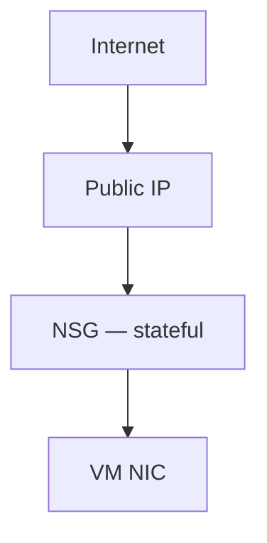

# NSG Basics (Azure Focus)

## 1. Concept Overview

Firewall layers compared to AWS:

| Layer | AWS | Azure (this course) |
|-------|-----|---------------------|
| Instance/NIC firewall | Security Group (stateful) | **NSG** (stateful) |
| Subnet edge ACL | Network ACL (stateless) | **No NACL equivalent in labs** — use NSG on subnet and/or Azure Firewall later |

**Defense in depth here:** place NSGs on the NIC and/or subnet; keep private subnet without public IPs.

---

## 2. Why DevOps Engineers Use NSGs

- Daily rules (SSH from My IP, HTTP from LB)
- Subnet-level association for whole tiers
- Document allow lists without OS `iptables` edits

For this lab, create a dedicated **NSG**; Azure has **no NACL** workflow to customize.

---

## 3. Important Terms

| Term | Meaning |
|------|---------|
| **Inbound / Outbound** | Both exist for NSGs |
| **Priority** | Lower number wins |
| **Application Security Group (ASG)** | Tag NICs for source/destination grouping (advanced) |

---

## 4. Architecture Diagram

---

## 5. Before You Start

| NSG name | `devops-lab-<yourname>-vnet-nsg` |
| RG | `devops-lab-<yourname>-rg-03` |

> **Cost warning:** NSGs are free.

---

## 6. Step-by-Step Azure Portal Lab

### Create NSG for custom VNet labs

1. Search **Network security groups** → **+ Create**
2. **Name:** `devops-lab-<yourname>-vnet-nsg`
3. **Resource group:** `devops-lab-<yourname>-rg-03`
4. **Region:** Southeast Asia
5. **Create**

### Add inbound rules

1. Open NSG → **Inbound security rules** → **+ Add**

| Priority | Name | Port | Protocol | Source | Action |
|----------|------|------|----------|--------|--------|
| 1000 | Allow-SSH-MyIP | 22 | TCP | `YOUR_IP/32` | Allow |
| 1010 | Allow-HTTP-MyIP | 80 | TCP | `YOUR_IP/32` | Allow |

2. Leave outbound defaults (Allow Internet)

### Associate NSG (choose one approach)

**Option A — Subnet association (good for tier policy)**

1. NSG → **Subnets** → **+ Associate**
2. VNet: `devops-lab-<yourname>-vnet`
3. Subnet: `devops-lab-<yourname>-public`

**Option B — Attach during VM create**

Select this NSG on the NIC in the next lesson.

### Classroom note — AWS NACL

| Mistake | Result |
|---------|--------|
| Expecting NACL deny lists in Azure | Use NSG deny rules or Azure Firewall instead |
| SG open SSH to 0.0.0.0/0 / Any | High risk — use My IP |

---

## 7. Validation / Testing Steps

| Check | Expected |
|-------|----------|
| NSG in `rg-03` | Exists |
| Inbound | SSH + HTTP from your IP |
| Association plan | Subnet and/or NIC for public tier |

---

## 8. Troubleshooting

| Problem | Solution |
|---------|----------|
| Rules present but blocked | Check priority vs default deny; verify association to correct NIC/subnet |
| Both NIC and subnet NSG | Traffic must be allowed through both |

---

## 9. Cleanup

[cleanup.md](cleanup.md)

---

## 10. Interview Questions

1. **Is an NSG stateful?**
   - *Yes — like AWS security groups.*

2. **Does Azure have NACLs?**
   - *No direct NACL feature; use NSGs (and Azure Firewall for advanced edge filtering).*

3. **NIC NSG vs subnet NSG?**
   - *Either or both; when both exist, traffic is filtered by both.*

---

## 11. What We Achieved

- Created NSG with My IP rules for SSH/HTTP
- Understood NSG vs AWS SG/NACL mapping

**Next:** [07-launch-vm-in-custom-vnet.md](07-launch-vm-in-custom-vnet.md)

---

## 12. References

- [Network security groups](https://learn.microsoft.com/azure/virtual-network/network-security-groups-overview)
- [How network security groups filter network traffic](https://learn.microsoft.com/azure/virtual-network/network-security-group-how-it-works)
