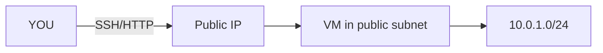

# Launch VM in Custom VNet

## 1. Concept Overview

Launch a Linux VM in the **public subnet** of your custom VNet, attach your Public IP and NSG, install nginx, test SSH and HTTP — same as Lab 02 but on **your network**.

---

## 2. Why DevOps Engineers Do This

Production apps run in custom VNets, not auto-wizard networks alone. This lab proves your VNet design works.

---

## 3. Important Terms

| Resource | Name |
|----------|------|
| Resource group | `devops-lab-<yourname>-rg-03` |
| VM | `devops-lab-<yourname>-vpc-web` |
| SSH key | Reuse `devops-lab-<yourname>-key` or create `...-vpc-key` |
| NSG | `devops-lab-<yourname>-vnet-nsg` |
| Public IP | `devops-lab-<yourname>-pip` |
| Subnet | `devops-lab-<yourname>-public` |

---

## 4. Architecture Diagram



---

## 5. Before You Start

Complete VNet, subnets, Public IP, routing awareness, and NSG steps.

> **Cost warning:** VM bills while running. Delete `rg-03` after lab.

---

## 6. Step-by-Step Azure Portal Lab

### Step 1 — Launch VM into custom VNet

1. **Virtual machines** → **+ Create** → **Azure virtual machine**
2. **Resource group:** `devops-lab-<yourname>-rg-03`
3. **Name:** `devops-lab-<yourname>-vpc-web`
4. **Region:** Southeast Asia
5. **Image:** Ubuntu Server 22.04 LTS
6. **Size:** `Standard_B1s`
7. **Authentication:** SSH public key → paste your `.pub` key
8. **Username:** `azureuser`
9. **Networking** tab:
   - **Virtual network:** `devops-lab-<yourname>-vnet`
   - **Subnet:** `devops-lab-<yourname>-public`
   - **Public IP:** select `devops-lab-<yourname>-pip` (or create if you skipped lesson 04)
   - **NIC NSG:** Advanced → select `devops-lab-<yourname>-vnet-nsg`
10. Tags: `Project=azure-basic`, `Owner=<yourname>`
11. **Review + create** → **Create**

### Step 2 — SSH and install nginx

```bash
ssh -i ~/.ssh/devops-lab-<yourname>-key azureuser@<PUBLIC_IP>

sudo apt update
sudo apt install nginx -y
sudo systemctl enable --now nginx
echo "<h1>Custom VNet — devops-lab-<yourname></h1>" | sudo tee /var/www/html/index.nginx-debian.html
```

### Step 3 — Browser test

Open `http://<PUBLIC_IP>` from laptop (NSG must allow HTTP from your IP).

---

## 7. Validation / Testing Steps

| Check | Expected |
|-------|----------|
| VM in custom VNet | Networking shows your VNet/subnet |
| Subnet | Public subnet |
| SSH | Works |
| HTTP | nginx page loads |

---

## 8. Troubleshooting

| Problem | Solution |
|---------|----------|
| No public IP on VM | Associate `devops-lab-<yourname>-pip` to NIC |
| Timeout | NSG missing My IP rules; wrong subnet; VM not Running |
| Wrong VNet | Delete VM and relaunch into correct VNet |

---

## 9. Cleanup

[cleanup.md](cleanup.md) immediately after validation.

---

## 10. Interview Questions

1. **Why launch in the public subnet for this lab?**
   - *Direct internet access via Public IP for SSH and HTTP testing.*

2. **Where would MySQL Flexible Server go later?**
   - *Private subnet / private access with NSGs allowing only the app tier.*

---

## 11. What We Achieved

- VM running in **custom VNet** public subnet
- nginx tested over HTTP
- End-to-end custom network working

**Next:** [cleanup.md](cleanup.md)

---

## 12. References

- [Create a Linux VM in the Azure portal](https://learn.microsoft.com/azure/virtual-machines/linux/quick-create-portal)
- [Associate a public IP to a VM](https://learn.microsoft.com/azure/virtual-network/ip-services/associate-public-ip-address-vm)
