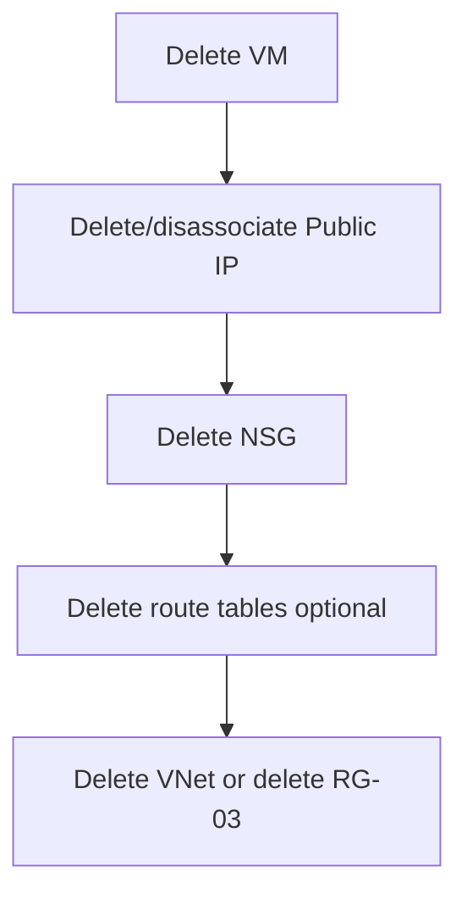

# Custom VNet VM — Cleanup

## 1. Concept Overview

Delete in **dependency order**: VM → NIC/Public IP/NSG → optional route table → subnets → VNet — **or** delete the whole resource group `devops-lab-<yourname>-rg-03` (preferred).

---

## 2. Why DevOps Engineers Clean Up VNet Labs

Orphaned VNets are cheap, but attached VMs and public IPs cost money. Clean habits prevent clutter and surprise bills.

---

## 3. Important Terms

**Dependency order** — delete children before parents when not using resource-group delete.

---

## 4. Architecture Diagram

---

## 5. Before You Start

Region `southeastasia`. Download any data from the VM first.

> **Cost warning:** VM must be deleted first to stop compute charges.

---

## 6. Step-by-Step Cleanup

### Preferred — Delete resource group

1. **Resource groups** → `devops-lab-<yourname>-rg-03`
2. **Delete resource group** → type name → Delete
3. Done

### Alternative — Piecewise delete

### Step 1 — Delete VM

**Virtual machines** → delete `devops-lab-<yourname>-vpc-web` (delete associated disks when prompted)

### Step 2 — Delete Public IP

**Public IP addresses** → delete `devops-lab-<yourname>-pip` (disassociate if needed)

### Step 3 — Delete NSG

**Network security groups** → delete `devops-lab-<yourname>-vnet-nsg`

### Step 4 — Delete route table (if created)

**Route tables** → delete `devops-lab-<yourname>-public-rt`

### Step 5 — Delete VNet

**Virtual networks** → delete `devops-lab-<yourname>-vnet` (subnets delete with it if empty)

### Step 6 — Delete leftover NICs / disks

Remove any remaining NICs or disks in `rg-03`, then delete the empty RG.

---

## 7. Validation

| Check | Expected |
|-------|----------|
| `rg-03` gone | Not listed (preferred) |
| No lab VMs | VM list clean for this lab |
| Public IP gone | Deleted |

---

## 8. Troubleshooting

| Problem | Solution |
|---------|----------|
| VNet has dependencies | Delete VMs, NICs, private endpoints first |
| Public IP won't delete | Dissociate from NIC first |

---

## 9. Cleanup Checklist

- [ ] VM terminated/deleted
- [ ] Public IP deleted
- [ ] NSG deleted
- [ ] Route table deleted (if any)
- [ ] VNet deleted **or** entire `rg-03` deleted
- [ ] Local key kept or removed intentionally

---

## 10. Interview Questions

1. **Why is deleting the resource group preferred?**
   - *Removes dependent networking and compute resources in one operation.*

2. **Can you delete a VNet with a running VM?**
   - *No — remove VMs/NICs first.*

---

## 11. What We Achieved

- Fully removed custom VNet lab environment

**Next:** [04-managed-disks](../04-managed-disks/README.md)

---

## 12. References

- [Delete a resource group](https://learn.microsoft.com/azure/azure-resource-manager/management/delete-resource-group)
- [Delete a virtual network](https://learn.microsoft.com/azure/virtual-network/virtual-network-manage)
