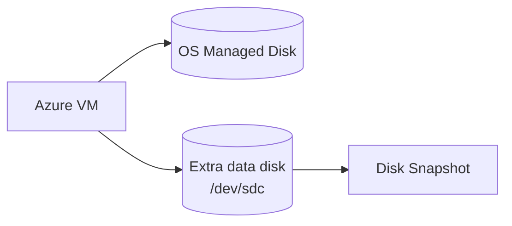

# Managed Disk Theory

## 1. Concept Overview

**Azure Managed Disks** provide persistent block storage volumes for VMs. Like a USB drive for your virtual server — data survives reboots when attached. Azure manages the underlying storage account complexity for you.

**AWS mapping:** EBS → Managed Disk; gp3 → Premium SSD v2 / Standard SSD (lab uses Standard SSD); snapshot → disk snapshot; AZ-bound attach → same region/zone constraints for attach.

---

## 2. Why DevOps Engineers Use Managed Disks

| Use | Example |
|-----|---------|
| OS disk | Ubuntu system disk created with the VM |
| Data disk | Separate `/data` for databases or logs |
| Snapshots | Backup and create new disks from point-in-time copies |

---

## 3. Important Terms

| Term | Meaning |
|------|---------|
| **Standard SSD** | Cost-effective SSD for labs/dev |
| **Premium SSD** | Higher IOPS/throughput for production |
| **Ultra Disk** | Extreme performance (advanced) |
| **OS disk** | Boot disk attached at VM create |
| **Data disk** | Extra disk you attach (this lab) |
| **Snapshot** | Point-in-time backup of a managed disk |
| **LUN** | Logical unit number for the data disk on the VM |

---

## 4. Architecture Diagram

---

## 5. Before You Start

Region `southeastasia`. You need a running VM from Lab 02 (`devops-lab-<yourname>-web` in `rg-02`). If cleaned up, relaunch Lab 02 quickly before continuing.

> **Cost warning:** Disks charged per GB-month. Snapshots charged per GB-month stored. Use **8–10 GiB** for labs.

---

## 6–9. Theory Lab

1. Portal → **Disks** — view existing OS disks
2. Note **Disk state** (Attached / Unattached)
3. Note **Location** — must match VM region for attach
4. Open Lab 02 VM → **Disks** blade — see OS disk, empty data disks list

No extra disk created yet.

---

## 7. Validation

Understand disk list, OS vs data disks, and region column.

---

## 8. Troubleshooting

| Problem | Solution |
|---------|----------|
| No disks | Launch Lab 02 VM first — OS disk auto-created |

---

## 9. Cleanup

N/A

---

## 10. Interview Questions

1. **Managed disk vs ephemeral OS disk / temp disk?**
   - *Managed disks persist; temp disk on some sizes is ephemeral and lost on deallocate/redeploy.*

2. **Can you attach a disk from another region?**
   - *No — disk must be in the same region as the VM (and zone constraints apply for zonal disks).*

---

## 11. What We Achieved

- Understood managed disk types and attach constraints

**Next:** [02-create-and-attach-disk.md](02-create-and-attach-disk.md)

---

## 12. References

- [Azure managed disks overview](https://learn.microsoft.com/azure/virtual-machines/managed-disks-overview)
- [Disk types](https://learn.microsoft.com/azure/virtual-machines/disks-types)
