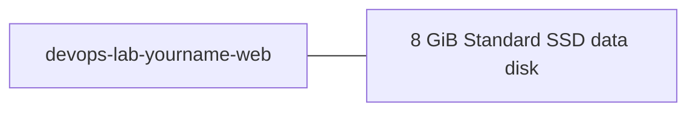

# Create and Attach Managed Disk

## 1. Concept Overview

Create a new **8 GiB Standard SSD** data disk and attach it to the running Lab 02 VM as a second disk.

**Names:** Disk `devops-lab-<yourname>-data-disk`

---

## 2. Why DevOps Engineers Attach Extra Data Disks

Separate data from the OS disk — easier backup, resize, and snapshot without touching the OS disk.

---

## 3. Important Terms

| Term | Meaning |
|------|---------|
| **LUN** | Host bus location Azure assigns (0, 1, …) |
| **Attach** | Links disk to VM in same region |
| **Host caching** | ReadOnly / ReadWrite / None for data disks |

---

## 4. Architecture Diagram



---

## 5. Before You Start

| Item | Detail |
|------|--------|
| VM | Running `devops-lab-<yourname>-web` from [Lab 02](../02-vm-default-vnet/README.md) — **do not delete Lab 02 yet** |
| RG | `devops-lab-<yourname>-rg-02` |
| Region | Same as VM (`southeastasia`) |

> **Cost warning:** Disks bill monthly per GB — delete after lab. Run [cleanup.md](cleanup.md) when finished (also cleans Lab 02 VM).

---

## 6. Step-by-Step Portal Lab

### Step 1 — Create disk

1. Search **Disks** → **+ Create**
2. **Resource group:** `devops-lab-<yourname>-rg-02`
3. **Disk name:** `devops-lab-<yourname>-data-disk`
4. **Region:** Southeast Asia (match VM; match zone if VM is zonal)
5. **Source type:** None (empty disk)
6. **Size:** Change size → **8 GiB**, **Standard SSD**
7. Tags: `Name`/`Project=azure-basic`, `Owner=<yourname>`
8. **Review + create** → **Create**

### Step 2 — Attach to VM

1. Open VM `devops-lab-<yourname>-web` → **Disks**
2. **+ Create and attach a new disk** *or* **Attach existing disks**
3. Select `devops-lab-<yourname>-data-disk`
4. **LUN:** accept default (e.g. 0)
5. **Host caching:** ReadOnly (common for data) or None — lab default OK
6. **Save**
7. Wait until disk shows under Data disks

### Step 3 — SSH and find disk

```bash
lsblk
```

Look for a new disk (e.g. `sdc` or `nvme0n2`) — **no filesystem yet**.

Alternatively:

```bash
ls -l /dev/disk/azure/scsi1/
```

---

## 7. Validation

| Check | Expected |
|-------|----------|
| Disk attached | Listed under VM → Disks |
| `lsblk` | New disk without mountpoint |

---

## 8. Troubleshooting

| Problem | Solution |
|---------|----------|
| Attach fails | Region/zone mismatch — recreate disk matching VM |
| Disk not in `lsblk` | Wait 30s; refresh; reboot VM if needed |
| Wrong RG | Create disk in `rg-02` with the VM |

---

## 9. Cleanup

[cleanup.md](cleanup.md) after snapshot lab.

---

## 10. Interview Questions

1. **Why match region (and zone when applicable)?**
   - *Disks attach only to VMs that meet Azure locality rules for that disk.*

---

## 11. What We Achieved

- Created and attached an extra managed data disk

**Next:** [03-format-mount-persist-disk.md](03-format-mount-persist-disk.md)

---

## 12. References

- [Attach a data disk to a Linux VM](https://learn.microsoft.com/azure/virtual-machines/linux/attach-disk-portal)
