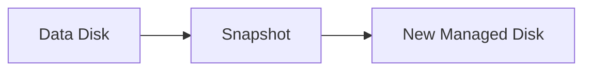

# Snapshot and Restore

## 1. Concept Overview

A **managed disk snapshot** is a point-in-time backup of a disk. Create a snapshot from the data disk; restore by creating a **new managed disk** from the snapshot (optionally attach and mount).

**AWS mapping:** EBS snapshot → Azure snapshot; create volume from snapshot → create disk from snapshot.

---

## 2. Why DevOps Engineers Use Snapshots

- Backup before changes
- Clone disk to a new VM
- Disaster recovery baseline

---

## 3. Important Terms

| Term | Meaning |
|------|---------|
| **Snapshot** | Point-in-time copy of a managed disk |
| **Incremental snapshot** | Stores changed data efficiently (Azure incremental snapshots) |
| **Create disk from snapshot** | Restore/clone workflow |

---

## 4. Architecture Diagram



---

## 5. Before You Start

Data disk with files in `/data`.

> **Cost warning:** Snapshots cost per GB-month stored.

---

## 6. Step-by-Step Portal Lab

### Create snapshot

1. **Disks** → select `devops-lab-<yourname>-data-disk`
2. **Create snapshot** (or Snapshots blade → Create)
3. **Name:** `devops-lab-<yourname>-data-snap`
4. **Resource group:** `devops-lab-<yourname>-rg-02`
5. **Snapshot type:** Full (or Incremental if offered and instructor prefers)
6. Tags: `Project=azure-basic`, `Owner=<yourname>`
7. **Review + create** → **Create**
8. Wait until snapshot succeeds

### Restore (create disk from snapshot)

1. Open snapshot → **Create disk** (or Disks → Create → Source = Snapshot)
2. **Name:** `devops-lab-<yourname>-restored-disk`
3. **Size / type:** match or larger than original (e.g. 8 GiB Standard SSD)
4. **Region:** same as VM
5. **Create**
6. Optional: detach old data disk, attach restored disk to the VM, mount `/data`

### Verify data (if reattached)

```bash
# Identify new device with lsblk, then:
sudo mount /dev/sdc /data   # adjust device
cat /data/testfile.txt
```

---

## 7. Validation

| Check | Expected |
|-------|----------|
| Snapshot | Succeeded |
| Restored disk | Available or attached with data |

---

## 8. Troubleshooting

| Problem | Solution |
|---------|----------|
| Snapshot pending long | Normal for first snap on larger disks — wait |
| Cannot create disk | Ensure snapshot completed; check region |

---

## 9. Cleanup

[cleanup.md](cleanup.md) — delete snapshots and disks (includes Lab 02 VM).

---

## 10. Interview Questions

1. **What is a managed disk snapshot?**
   - *A point-in-time backup of a managed disk stored as an Azure snapshot resource.*

2. **Are snapshots incremental?**
   - *Azure supports incremental snapshots that store only changed data after the baseline.*

---

## 11. What We Achieved

- Created snapshot and restored a disk

**Next:** [cleanup.md](cleanup.md)

---

## 12. References

- [Create a snapshot of a managed disk](https://learn.microsoft.com/azure/virtual-machines/snapshot-copy-managed-disk)
- [Create a managed disk from a snapshot](https://learn.microsoft.com/azure/virtual-machines/scripts/create-managed-disk-from-snapshot)
