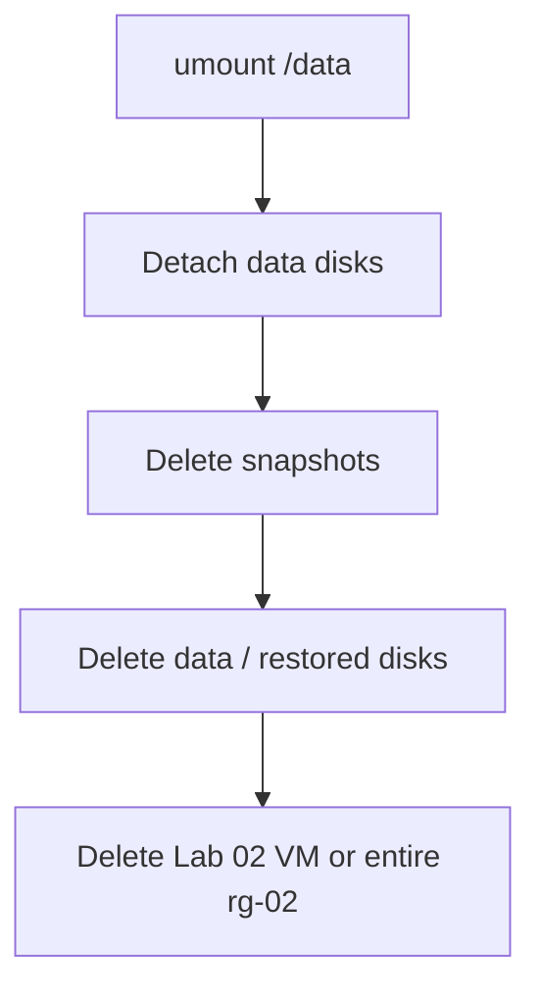

# Managed Disks — Cleanup

## 1. Concept Overview

Unmount, detach, delete data disks and snapshots to stop storage charges. This cleanup also finishes **Lab 02** by deleting `devops-lab-<yourname>-web` / `rg-02`.

---

## 2. Why Clean Up

Managed disks and snapshots bill even when the VM is stopped (deallocated).

---

## 3–4. Diagram



---

## 5. Before You Start

Region `southeastasia`.

> **Cost warning:** Unattached disks and snapshots keep charging.

---

## 6. Step-by-Step Cleanup

### On VM (SSH)

```bash
sudo umount /data
```

Remove the `/data` line from `/etc/fstab` if added.

### Portal — detach and delete storage first

1. VM → **Disks** → detach `devops-lab-<yourname>-data-disk` and `devops-lab-<yourname>-restored-disk` if attached → **Save**
2. **Disks** → delete data disk and restored disk
3. **Snapshots** → delete `devops-lab-<yourname>-data-snap` and any restore-test snapshots

### Portal — remove Lab 02 compute (preferred)

1. **Resource groups** → delete `devops-lab-<yourname>-rg-02`  
   This removes the Lab 02 VM, OS disk, NIC, NSG, public IP, and VNet created for that lab.

### Alternative — delete VM then leftovers

1. Delete VM `devops-lab-<yourname>-web`
2. Delete remaining disks, NSG, public IP, VNet in `rg-02`
3. Delete empty `rg-02`
4. Optionally remove local SSH private key if no longer needed

---

## 7. Validation

No lab data disks or snapshots remain. Lab 02 VM / `rg-02` gone.

---

## 8. Troubleshooting

| Problem | Solution |
|---------|----------|
| Cannot detach | Stop (deallocate) VM first, then detach |
| Disk in-use | Detach from VM; ensure no other VM attachment |
| Snapshot won't delete | Ensure no disks currently being created from it |

---

## 9. Checklist

- [ ] `/data` unmounted; fstab entry removed
- [ ] Data disks detached and deleted
- [ ] Snapshots deleted
- [ ] Lab 02 VM / `rg-02` deleted
- [ ] Local SSH key secured or removed intentionally

---

## 10. Interview Questions

1. **Stopped (deallocated) VM disk cost?**
   - *Managed disks still billed while they exist.*

---

## 11. What We Achieved

- Zero disk/snapshot charges from this lab
- Cleaned Lab 02 resources that were deferred for Managed Disks

**Next:** [05-blob-storage](../05-blob-storage/README.md) *(when available)*

---

## 12. References

- [Detach a data disk](https://learn.microsoft.com/azure/virtual-machines/linux/detach-disk)
- [Delete a snapshot](https://learn.microsoft.com/azure/virtual-machines/snapshot-copy-managed-disk?tabs=portal#clean-up-resources)
