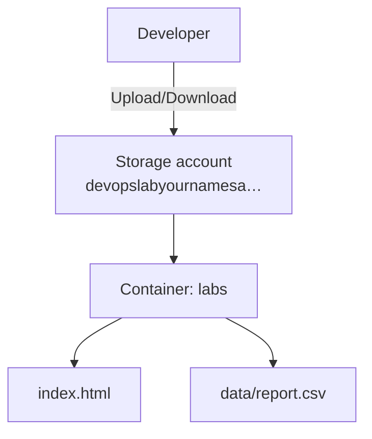

# Blob Storage Theory

## 1. Concept Overview

**Azure Blob Storage** is object storage. Store files as **blobs** in **containers** inside a **storage account** — high scale, designed for durability across replicas in the account’s redundancy mode.

Unlike managed disks (attached to one VM), Blob Storage is accessed over HTTPS/API from anywhere with authorization.

---

## 2. Why DevOps Engineers Use Blob Storage

| Use | Example |
|-----|---------|
| Artifacts | CI build outputs, Terraform state (with locking) |
| Static content | HTML/CSS/JS (often behind CDN — advanced) |
| Backups | DB dumps, log archives |
| Data lake | Analytics input files (Data Lake Gen2) |

---

## 3. Important Terms

| Term | Meaning |
|------|---------|
| **Storage account** | Top-level resource — name is globally unique |
| **Container** | Folder-like namespace for blobs (like an S3 bucket interior) |
| **Blob** | Object = data + metadata |
| **Blob name / path** | Key-like path (e.g. `images/logo.png`) |
| **Region** | Storage account lives in one region |
| **Versioning** | Keep multiple versions of the same blob |
| **Encryption** | Server-side encryption by default (Microsoft-managed keys) |
| **Anonymous access** | Public blob/container read — **avoid in basic lab** |

---

## 4. Architecture Diagram

---

## 5. Before You Start

Region `southeastasia`. Storage account names must be **globally unique**, **3–24 characters**, **lowercase letters and numbers only** (no hyphens).

> **Cost warning:** Pennies for small labs; delete the storage account when done.

---

## 6–9. Explore Storage Console

1. Open **Storage accounts**
2. Note performance tiers (Standard vs Premium) and redundancy options
3. Look for **Access control (IAM)** and **Shared access signature** concepts (covered later)

---

## 10. Interview Questions

1. **Blob Storage vs managed disk?**
   - *Blob is object storage via API; managed disk is block storage for one VM.*

2. **Storage account name uniqueness?**
   - *Global across all Azure subscriptions — must be 3–24 lowercase alphanumeric.*

---

## 11. What We Achieved

- Understood storage accounts, containers, blobs, and region

**Next:** [02-create-storage-account.md](02-create-storage-account.md)
