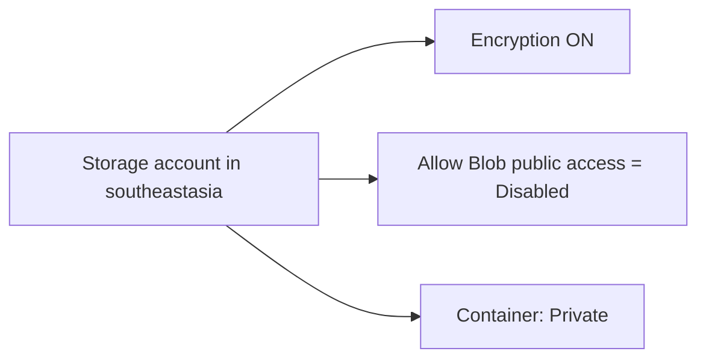

# Create Storage Account

## 1. Concept Overview

Create a storage account (e.g. `devopslab<yourname>sa<random>`) in `southeastasia` with secure defaults: no anonymous public access, encryption on, and a private blob container.

**Naming reminder:** storage account names are **3–24 lowercase alphanumeric only** — no hyphens. Course pattern `devops-lab-<yourname>-…` becomes something like `devopslab<yourname>sa01`.

---

## 2. Why DevOps Engineers Configure Storage Carefully

Misconfigured public containers cause data leaks — disable anonymous blob access unless you have a deliberate CDN or static-site pattern with controls.

---

## 3. Important Terms

**Storage account example:** `devopslabfaizulsa2026` (add digits/letters if taken)

**Container name:** `labs` (lowercase, 3–63 chars, letters/numbers/hyphens)

---

## 4. Architecture Diagram

---

## 5. Before You Start

Resource group: create or reuse `devops-lab-<yourname>-rg`.

> **Cost warning:** Capacity + transactions. Keep blobs small.

---

## 6. Step-by-Step Console Lab

### Step 1 — Resource group (if needed)

1. **Resource groups** → **Create**
2. **Name:** `devops-lab-<yourname>-rg`
3. **Region:** Southeast Asia
4. **Tags:** `Project=azure-basic-lab`, `Owner=<yourname>`, `Environment=training`
5. **Create**

### Step 2 — Create storage account

1. **Storage accounts** → **Create**
2. **Subscription:** your training subscription
3. **Resource group:** `devops-lab-<yourname>-rg`
4. **Storage account name:** `devopslab<yourname>sa<random>` (must be unique, 3–24 chars, [a-z0-9] only)
5. **Region:** Southeast Asia
6. **Performance:** Standard
7. **Redundancy:** LRS (cheapest for lab)
8. **Next: Advanced**
   - **Allow enabling anonymous access on individual containers:** **Disabled** (or equivalent — keep account-level public blob access off)
9. **Next: Networking** — Public endpoint from all networks is OK for lab; firewall optional
10. **Encryption:** default Microsoft-managed keys
11. **Tags:** `Project=azure-basic-lab`, `Owner=<yourname>`
12. **Review + create** → **Create**

### Step 3 — Create container

1. Open the storage account → **Containers** → **+ Container**
2. **Name:** `labs`
3. **Anonymous access level:** **Private (no anonymous access)**
4. **Create**

---

## 7. Validation

| Check | Expected |
|-------|----------|
| Storage account listed | Region Southeast Asia |
| Public blob access | Disabled / private |
| Container `labs` | Private |

---

## 8. Troubleshooting

| Problem | Solution |
|---------|----------|
| Name taken / invalid | Shorter name; only lowercase letters and numbers |
| Wrong region | Recreate in Southeast Asia (storage account region is fixed at create) |

---

## 9. Cleanup

[cleanup.md](cleanup.md)

---

## 10. Interview Questions

1. **Should lab containers be anonymous/public?**
   - *No — keep private and use RBAC or SAS. Avoid anonymous static website in this basic lab.*

---

## 11. What We Achieved

- Created a private storage account and blob container

**Next:** [03-upload-download-blobs.md](03-upload-download-blobs.md)
