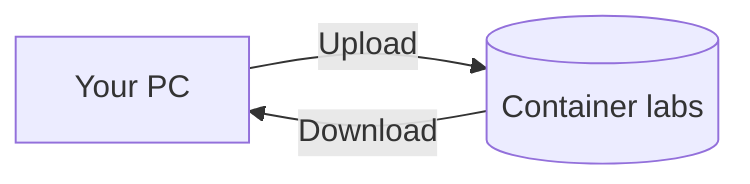

# Upload and Download Blobs

## 1. Concept Overview

Upload files to Blob Storage as **blobs** with **blob names** (paths). Download via Portal or authenticated tools (Azure CLI / Storage Explorer — later modules).

---

## 2. Why DevOps Engineers Use Blobs for Objects

Central artifact store for builds, logs, and static assets.

---

## 3. Important Terms

| Term | Meaning |
|------|---------|
| **Virtual directory / prefix** | Folder-like path (`logs/2026/app.log`) |
| **Upload** | Put blob into container |
| **Block blob** | Default type for files and most apps |

---

## 4. Architecture Diagram

---

## 5. Before You Start

Storage account and `labs` container created. Prepare small text file `hello.txt` on laptop.

---

## 6. Step-by-Step Console Lab

### Upload

1. Storage account → **Containers** → `labs` → **Upload**
2. Select `hello.txt`
3. **Advanced** → **Upload to folder** (optional): `week1`
4. **Upload**

### Create second blob via Portal

1. Optionally use **Upload** again with folder `images/`
2. Upload a small `.png` or second text file

### Download

1. Select `hello.txt` (or `week1/hello.txt`) → **Download**
2. Open file locally — verify content

### View blob properties

1. Click blob → note **URL**, **Size**, **Content type**, **Lease status**
2. Confirm access requires auth (anonymous browser open of blob URL should fail)

---

## 7. Validation

| Check | Expected |
|-------|----------|
| Blobs visible | Under correct prefix/folder |
| Download works | File matches upload |
| Anonymous URL | Denied / login required |

---

## 8. Troubleshooting

| Problem | Solution |
|---------|----------|
| Access denied | Your Entra ID needs Storage Blob Data Reader/Contributor (or use account key in Portal — Portal owners often already can manage) |
| Blob not listed | Refresh; check folder path |

---

## 9. Cleanup

Keep for versioning lesson.

---

## 10. Interview Questions

1. **Blob name vs blob?**
   - *Blob name is the path/key; the blob is name + data + metadata.*

---

## 11. What We Achieved

- Uploaded and downloaded blobs in a private container

**Next:** [04-versioning.md](04-versioning.md)
