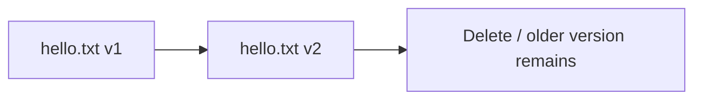

# Versioning

## 1. Concept Overview

**Blob versioning** keeps prior versions when a blob is overwritten or deleted. Protects against accidental deletes and overwrites. Related features: soft delete (can coexist).

---

## 2. Why DevOps Engineers Enable Versioning

- Recover previous file version
- Compliance and audit trail
- Pair with lifecycle management (advanced)

---

## 3. Important Terms

| Term | Meaning |
|------|---------|
| **Version ID** | Unique per blob version |
| **Current version** | Latest version of the blob |
| **Soft delete** | Retain deleted blobs for a retention period (optional) |

---

## 4. Architecture Diagram

---

## 5. Before You Start

> **Cost warning:** All versions stored — purge old versions in cleanup.

---

## 6. Step-by-Step Console Lab

### Enable versioning

1. Storage account → **Data management** → **Data protection** (or **Blob service** → **Data protection**)
2. Enable **Enable versioning for blobs**
3. Optionally enable **Enable soft delete for blobs** with short retention (e.g. 7 days) — note for cleanup
4. **Save**

### Demonstrate versions

1. Upload `hello.txt` (path `week1/hello.txt`) with content `version 1`
2. Upload again same name/path with content `version 2` (overwrite)
3. Open blob → **Versions** tab (or enable version list view)
4. See two versions

### Delete and restore concept

1. Delete current `hello.txt`
2. With versioning: prior versions remain listed under Versions
3. Restore by promoting an older version to current (Portal: select version → **Make current version** / download + re-upload — follow UI label)

---

## 7. Validation

| Check | Expected |
|-------|----------|
| Versioning | Enabled on account |
| Two versions | Visible for overwritten blob |

---

## 8. Troubleshooting

| Problem | Solution |
|---------|----------|
| Cannot empty container | Delete all versions; check soft-deleted blobs |
| Versions tab missing | Confirm versioning is enabled; refresh Portal |

---

## 9. Cleanup

[cleanup.md](cleanup.md) — must delete all versions (and purge soft-deleted if needed).

---

## 10. Interview Questions

1. **Can you fully “turn off” versioning history?**
   - *You can disable versioning going forward; existing versions remain until deleted.*

---

## 11. What We Achieved

- Enabled blob versioning and observed version history

**Next:** [05-access-control-basic.md](05-access-control-basic.md)
