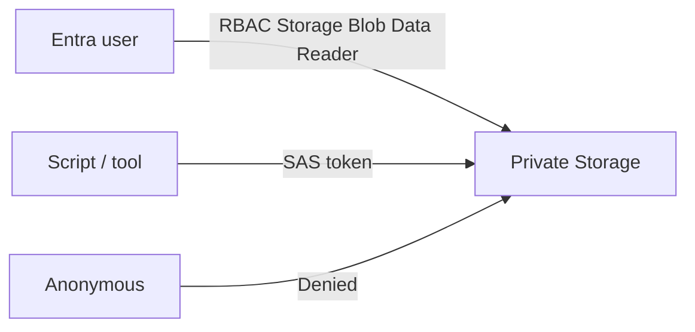

# Basic Access Control (RBAC and SAS)

## 1. Concept Overview

Azure Blob access is controlled by:

| Mechanism | Role |
|-----------|------|
| **RBAC** (Entra ID) | Grant identities roles like Storage Blob Data Reader on the account/container |
| **SAS** (Shared Access Signature) | Time-limited token for clients without Entra ID |
| **Account keys** | Full control — treat like root secrets; avoid in apps |

**Static website concept:** Azure can host static content from `$web` — that pattern usually involves anonymous or CDN access. **This basic lab stays private** — do **not** enable anonymous public website access.

---

## 2. Why DevOps Engineers Prefer RBAC / SAS over Keys

- Least privilege and auditable identity (RBAC)
- Scoped, expiring access for tools/partners (SAS)
- Account keys are powerful and hard to rotate safely if leaked

---

## 3. Important Terms

| Term | Meaning |
|------|---------|
| **Role assignment** | Who + role + scope (subscription / RG / account / container) |
| **Storage Blob Data Reader** | Read blob data (data-plane) |
| **Storage Blob Data Contributor** | Read/write blob data |
| **SAS** | Signed URI with expiry, permissions, optional IP |
| **Anonymous access** | Public read — **keep disabled** |

---

## 4. Architecture Diagram

---

## 5. Before You Start

Storage account name ready. You are Owner/Contributor on the resource group (control plane). Data-plane RBAC may still be required for some tools.

> **Cost warning:** Free to configure RBAC/SAS.

---

## 6. Step-by-Step Console Lab

### Step 1 — Confirm container stays private

1. Storage account → **Configuration** / **Allow Blob anonymous access** — **Disabled**
2. Container `labs` → **Change access level** — **Private**

### Step 2 — Assign RBAC (data plane example)

1. Storage account → **Access control (IAM)** → **Add role assignment**
2. **Role:** **Storage Blob Data Contributor** (or Reader for read-only demo)
3. **Members:** your Entra user (or lab user `devops-lab-<yourname>-user` if created in Lab 01)
4. **Scope:** this storage account (or container for tighter scope)
5. **Review + assign**

> Portal may already allow management via control-plane roles; RBAC data roles matter for CLI/SDKs and least-privilege demos.

### Step 3 — Generate a SAS (time-limited access)

1. Storage account → **Shared access signature** (account SAS) **or** container → **Generate SAS**
2. **Permissions:** Read (and List if needed) only — avoid full control for demos
3. **Start / Expiry:** short window (e.g. 1–2 hours)
4. **Allowed protocols:** HTTPS only
5. **Generate SAS and connection string** / **Generate SAS token and URL**
6. Copy blob URL + SAS query string — open in browser to download one blob

> Never commit SAS URLs to Git. Treat them as secrets.

### Step 4 — Static website (concept only — do NOT enable public)

1. Storage account → **Static website** — note `$web` container and primary endpoint
2. Enabling this for anonymous hosting is **out of scope** for this basic lab
3. Production pattern: private blobs + Azure CDN / Front Door with controlled origin access (advanced)

---

## 7. Validation

| Check | Expected |
|-------|----------|
| Anonymous access | Disabled |
| RBAC assignment | Visible under IAM |
| SAS download | Works until expiry; fails after |
| Public website | Not enabled for this lab |

---

## 8. Troubleshooting

| Problem | Solution |
|---------|----------|
| AuthorizationFailure on CLI | Assign Storage Blob Data * role; wait a few minutes for propagation |
| SAS 403 | Check expiry, permissions, HTTPS, clock skew |
| Policy / network deny | Firewall/VNet rules blocking your IP |

---

## 9. Cleanup

[cleanup.md](cleanup.md)

---

## 10. Interview Questions

1. **RBAC vs SAS?**
   - *RBAC ties access to Entra identity; SAS is a signed time-bound token for a resource.*

2. **Static site without anonymous container?**
   - *CDN/Front Door in front of private origin, or authenticated app delivery — not open anonymous `$web` for production secrets.*

---

## 11. What We Achieved

- Applied private container access with RBAC and SAS
- Understood why anonymous public website is avoided in this basic lab

**Next:** [cleanup.md](cleanup.md)
