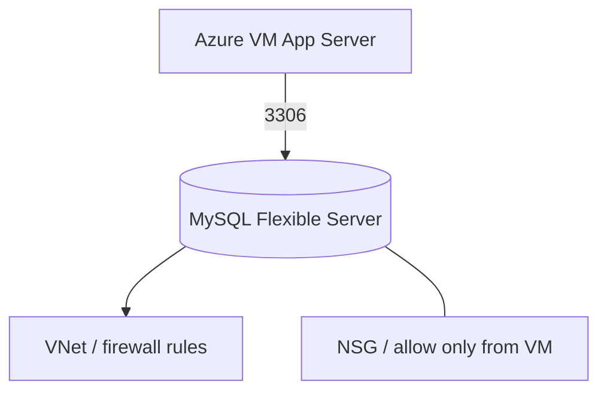

# MySQL Flexible Server Theory

## 1. Concept Overview

**Azure Database for MySQL — Flexible Server** is a managed MySQL service. Azure handles patching, hosting infrastructure, backups, and high-availability options.

You manage: schemas, database users, networking rules, and SKU sizing.

---

## 2. Why DevOps Engineers Use Flexible Server

| vs MySQL on a VM | Flexible Server benefit |
|------------------|-------------------------|
| OS/DB patching | Azure manages platform |
| Backups | Automated backups |
| HA options | Zone-redundant HA (costs more) |
| Ops time | Focus on app not database admin |

---

## 3. Important Terms

| Term | Meaning |
|------|---------|
| **Flexible Server** | Managed MySQL instance |
| **SKU / compute tier** | Burstable, General Purpose, Memory Optimized |
| **Burstable (B-series)** | Smallest/cheapest for labs (e.g. Standard_B1ms) |
| **VNet integration** | Private access inside virtual network (preferred) |
| **Public access + firewall** | IP allow list — **restrict tightly; avoid 0.0.0.0/0 in production** |

---

## 4. Architecture Diagram

---

## 5. Before You Start

Region `southeastasia`.

> **Cost warning:** Flexible Server bills **while running** + storage. **Most expensive beginner lab.** Delete **same day**. Use smallest **Burstable** SKU.

---

## 6. Explore MySQL Console

1. Open **Azure Database for MySQL flexible servers**
2. Note **Networking**, **Compute + storage**, **Backup and restore**

---

## 10. Interview Questions

1. **Flexible Server vs MySQL on VM?**
   - *Flexible Server is managed patching/backups; on a VM you manage everything.*

2. **Should MySQL be open to the internet?**
   - *No for production — private networking; allow only app subnet/VM.*

---

## 11. What We Achieved

- Understood managed MySQL concepts on Azure

**Next:** [02-create-mysql-flexible.md](02-create-mysql-flexible.md)
