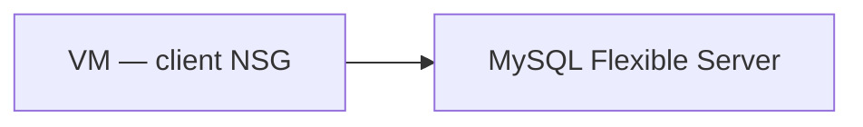

# Create MySQL Flexible Server

## 1. Concept Overview

Create **Azure Database for MySQL Flexible Server** with the **smallest burstable SKU**, networking locked down so only your lab VM can connect.

**Resource names:**

| Resource | Name |
|----------|------|
| Resource group | `devops-lab-<yourname>-rg` (reuse or create) |
| MySQL server | `devops-lab-<yourname>-mysql` |
| Admin user | `mysqladmin` |
| Admin password | `<your-strong-password>` (placeholder — store locally) |
| Client VM | `devops-lab-<yourname>-mysql-client` |
| Client NSG | `devops-lab-<yourname>-mysql-client-nsg` |

---

## 2. Why DevOps Engineers Isolate MySQL

Database should only accept connections from the application tier — never open 3306 to the entire internet for production.

---

## 3. Important Terms

**Connectivity method:** Prefer **Private access (VNet Integration)** if the wizard offers it for your subscription; otherwise **Public access** with firewall limited to the VM’s public IP for a short lab (document the risk).

---

## 4. Architecture Diagram

---

## 5. Before You Start

Launch a small Ubuntu VM for later connection (or create it first as below).

> **Cost warning:** Burstable MySQL still costs real money hourly. Delete within hours — **same day**.

---

## 6. Step-by-Step Console Lab

### Step 1 — Create client VM (if needed)

1. **Virtual machines** → **Create** → Azure VM
2. **Name:** `devops-lab-<yourname>-mysql-client`
3. **Region:** Southeast Asia
4. **Image:** Ubuntu Server 22.04 LTS
5. **Size:** Standard_B1s (or smallest available)
6. **Authentication:** SSH public key — key name `devops-lab-<yourname>-key`
7. **Inbound ports:** SSH (22) — preferably restrict to your IP in NSG after create
8. **Tags:** `Project=azure-basic-lab`, `Owner=<yourname>`
9. Create VM; note **public IP**

### Step 2 — Create Flexible Server

1. Search **Azure Database for MySQL flexible servers** → **Create**
2. **Basics:**
   - **Resource group:** `devops-lab-<yourname>-rg`
   - **Server name:** `devops-lab-<yourname>-mysql` (globally unique DNS label)
   - **Region:** Southeast Asia
   - **MySQL version:** 8.0 (or latest 8.x shown)
   - **Workload type:** Development (if offered)
   - **Compute + storage:** **Burstable** — pick **smallest** SKU (e.g. **Standard_B1ms**)
   - **Storage:** minimum allowed (e.g. 20 GiB) — disable storage auto-grow for cost control if instructor allows
   - **Admin username:** `mysqladmin`
   - **Password:** strong password — save securely
3. **Networking:**
   - Prefer **Private access (VNet Integration)** to the same VNet as the client VM
   - If using **Public access**: add firewall rule for client VM public IP **only** — do **not** enable “Allow public access from any Azure service” unless required for demo
4. **Security:** TLS required (default)
5. **Tags:** `Project=azure-basic-lab`, `Owner=<yourname>`
6. **Review + create** → **Create**
7. Wait **Succeeded** (often 10–20+ minutes) — note **Server name** FQDN e.g. `devops-lab-<yourname>-mysql.mysql.database.azure.com`

### Step 3 — Create database (optional via Portal)

1. Server → **Databases** → **Add** → name `devopslab` → OK

---

## 7. Validation

| Check | Expected |
|-------|----------|
| Status | Ready / Succeeded |
| SKU | Smallest Burstable |
| Networking | Private VNet or firewall limited to VM IP |

---

## 8. Troubleshooting

| Problem | Solution |
|---------|----------|
| Name unavailable | Change server name suffix |
| Slow provisioning | Wait; check Activity log / quotas |
| SKU unavailable in region | Pick next-smallest burstable size |

---

## 9. Cleanup

[cleanup.md](cleanup.md)

---

## 10. Interview Questions

1. **Why restrict MySQL networking?**
   - *Limits blast radius; only app tier should reach the database.*

---

## 11. What We Achieved

- MySQL Flexible Server on smallest burstable SKU with restricted access

**Next:** [03-connect-from-vm.md](03-connect-from-vm.md)
