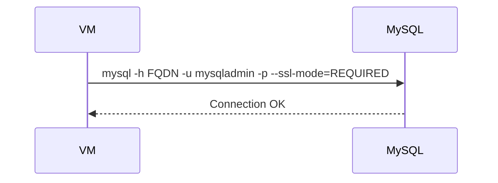

# Connect from Azure VM

## 1. Concept Overview

Install a MySQL client on the lab VM, connect to the Flexible Server FQDN on port 3306 (TLS), and run basic SQL.

---

## 2. Why DevOps Engineers Test DB Connectivity

Validates networking, firewall/VNet rules, TLS, and credentials before application deployment.

---

## 3. Important Terms

| Term | Meaning |
|------|---------|
| **FQDN / Server name** | Hostname for connections |
| **Port** | 3306 for MySQL |
| **require_secure_transport** | TLS typically required |

---

## 4. Architecture Diagram



---

## 5. Before You Start

Server status Ready. VM running. Password saved. Firewall/VNet allows VM → 3306.

---

## 6. Step-by-Step Lab (SSH to VM)

```bash
# Install client (Ubuntu)
sudo apt-get update
sudo apt-get install -y mysql-client

# Connect (replace FQDN)
mysql -h devops-lab-<yourname>-mysql.mysql.database.azure.com \
  -u mysqladmin \
  -p \
  --ssl-mode=REQUIRED
```

Enter password at prompt.

### SQL tests

```sql
SHOW DATABASES;
CREATE DATABASE IF NOT EXISTS devopslab;
USE devopslab;
CREATE TABLE students (id INT AUTO_INCREMENT PRIMARY KEY, name VARCHAR(50));
INSERT INTO students (name) VALUES ('devops-lab-<yourname>');
SELECT * FROM students;
EXIT;
```

---

## 7. Validation

| Check | Expected |
|-------|----------|
| mysql connect | No timeout |
| INSERT/SELECT | Works |

---

## 8. Troubleshooting

| Problem | Solution |
|---------|----------|
| Timeout | Firewall missing VM IP; private networking mismatch; NSG blocking |
| Access denied | Wrong password/user; use admin name exactly as created |
| SSL/TLS errors | Add `--ssl-mode=REQUIRED` or update client |
| Unknown host | Copy FQDN from Portal Overview |

---

## 9. Cleanup

Keep for backup lesson.

---

## 10. Interview Questions

1. **Why connection timeout?**
   - *Usually networking/firewall — not credentials.*

---

## 11. What We Achieved

- Connected Azure VM to MySQL Flexible Server

**Next:** [04-backup-restore.md](04-backup-restore.md)
