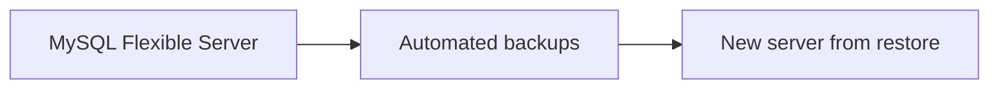

# Backup and Restore

## 1. Concept Overview

Flexible Server provides **automated backups** with point-in-time restore. You can also trigger restore to a **new server**. Manual “snapshot” naming differs from AWS RDS — focus on backup retention and restore workflow.

---

## 2. Why DevOps Engineers Practice Restore

Before schema migration, version upgrade, or proving DR — restores create a **new** server, so always plan cost of a temporary second instance.

---

## 3. Important Terms

| Term | Meaning |
|------|---------|
| **Automated backup** | Continuous backup within retention window |
| **Point-in-time restore (PITR)** | Restore to a timestamp → new Flexible Server |
| **Backup retention** | Days of recoverable history (shorter = less cost) |

---

## 4. Architecture Diagram

---

## 5. Before You Start

> **Cost warning:** Restore creates another billable server. Prefer **view-only** of backup settings unless instructor asks you to restore — if you restore, delete the restored server immediately.

---

## 6. Step-by-Step Console Lab

### View backups

1. Open Flexible Server → **Backup and restore** (or **Settings** → **Compute + storage** / backup blade)
2. Note **Backup retention** (e.g. 7 days — reduce for lab if allowed)
3. Note earliest restore point

### Optional — point-in-time restore (costs money)

1. **Backup and restore** → **Restore**
2. Choose **Point-in-time** close to now
3. **Target server name:** `devops-lab-<yourname>-mysql-restored`
4. Same region / minimal SKU
5. **Review + create** — **or Cancel** if instructor says backups-concept-only
6. If created: verify Ready, then proceed to cleanup and delete the restored server ASAP

### On-demand tip

Some Portal experiences let you adjust retention only — there may not be a classic “Take snapshot” button like RDS. Emphasize automated backups + PITR for interviews.

---

## 7. Validation

| Check | Expected |
|-------|----------|
| Backup settings | Retention visible |
| Restore (if done) | New server Ready — then deleted in cleanup |

---

## 8. Troubleshooting

| Problem | Solution |
|---------|----------|
| Restore disabled | Server still provisioning or permission issue |
| Second server expensive | Delete restored server immediately after demo |

---

## 9. Cleanup

[cleanup.md](cleanup.md) — delete primary **and** any restored servers today.

---

## 10. Interview Questions

1. **Backup vs read replica?**
   - *Backup is for restore/DR; replica is a live copy for read scale/HA patterns.*

---

## 11. What We Achieved

- Reviewed MySQL Flexible Server backup and restore concepts

**Next:** [cleanup.md](cleanup.md)
