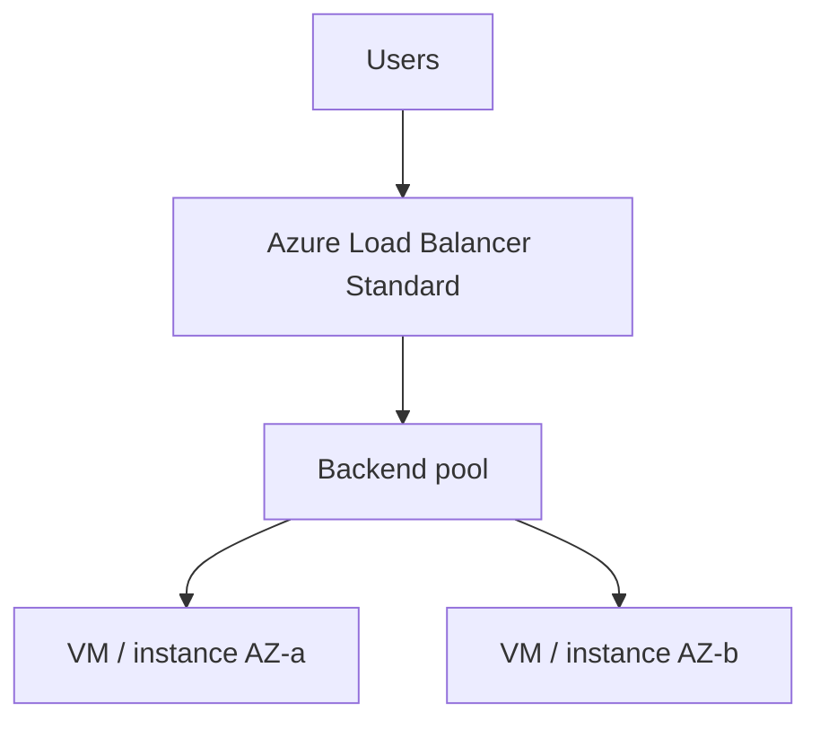

# Load Balancer Theory

## 1. Concept Overview

**Azure Load Balancer (Standard)** distributes traffic across multiple VM/VMSS instances. For basics this lab uses **Layer-4** (TCP/UDP) load balancing with a health probe.

**Application Gateway** (Layer-7 HTTP/HTTPS, WAF, path-based routing) exists for advanced web scenarios — mention it for interviews; this lab prefers **Load Balancer Standard**.

---

## 2. Why DevOps Engineers Use Load Balancer

| Benefit | Detail |
|---------|--------|
| High availability | Traffic shifts to healthy instances |
| Scaling | Works with VM Scale Sets |
| Health probes | Unhealthy instances taken out of rotation |
| Front-end IP | Stable public (or private) VIP for clients |

---

## 3. Important Terms

| Term | Meaning |
|------|---------|
| **Frontend IP** | Public or private IP on the LB |
| **Backend pool** | VMs/NICs receiving traffic |
| **Health probe** | Checks instance health (HTTP `/` or TCP) |
| **Load balancing rule** | Maps frontend port → backend port |
| **SKU** | Basic (legacy/limited) vs **Standard** (preferred) |

---

## 4. Architecture Diagram

---

## 5. Before You Start

Region `southeastasia`. Use a VNet with at least one subnet (two zones if zone-redundant LB is available).

> **Cost warning:** Standard LB bills hourly. **Delete same day.**

---

## 6. Explore Networking / LB Console

1. Search **Load balancers**
2. Note **Frontend IP configuration**, **Backend pools**, **Health probes**, **Load balancing rules**
3. Glance at **Application Gateway** in the portal (concept only)

---

## 10. Interview Questions

1. **Load Balancer vs Application Gateway?**
   - *LB is L4 (TCP/UDP); App Gateway is L7 HTTP with WAF/path routing.*

2. **Basic vs Standard LB?**
   - *Standard is current default for production features (zones, diagnostics, secure by default).*

---

## 11. What We Achieved

- Understood Azure Load Balancer components and when App Gateway applies

**Next:** [02-image-and-vmss-model.md](02-image-and-vmss-model.md)
