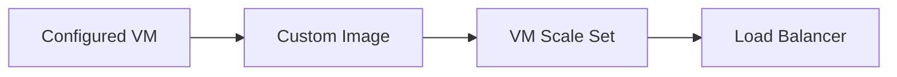

# Custom Image and VM Scale Set Model

## 1. Concept Overview

A **custom image** (managed image or Azure Compute Gallery version) captures a configured VM OS disk — like an AMI. A **Virtual Machine Scale Set (VMSS)** launches identical instances from an image/SKU model and can attach to a load balancer backend pool.

---

## 2. Why DevOps Engineers Use Images + VMSS

Consistent nginx config every scale-out — same packages, same homepage, same NSG pattern.

---

## 3. Important Terms

| Resource | Name |
|----------|------|
| Base VM | `devops-lab-<yourname>-lb-base` |
| Custom image | `devops-lab-<yourname>-nginx-image` |
| VMSS | `devops-lab-<yourname>-vmss` (created in later lesson) |

---

## 4. Architecture Diagram



---

## 5. Before You Start

Resource group `devops-lab-<yourname>-rg`. Region Southeast Asia.

> **Cost warning:** Images and disks have small storage cost; base VM bills until deleted.

---

## 6. Step-by-Step Console Lab

### Step 1 — Launch and configure base VM

1. Create Ubuntu VM `devops-lab-<yourname>-lb-base`, size **Standard_B1s**, region Southeast Asia
2. Create NSGs with production-style pattern:

**LB / frontend NSG** `devops-lab-<yourname>-lb-nsg`:
- Allow **HTTP 80** from Internet (for public LB frontend — often attached to LB or public IP path)

**Instance NSG** `devops-lab-<yourname>-app-nsg`:
- Allow **HTTP 80** from Azure Load Balancer / or from VNet (tighten later when LB exists)
- Allow **SSH 22** from **your IP only**

For a first pass in Portal, allowing HTTP 80 from VirtualNetwork + SSH from your IP on the base VM is OK; refine to LB health probe / LB source when LB is created.

3. SSH and install nginx + custom page:

```bash
sudo apt-get update
sudo apt-get install -y nginx
sudo systemctl enable --now nginx
echo "<h1>devops-lab-<yourname> — LB backend</h1>" | sudo tee /var/www/html/index.html
```

### Step 2 — Generalize and create image (Portal path)

Azure typically requires **deprovision** before a generalized image:

```bash
sudo waagent -deprovision+user -force
# then exit SSH
```

1. Portal → VM → **Stop** (deallocate)
2. VM → **Capture**
3. **Share image to Azure Compute Gallery** (recommended) **or** Create managed image
4. **Image name / definition:** `devops-lab-<yourname>-nginx-image`
5. Complete capture wizard
6. Wait until image/version **Succeeded**

> If Capture UI differs, follow Portal prompts: create gallery `devops-lab-<yourname>-gallery`, image definition, then version `1.0.0`.

### Step 3 — Delete base VM (required)

After the image is available, delete `devops-lab-<yourname>-lb-base` and its disks/NIC/IP so it stops billing. VMSS will create new instances from the image.

> If you skip this, the base VM keeps billing. [cleanup.md](cleanup.md) also deletes it if still present.

---

## 7. Validation

| Check | Expected |
|-------|----------|
| Image / gallery version | Succeeded |
| Base VM | Deleted after capture |

---

## 8. Troubleshooting

| Problem | Solution |
|---------|----------|
| Capture fails | Must deallocate; run `waagent -deprovision` for generalized Linux images |
| Image pending | Wait several minutes |

---

## 9. Cleanup

[cleanup.md](cleanup.md) — delete VMSS, LB, image/gallery, and base VM if still running.

---

## 10. Interview Questions

1. **Custom image vs marketplace image?**
   - *Custom image encodes your baked config; marketplace is the vendor OS baseline.*

2. **VMSS vs individual VMs?**
   - *VMSS manages identical instance fleet with scale properties; closer to ASG than N standalone VMs.*

---

## 11. What We Achieved

- Golden custom image ready for VM Scale Set

**Next:** [03-create-load-balancer.md](03-create-load-balancer.md)
