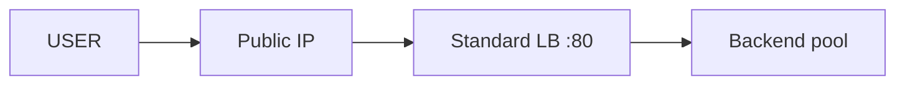

# Create Azure Load Balancer

## 1. Concept Overview

Create a **Standard** public **Azure Load Balancer** with HTTP (TCP 80) load balancing rule, health probe, and backend pool ready for VMSS.

App Gateway remains a valid L7 alternative for path-based HTTPS apps — not required in this lab.

---

## 2. Why DevOps Engineers Create the LB First

Backend pool and probe must exist before (or while) attaching a Scale Set. Portal VMSS wizard can also create an LB — this lesson builds LB explicitly so concepts stay clear.

---

## 3. Important Terms

| Resource | Name |
|----------|------|
| Load Balancer | `devops-lab-<yourname>-lb` |
| Public IP | `devops-lab-<yourname>-lb-pip` |
| Backend pool | `devops-lab-<yourname>-bepool` |
| Health probe | `devops-lab-<yourname>-probe` |

---

## 4. Architecture Diagram

---

## 5. Before You Start

VNet with subnet in `southeastasia` (create simple VNet `devops-lab-<yourname>-vnet` / subnet `app` if needed).

> **Cost warning:** Standard LB hourly charge starts when resources exist.

---

## 6. Step-by-Step Console Lab

### Step 1 — Public IP

1. **Public IP addresses** → **Create**
2. **Name:** `devops-lab-<yourname>-lb-pip`
3. **SKU:** **Standard**
4. **Assignment:** Static
5. Region Southeast Asia → Create

### Step 2 — Load Balancer

1. **Load balancers** → **Create**
2. **Name:** `devops-lab-<yourname>-lb`
3. **Region:** Southeast Asia
4. **SKU:** **Standard**
5. **Type:** Public
6. **Tier:** Regional
7. **Frontend IP:** add config using `devops-lab-<yourname>-lb-pip`
8. **Backend pools:** create `devops-lab-<yourname>-bepool` (empty — VMSS attaches later). Prefer **NIC** based pool for VMSS.
9. **Health probes:**
   - Name `devops-lab-<yourname>-probe`
   - Protocol **HTTP**, Port **80**, Path `/`
   - Interval ~5s
10. **Load balancing rules:**
    - Name `devops-lab-<yourname>-lbrule`
    - Frontend port **80** → Backend port **80**
    - Backend pool + probe from above
    - Session persistence: None
11. Tags → **Review + create**

### Step 3 — Note App Gateway (concept)

Search **Application Gateways** — L7 load balancing with listeners, rules, WAF. Use later for path-based apps; not created in this lab.

---

## 7. Validation

| Check | Expected |
|-------|----------|
| LB | Succeeded, Standard SKU |
| Frontend | Public IP associated |
| Backend pool | Empty until VMSS |

---

## 8. Troubleshooting

| Problem | Solution |
|---------|----------|
| SKU mismatch | Public IP must be Standard to match Standard LB |
| No healthy backends | Expected until VMSS instances join |

---

## 9. Cleanup

[cleanup.md](cleanup.md)

---

## 10. Interview Questions

1. **Why Standard public IP with Standard LB?**
   - *SKUs must match; Basic/Standard mixes fail.*

---

## 11. What We Achieved

- Standard Load Balancer + probe + backend pool ready for VMSS

**Next:** [04-create-vm-scale-set.md](04-create-vm-scale-set.md)
