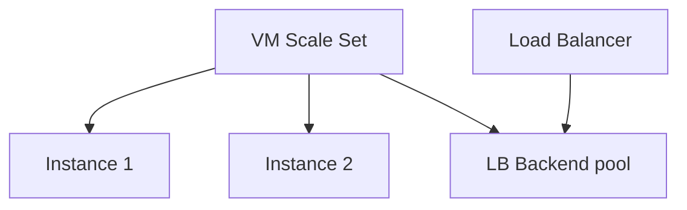

# Create VM Scale Set

## 1. Concept Overview

**Virtual Machine Scale Set (VMSS)** maintains a desired instance count from an image, spreads capacity for HA, and registers instances with the Load Balancer backend pool.

---

## 2. Why DevOps Engineers Use VMSS

Replace unhealthy instances, scale out/in, deploy from a consistent image — Azure’s close analogue to an Auto Scaling Group.

---

## 3. Important Terms

| Term | Meaning |
|------|---------|
| **Instance count** | Desired VMs (use **2** for lab) |
| **Orchestration mode** | Uniform (classic identical) vs Flexible (newer mix) — Uniform is fine for basics |
| **Upgrade policy** | Manual / Automatic / Rolling |

---

## 4. Architecture Diagram

---

## 5. Before You Start

Custom image available. Load Balancer and backend pool exist.

> **Cost warning:** 2× VM size + Standard LB billing.

---

## 6. Step-by-Step Console Lab

### Create VMSS

1. Search **Virtual machine scale sets** → **Create**
2. **Basics:**
   - **Name:** `devops-lab-<yourname>-vmss`
   - **Region:** Southeast Asia
   - **Orchestration:** Uniform (or Flexible if instructed)
   - **Security type:** Standard
   - **Image:** your custom image / gallery version `devops-lab-<yourname>-nginx-image` (or Ubuntu + cloud-init if image skipped — prefer custom image)
   - **Size:** Standard_B1s
   - **Authentication:** SSH key
   - **Instance count:** **2**
3. **Spot / discounts:** Off for predictable lab
4. **Disks:** default OS disk — prefer Standard HDD/SSD for cost
5. **Networking:**
   - VNet/subnet for app
   - **Load balancing:** Azure Load Balancer → select `devops-lab-<yourname>-lb`
   - Backend pool `devops-lab-<yourname>-bepool`
   - NSG: `devops-lab-<yourname>-app-nsg` (HTTP from LB/VNet, SSH from your IP)
6. **Scaling:** Manual — min/max/count **2** (fixed for cost control). Optional autoscale rule later.
7. **Management:** boot diagnostics optional
8. Tags → **Review + create**

### Wait for instances

1. VMSS → **Instances** — 2 Running
2. Load Balancer → **Backend pools** — 2 addresses
3. Check probe health (may take a few minutes) — HTTP `/` must return 200

---

## 7. Validation

| Check | Expected |
|-------|----------|
| VMSS | 2 instances Running |
| Backend health | Healthy / probes succeeding |

---

## 8. Troubleshooting

| Problem | Solution |
|---------|----------|
| Unhealthy probe | NSG blocks LB probes; nginx not running; wrong path |
| Instances not creating | Image permissions, quota, subnet capacity |
| Cannot select custom image | Capture completed? Gallery replication finished? |

---

## 9. Cleanup

[cleanup.md](cleanup.md)

---

## 10. Interview Questions

1. **How do LB health probes relate to VMSS?**
   - *Unhealthy instances stop receiving new connections; scale set can replace failed VMs depending on policy/health extension settings.*

---

## 11. What We Achieved

- VMSS with 2 instances behind Standard Load Balancer

**Next:** [05-test-high-availability.md](05-test-high-availability.md)
