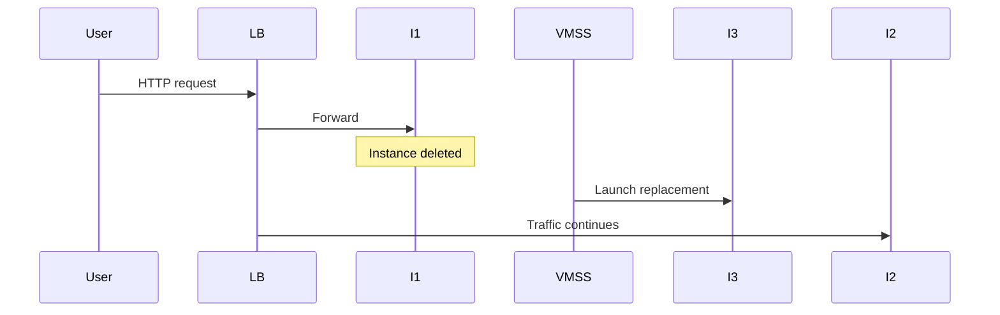

# Test High Availability

## 1. Concept Overview

Test the Load Balancer by opening its public IP in a browser, then **delete one VMSS instance** — capacity recovers and the LB continues serving healthy instances.

---

## 2. Why DevOps Engineers Test Failover

Proves architecture survives single instance failure — core reliability practice.

---

## 3. Important Terms

| Term | Meaning |
|------|---------|
| **Healthy** | Instance passing probe |
| **Instance delete** | VMSS may create a replacement to restore count |

---

## 4. Architecture Diagram

---

## 5. Before You Start

Copy Load Balancer public IP. Two healthy backends.

> **Cost warning:** Still billing — cleanup after test.

---

## 6. Step-by-Step Lab

### Test 1 — Browser access

1. Open `http://<lb-public-ip>`
2. See nginx custom page — refresh multiple times

### Test 2 — Delete one instance

1. **VMSS** → **Instances**
2. Select one instance → **Delete**
3. Confirm

### Test 3 — Observe recovery

1. VMSS → **Instances** / **Scaling** — new instance appears to restore count (~few minutes)
2. Backend pool — temporarily 1 healthy, then 2 again
3. Browser — site still loads (may briefly 502 if both fail — rare with one delete)

### Test 4 — Optional autoscale

If you enabled CPU autoscale, skip stress tests in basic lab to control cost.

---

## 7. Validation

| Check | Expected |
|-------|----------|
| LB URL | Works before and after delete |
| VMSS | Returns to 2 instances |
| Backend pool | Returns to 2 healthy |

---

## 8. Troubleshooting

| Problem | Solution |
|---------|----------|
| 502 / timeout | No healthy backends — check NSG, nginx, probe path |
| Slow recovery | Normal — wait for provision + probes |

---

## 9. Cleanup

[cleanup.md](cleanup.md) **immediately**.

---

## 10. Interview Questions

1. **What happens when an instance dies behind LB?**
   - *Probe fails; LB stops sending new flows; VMSS can recreate capacity.*

---

## 11. What We Achieved

- Verified HA with Azure Load Balancer + VMSS failover test

**Next:** [cleanup.md](cleanup.md)
