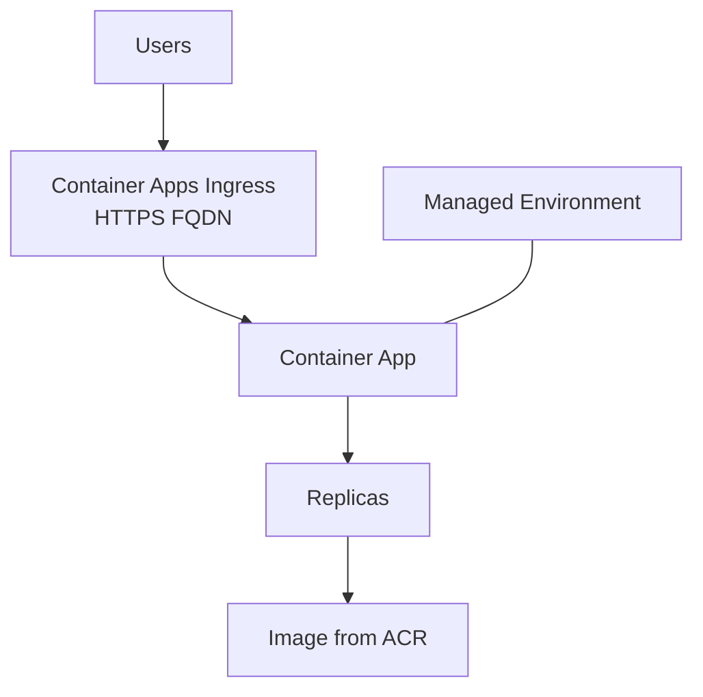

# Container Apps Theory

## 1. Concept Overview

**Azure Container Apps** runs containerized apps and microservices without managing Kubernetes control planes yourself. It sits on Azure’s serverless container platform (powered by Kubernetes under the covers).

| Concept | Meaning |
|---------|---------|
| **Environment** | Shared secure boundary (logging, networking) for apps |
| **Container App** | Your runnable app — image, scale rules, ingress |
| **Revision** | Immutable deployment version of an app |
| **Ingress** | Built-in HTTP/HTTPS endpoint with FQDN (like ALB built-in) |

Compare to AWS ECS Fargate: similar “serverless containers” idea. AKS is the managed Kubernetes alternative (closer to EKS).

---

## 2. Why DevOps Engineers Use Container Apps

- Deploy Docker images from CI/CD with less cluster ops
- Scale to zero or on HTTP/CPU rules
- Built-in ingress TLS/FQDN for quick exposure
- Simpler than full AKS for many teams

---

## 3. Important Terms

See table above plus **Replica**, **Registry (ACR)**, **Managed identity** (pull images without admin passwords — preferred).

---

## 4. Architecture Diagram

---

## 5. Before You Start

Docker installed locally (for build/push). Region `southeastasia`.

> **Cost warning:** Environment + running replicas + ACR — delete same day.

---

## 6. Explore Container Apps Console

1. Search **Container Apps**
2. Note **Environments** and **Container Apps** blades

---

## 10. Interview Questions

1. **Container Apps vs AKS?**
   - *Container Apps is opinionated serverless containers; AKS is managed Kubernetes with more control/ops.*

2. **Container Apps vs App Service?**
   - *Both can run containers; Container Apps is microservices/event/scale-centric; App Service is classic web app PaaS.*

---

## 11. What We Achieved

- Understood Container Apps environment, app, revision, ingress

**Next:** [02-acr-theory.md](02-acr-theory.md)
