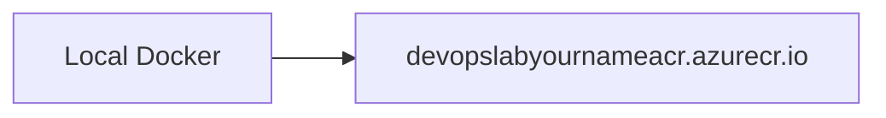

# Create ACR

## 1. Concept Overview

Create an Azure Container Registry and push a sample nginx Docker image from your machine.

**Registry name:** `devopslab<yourname>acr` (5–50 alphanumeric, globally unique — **no hyphens**)

**Repository / image:** `devops-lab-<yourname>-app` (repository names may include hyphens)

---

## 2. Why DevOps Engineers Push to ACR

Container Apps references the ACR image — deployment pipeline artifact.

---

## 3. Important Terms

**Admin user** — easy for lab login; prefer **Azure AD auth / managed identity** in real systems.

---

## 4. Architecture Diagram



---

## 5. Before You Start

Docker running. Portal user can create registries (Owner/Contributor on RG).

> **Cost warning:** Minimal for Basic tier short labs.

---

## 6. Step-by-Step Console Lab

### Create registry

1. Search **Container registries** → **Create**
2. **Resource group:** `devops-lab-<yourname>-rg`
3. **Registry name:** `devopslab<yourname>acr` (unique, alphanumeric)
4. **Location:** Southeast Asia
5. **SKU:** **Basic**
6. Tags → **Review + create**

### Enable admin user (lab convenience)

1. ACR → **Access keys** → **Admin user** → Enable
2. Note **Login server**, **Username**, **password** — store locally, never commit

### Push image (from laptop)

```bash
# Set your short lowercase name (no angle brackets — Bash treats <...> as redirection)
export YOURNAME=alice   # change me
export ACR="devopslab${YOURNAME}acr"

# 1. Login (username/password from Access keys — or: az acr login --name "$ACR")
docker login "${ACR}.azurecr.io"

# 2. Build (from folder with Dockerfile)
docker build -t "devops-lab-${YOURNAME}-app" .

# 3. Tag for ACR
docker tag "devops-lab-${YOURNAME}-app:latest" "${ACR}.azurecr.io/devops-lab-${YOURNAME}-app:latest"

# 4. Push
docker push "${ACR}.azurecr.io/devops-lab-${YOURNAME}-app:latest"
```

> **Note:** Azure CLI `az acr login --name devopslab<yourname>acr` is preferred once Module 04 CLI is set up. If Docker push is blocked, instructors may allow `mcr.microsoft.com/oss/nginx/nginx:1.21.6` (or similar public image) as a temporary fallback — prefer ACR push for the full lab.

### Verify in Portal

ACR → **Repositories** → image tag `latest` appears.

---

## 7. Validation

| Check | Expected |
|-------|----------|
| ACR | Basic, Southeast Asia |
| Repository | Tag `latest` present |

---

## 8. Troubleshooting

| Problem | Solution |
|---------|----------|
| docker login fail | Admin user enabled? Correct login server? |
| name unavailable | Change registry name (must be unique globally) |
| denied on push | Wrong credentials; SKU/quota |

---

## 9. Cleanup

[cleanup.md](cleanup.md)

---

## 10. Interview Questions

1. **How should Container Apps authenticate to ACR?**
   - *System/user-assigned managed identity with AcrPull role — not long-lived admin passwords.*

---

## 11. What We Achieved

- ACR with pushed image

**Next:** [04-create-container-apps-environment.md](04-create-container-apps-environment.md)
