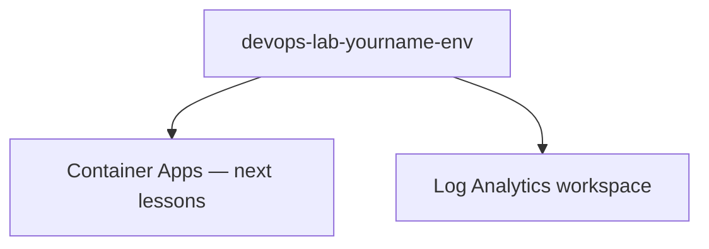

# Create Container Apps Environment

## 1. Concept Overview

A **Container Apps environment** is the shared secure boundary for one or more Container Apps — logging (Log Analytics), networking, and observability live here.

**Environment name:** `devops-lab-<yourname>-env`

---

## 2. Why DevOps Engineers Use Environments

Group apps by stage (dev/stage/prod), share logs, and isolate networking.

---

## 3. Important Terms

**Consumption workload profile** — pay-per-use serverless style suitable for labs (names vary in Portal as “Consumption”).

---

## 4. Architecture Diagram

---

## 5. Before You Start

> **Cost warning:** Environment itself is lightweight; Log Analytics retention and running apps cost more.

---

## 6. Step-by-Step Console Lab

1. Search **Container Apps** → **Create** (or **Environments** → **Create**)
2. If creating environment alone:
   - **Name:** `devops-lab-<yourname>-env`
   - **Region:** Southeast Asia
   - **Zone redundancy:** Off for lab cost
   - **Monitoring:** create or select Log Analytics workspace `devops-lab-<yourname>-law`
3. Networking: default (external) is fine for this lab’s public ingress
4. Tags: `Project=azure-basic-lab`, `Owner=<yourname>`
5. **Create**
6. Wait until environment **Succeeded**

> Many Portal flows create the environment **during** the first Container App create wizard. Creating it first keeps the lesson parallel to ECS “create cluster first.”

---

## 7. Validation

| Check | Expected |
|-------|----------|
| Environment | Succeeded |
| Log Analytics | Linked |

---

## 8. Troubleshooting

| Problem | Solution |
|---------|----------|
| Region not supported | Confirm Container Apps availability in Southeast Asia for your subscription |
| Quota | Request increase or use another training subscription |

---

## 9. Cleanup

[cleanup.md](cleanup.md)

---

## 10. Interview Questions

1. **Is a Container Apps environment a VM?**
   - *No — managed shared environment; you do not patch nodes.*

---

## 11. What We Achieved

- Container Apps environment created

**Next:** [05-create-container-app.md](05-create-container-app.md)
